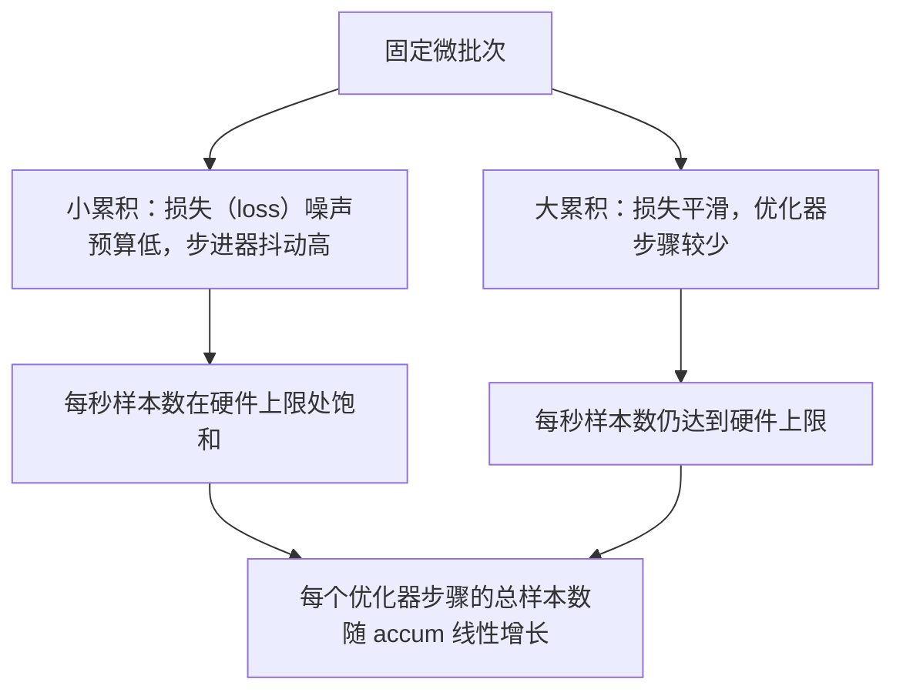

# 梯度累积

> 一次一个微批次，训练你无法一次容纳的有效批次：缩放损失、暂缓优化器更新，让梯度逐步累积。

**类型：** 构建
**语言：** Python
**前置课程：** Phase 19 第 42–45 课
**用时：** 约 90 分钟

## 学习目标

- 推导 `effective_batch = micro_batch * accum_steps`。
- 实现逐微批次损失缩放，使累积梯度等同于一次完整批次反向传播。
- 只在最后一个微批次同步优化器。
- 阅读有效批次与吞吐曲线，解释收益递减。

## 问题

你希望使用 512 的有效批次，因为损失曲线更平滑，而且优化器在这个规模上的更新更有意义；桌面上的加速器在耗尽显存前只能容纳 32 个样本。不能把批次翻倍，也不能把模型减半。这个领域自 2017 年起一直使用的办法是做 16 次反向传播，让梯度留在参数缓冲区中，计数达到目标后才执行一次优化器更新。

风险是损失不再是大批次时的同一个数。16 个微批次的交叉熵如果直接相加，会是一个完整批次损失的 16 倍；不缩放时梯度方向虽然正确，幅度却错了，优化器步长会大 16 倍。修复只需做一次除法，但也很容易忘记。

你希望使用 512 的有效批次，但设备只能容纳 32 个样本。将模型减半或直接增大批次都不可行，于是运行 16 次反向传播，让梯度留在参数缓冲区中，达到目标后再更新。

风险是损失尺度改变：16 个微批次直接相加会使梯度大 16 倍，优化器步长也会过大。每个微批次的损失除以累积次数即可修复，但很容易忘记。

## 概念

契约有四点：每个微批次在 backward 前把损失除以 accum_steps，利用 PyTorch 默认将梯度累加到 param.grad 的行为恢复正确尺度；每个有效批次只在最后一个微批次反向之后更新一次，不能在累积中途 step；动量和 Adam 一阶、二阶矩等优化器状态按有效步而不是微批次推进；多卡时把非末尾微批次放入 no_sync 上下文，跳过梯度 all-reduce，只在最后一次反向时一次性归约完整累积梯度。


契约很短：每个微批次在 `backward()` 前将损失除以 `accum_steps`；每个有效批次只在最后一次反向后更新；优化器状态按有效步而非微批次推进。在多卡环境中，非最后微批次放在 `no_sync` 中，最后一次才进行梯度 all-reduce。

### 代码中的等价性证明

```python
loss = criterion(model(x_full), y_full)
loss.backward()
opt.step()
```

等价于

```python
for x, y in chunks(x_full, y_full, n):
    scaled = criterion(model(x), y) / n
    scaled.backward()
opt.step()
```

除浮点求和顺序外，累积梯度应与完整批次一致；课程在 `equivalence_check` 中用小于 1e-4 的最大绝对差断言。

### 成本如何分布

每个微批次都要一次前向和一次反向，累积是用时间换显存。固定微批次时，有效批次变大，吞吐曲线会记录在 outputs/accum-curve.json 中。不存在免费午餐：accum_steps 翻倍，单个优化器步骤的墙钟时间也翻倍；变化的是梯度估计的方差——同样的时间预算内，优化器步骤更少，但每步平均了更多样本。文献把大批次和小批次视为不同的优化问题，本课关注的是机械实现而非统计结论。

每个微批次都要一次前向和反向；累积用时间换显存。增大 `accum_steps` 会线性增加每个优化器步骤的耗时，却降低梯度估计方差。



```figure
cc-grad-accumulation
```

## 构建

### 第 1 步：等价性检查

equivalence_check 会用同一个种子构造两个相同网络：一个一次前向处理 16 个样本，另一个处理四个 4 样本块并把损失除以四。它在优化器更新前比较梯度缓冲区，在更新后比较参数，并断言最大绝对差小于 1e-4。

### 第 2 步：最后一步同步模式

train_one_optimizer_step 遍历微批次，除最后一个以外都进入 no_sync_context。单进程时该上下文是空操作，DDP 中则跳过梯度 all-reduce。sync_counter 记录离开 no_sync 作用域的同步次数；N 个微批次每个有效步骤只应有一次同步，而不是 N 次。

### 第 3 步：吞吐曲线

sweep_effective_batches 固定微批次大小，扫描一组累积步数，并记录 samples_per_sec、median_step_ms、sync_calls 和 avg_loss。结果写入 outputs/accum-curve.json，可从 notebook 复用。

`code/main.py` 依次完成等价性检查、最后一步同步模式和吞吐扫描。扫描记录 `samples_per_sec`、`median_step_ms`、`sync_calls`、`avg_loss`，结果写入 `outputs/accum-curve.json`。

```bash
python3 code/main.py
```

## 使用

生产中可将累积封装为一个旋钮：accumulation_steps = effective_batch // (micro_batch * world_size)。微批次应尽量填满设备显存；有效批次要结合学习率和预热选择；累积次数正是这两者之间可以运行时调节的桥梁。标准流程始终是缩放损失、非末尾微批次跳过同步、累积、每个有效批次只更新一次。

生产训练可用 `accumulation_steps = effective_batch // (micro_batch * world_size)`。微批次应尽量填满设备显存；有效批次应配合学习率和预热选择；累积次数连接两者。

## 交付

配方还应明确：按 accum_steps 缩放损失、非末尾微批次跳过优化器同步、每个有效批次执行一次 step，并以 JSON 记录有效批次与吞吐的关系，让取舍可见。

`outputs/skill-gradient-accumulation.md` 记录缩放损失、非末尾微批次跳过同步、每个有效批次更新，以及按 JSON 记录吞吐的配方。

## 练习

1. 用 `--num-steps 100` 重跑扫描并绘制曲线，找出曲线变平的位置。
2. 添加不除以 N 的错误版本，比较第 1 步参数差异。
3. 将 SGD 换成 AdamW，确认状态按有效步推进。
4. 接入 `DistributedDataParallel`，确认每个有效批次的同步次数减少 N-1。
5. 比较 2×8 与 4×4 的微批次拆分并解释容差变化。

## 关键术语

| 术语 | 常见说法 | 实际含义 |
|------|---------|---------|
| Micro batch | “前向批次” | 单次前向能放入显存的切片 |
| Accum steps | “每步反向次数” | 一次优化器更新前累积的反向次数 |
| Effective batch | “批次” | 微批次 × 累积次数 × 数据并行 world size |
| Loss scaling | “除以 N” | 使累积梯度匹配完整批次的逐微批次除法 |
| Sync on last | “跳过其余同步” | 只在窗口最后一次反向执行梯度 collective |

## 延伸阅读

- PyTorch `DistributedDataParallel.no_sync` 文档，介绍生产版最后一步同步技巧。
- Goyal 等，2017，大批次训练的线性缩放规则。
- PyTorch issue tracker 中关于混合精度反缩放与梯度累积的讨论。
- Phase 19 第 45 课的梯度安全模式。
