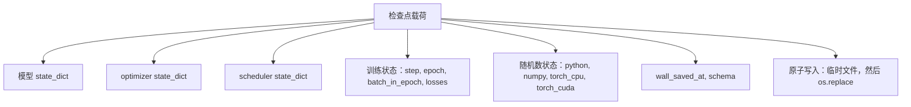
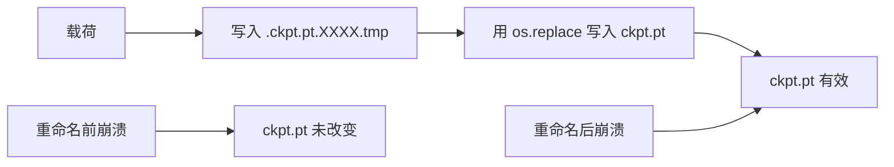
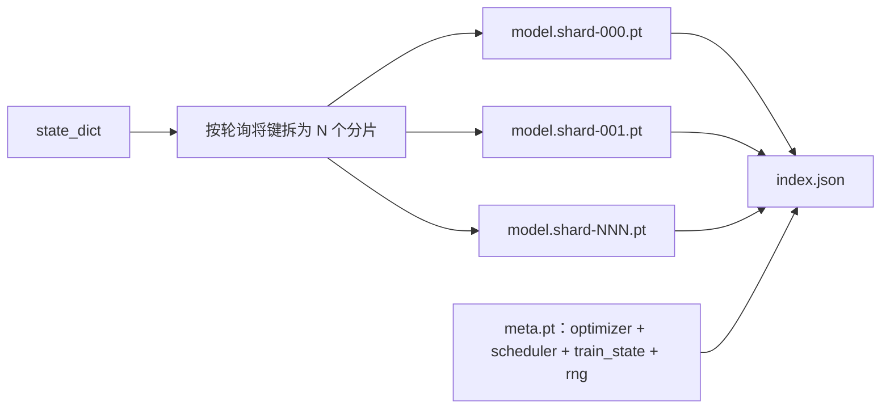

# 检查点保存与恢复

> 可恢复训练不是“保存权重”这么简单：必须保存能让下一步与中断前完全一致的全部状态。

**类型：** 构建
**语言：** Python
**前置课程：** Phase 19 第 46 课
**用时：** 约 90 分钟

## 学习目标

- 保存模型、优化器、调度器、随机数和数据游标。
- 使用原子替换避免半写入文件。
- 实现完整与分片检查点，并验证恢复后的轨迹一致。
- 在 epoch 中途恢复训练。

## 问题

例如，你把训练作业设为 18 小时，但墙钟上限是 4 小时；集群在第 11 小时因内核升级重启。如果没有检查点，就只能从头开始；即使模型权重幸存，前 11 小时学到的 AdamW 动量也丢失，下一步会突然偏向训练轨迹已经走过的方向。

正确的产物是一个包含继续训练所需一切内容的文件：模型参数、优化器状态、调度器状态、可绘图的 loss 历史、当前 step、epoch、epoch 内 batch 计数器，以及所有随机源的 RNG 状态。没有 RNG 状态，恢复后的损失曲线就会不同：模型和数据也许相同，但打乱顺序、dropout mask 和仪表盘上的数字都会不同。

原子保存是另一半契约。直接写最终文件名，写到一半崩溃会留下损坏文件；恢复时读到的就是垃圾。先在同一目录写入临时文件，再重命名，崩溃时仍会保留上一份好文件；在 POSIX 文件系统上，这次 rename 是原子的。

长时间训练会被抢占、断电或作业时限打断。只保存模型权重会丢失 Adam 动量、学习率位置、随机数和数据迭代器位置，恢复后实际运行的是另一条轨迹。

## 概念



### 五类状态

模型保存权重和 buffer，代表模型本身；优化器保存动量和自适应矩，缺失它们会让下一步变成不同的优化问题；调度器保存学习率曲线所处位置，尤其余弦调度依赖它；训练计数器保存 step、epoch、epoch 内 batch 和绘制仪表盘所需的 loss 历史；RNG 状态保证 dropout、数据打乱和模型内采样的确定性。五类状态必须作为一个一致快照。

模型参数、优化器状态、调度器状态、随机数生成器和数据位置必须作为一个一致快照保存。

### 原子保存

临时文件必须与目标位于同一目录，否则跨设备重命名不具备原子性；每次尝试的临时名称也必须唯一，避免两个写入者互相覆盖。

先写临时文件并 `fsync`，再用原子 rename 替换目标文件；这样进程崩溃不会留下看似完整却无法读取的检查点。

### 分片检查点

模型变大后，单文件载荷会变得难以快速加载和检查，也更容易在网络共享盘读取中途失败。做法是把参数状态拆成 N 个分片，并写一个小索引将它们连接起来。索引记录分片数量、每个分片的 sha256 及 meta 文件的 sha256；加载器发现任何哈希不匹配都会明确失败。分片可以位于不同物理磁盘，较小的 meta 文件先读取。

大模型可让各 rank 保存自己的参数分片，同时记录元数据、世界大小和分片范围；恢复时验证布局再重组。

### epoch 中途恢复

只跳到下一 epoch 开始会浪费几分钟到一天的工作。保存 epoch、batch_in_epoch 和 RNG 状态，加载后让随机数生成器快进过当前 epoch 已消费的 batch，再从该游标继续。课程断言恢复后的损失轨迹与不中断基线在中断点之后的差异小于 1e-4。

保存当前 epoch、batch 游标和累积步状态，恢复后从下一个 batch 继续，避免重复样本或跳过样本。





```figure
cc-atomic-checkpoint
```

## 构建

### 第 1 步：捕获并恢复 RNG 状态

capture_rng_state 同时保存 Python random.getstate、NumPy np.random.get_state，以及 PyTorch CPU 和 CUDA 的 RNG 字节；restore_rng_state 负责逆向恢复。CPU 状态是 PyTorch RNG 可以消费的 uint8 字节缓冲区。

保存 Python、NumPy 和 PyTorch 的随机状态，并在恢复时按同一顺序还原。

### 第 2 步：原子保存

atomic_save 在目标目录的临时文件中写入载荷，再用 os.replace 换成正式名称；atomic_write_json 对分片索引执行相同流程。

```bash
python3 code/main.py
```

临时路径写完并同步后再替换正式路径。

### 第 3 步：完整检查点往返

save_checkpoint 把模型、优化器、调度器、训练状态和 RNG 打包进一个字典；load_checkpoint 反向恢复并返回 TrainState。schema 字段是未来升级的钩子：格式变化时增加版本字符串，加载器再按版本分派。

运行一段训练，保存后重新加载，比较参数、优化器状态、学习率和随机数产生的后续结果。

### 第 4 步：分片变体

save_sharded_checkpoint 以轮询方式把参数键分配给 N 个分片，分别原子保存；随后写入包含优化器、调度器、训练状态的 meta 文件，并写出带各分片 sha256 的 JSON 索引。load_sharded_checkpoint 会在合并前验证每个分片。

按 rank 写入分片并验证缺失、重复和世界大小不匹配时能明确失败。

### 第 5 步：恢复演示

run_resume_demo 先训练小模型到 total_steps，在 interrupt_at 保存检查点再继续；第二个进程恢复该检查点并运行剩余步骤。函数返回中断点之后两条损失轨迹的最大绝对差。恢复 RNG 后，该差异应为零或仅为浮点噪声。

在 epoch 中途制造中断，恢复后继续；输出应与不中断参考轨迹一致。

## 使用

生产训练器通常把检查点作为内建能力，形状仍是模型、优化器、调度器、计数器和 RNG，原子写入并按 step 命名，方便找到最新版本。分片布局支持并行读取大型模型；index.json 是把这些文件组织起来的关键。

还应强制三点：将 schema 字符串写入载荷，迁移时按它分支；为每个分片计算 sha256，避免静默截断下载；每 N 步和每个墙钟时间间隔保存，取较短者，避免一次耗时很长的步骤在崩溃时浪费完整窗口。

按固定步数或时间间隔保存，并保留最近若干份。检查点元数据应包含代码版本、配置、设备布局和数据集身份。

## 交付

`outputs/skill-checkpoint-save-resume.md` 记录保存、原子提交、分片和恢复配方。

## 练习

1. 在写入过程中终止进程，确认正式检查点仍可读取。
2. 修改 batch 游标，验证不会重复或跳过样本。
3. 比较完整与分片保存的恢复结果。
4. 添加旧版本 schema 的迁移器。
5. 用 `fsync` 测量耐久性成本。

## 关键术语

| 术语 | 常见说法 | 实际含义 |
|------|---------|---------|
| Checkpoint | “保存模型” | 可继续训练所需的完整状态快照 |
| Atomic save | “安全写文件” | 临时写入并原子替换目标 |
| RNG state | “随机种子” | 决定后续随机序列的生成器状态 |
| Shard | “分片权重” | 由某个 rank 持有的状态子集 |
| Resume | “接着跑” | 从保存的步骤和数据位置继续 |

## 延伸阅读

- PyTorch `torch.save` 与 `torch.load` 文档，包括跨设备恢复的 `map_location`。
- Phase 19 第 46 课的累积梯度状态。
- Phase 19 第 48 课的分布式状态字典。
- Linux kernel `fsync` 文档中的耐久性保证。
