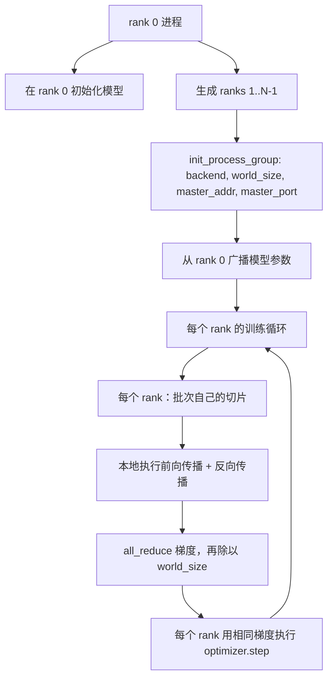
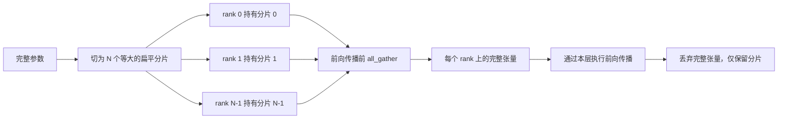

# 从零实现分布式数据并行与 FSDP

> 多 rank 训练依赖两个 collective 和一条规则：启动时广播参数，反向后平均梯度，绝不让各 rank 对当前步骤产生分歧。

**类型：** 构建
**语言：** Python
**前置课程：** Phase 19 第 42–45 课
**用时：** 约 90 分钟

## 学习目标

- 使用 `gloo` 在 N 个进程间建立 process group，无需专用硬件。
- 实现构造时广播参数、反向后 all-reduce 梯度的最小 DDP 包装器。
- 证明逐 rank 梯度归约等同于单进程拼接输入的梯度。
- 展示 FSDP 参数分片、前向前聚合和前向后释放。

## 问题

模型可以放进一台设备，但数据放不下；优化预算要求每秒看到 N 倍样本。第一种杠杆是数据并行：每个 rank 用不同批次切片运行同一模型，在优化器更新前平均梯度。第二种是 FSDP：如果模型本身也放不进一台设备，每个 rank 只保存每个参数的一部分，并在前向时逐层重建完整张量。

痛点在记账。如果各 rank 的参数漂移，训练会静默损坏；如果平均了梯度却没有平均损失，仪表盘会说谎；如果 collective 后端无法就拓扑达成一致，运行会永久挂起。一次手写这些 collective，才能知道包装器到底复现了什么。

本课运行在 CPU 上，不假定 CUDA。每个 PyTorch 构建都带有 gloo 后端，它接受 torch.multiprocessing worker；在多 GPU 节点上，将 backend 切换为 nccl 即可，代码结构不变。

模型能放进一台设备，但数据规模和吞吐目标要求多 rank。数据并行让每个 rank 处理不同批次切片并平均梯度；FSDP 更进一步，让每个 rank 只持有参数的一部分，在前向时逐层重建完整张量。

## 概念



### 两个关键 collective

| Collective | 作用 | 时机 |
|------------|------|------|
| `broadcast` | 将一个 rank 的张量复制给所有 rank | 参数初始化及一对多同步 |
| `all_reduce` | 跨 rank 求和/均值/最大值，所有 rank 获得结果 | 反向后的梯度平均 |
| `all_gather` | 每个 rank 提供张量，所有 rank 获得拼接结果 | logits 收集及 FSDP 解分片 |

DDP 契约是构造时 `broadcast`、反向后 `all_reduce`；FSDP 在每层前向前增加 `all_gather`。

### 梯度平均等同于单进程梯度

跨 N 个 rank 训练 B 样本的模型，必须产生与单进程训练 N×B 样本相同的梯度。将各 rank 的梯度求和再除以 N，得到的就是完整批次采用 mean reduction 的交叉熵梯度。课程用手工 all-reduce 梯度与单进程参考梯度的最大绝对差小于 1e-3 来断言这一点。

将每个 rank 的梯度求和再除以 N，得到的就是完整批次平均损失的梯度。课程以小于 1e-3 的最大绝对差断言这一点。

### FSDP 草图

每 rank 的参数显存准确降为 1/N，代价是每次前向都要聚合。生产 FSDP 会将聚合与上一层计算重叠，所以实际墙钟代价远小于朴素估算。课程对每个参数执行往返，并断言重建结果与原参数逐位相等；前向后重新分片就是从聚合张量取回一个切片。



每 rank 参数显存降为 1/N，代价是每次前向都要聚合。CPU 演示使用 `gloo`，迁移 GPU 时改为 `nccl`、设备张量和 `torchrun`。

### CPU 与 gloo 后端

gloo 是 CPU collective 后端。它比 GPU 上的 nccl 慢几个数量级，但 API 表面相同。课程用 backend="gloo" 初始化 process group，用 torch.multiprocessing 生成 rank，而不是 torchrun；最终都会进入相同的 torch.distributed 调用。在多 GPU 节点上只需改成 backend="nccl"、使用设备张量并用 torchrun 启动。

`gloo` 是 CPU collective 后端，API 形状与 GPU 的 `nccl` 相同。

```figure
cg-allreduce-ring
```

## 构建

### 第 1 步：建立 process group

MASTER_ADDR 和 MASTER_PORT 是 rendezvous：每个 rank 都连接同一主机的同一端口。课程通过 bind 后立即 close 的方式找空闲端口，避免多次运行共享机器时发生冲突。

```python
os.environ["MASTER_ADDR"] = "127.0.0.1"
os.environ["MASTER_PORT"] = str(port)
dist.init_process_group(backend="gloo", rank=rank, world_size=world_size)
```

### 第 2 步：构造时广播

MinimalDDP.__init__ 会遍历每个参数和 buffer 并调用 broadcast。rank 0 的值成为规范初始化；如果不这样做，各 rank 会依据自己的种子初始化，从第一步起就发生分歧。

`MinimalDDP.__init__` 遍历参数和 buffer，调用 `dist.broadcast(tensor, src=0)`，使 rank 0 成为规范初始化。

### 第 3 步：反向后归约梯度

每个 rank 最终都得到相同的平均梯度，因此每个优化器更新都是同一个输入的函数，参数就能在整个运行期间保持同步。

```python
def all_reduce_grads_(module, world_size):
    for p in module.parameters():
        if p.grad is None:
            p.grad = torch.zeros_like(p.data)
        dist.all_reduce(p.grad.data, op=dist.ReduceOp.SUM)
        p.grad.data.div_(world_size)
```

### 第 4 步：证明等价

manual_all_reduce_matches_single_process 会在 rank 0 构造相同模型，将归约后的梯度与单进程在拼接输入上计算出的梯度比较，最大绝对差约为 1e-8。

`manual_all_reduce_matches_single_process` 比较手工归约梯度与单进程拼接输入梯度，最大绝对差约为 1e-8。

### 第 5 步：FSDP 往返

fsdp_round_trip_sketch 会展平每个参数，补齐到 world_size 的倍数，切片、all-gather，再去掉填充；每个 rank 重建出的值都等于原值。这是 unshard 步骤，前向后重新分片就是从聚合张量取回一个切片。

`fsdp_round_trip_sketch` 展平、补齐、切片、all-gather 并去除填充，确认每个 rank 重建出的张量与原值完全相等。

```bash
python3 code/main.py
```

默认 world size 为 2；两个 CPU 进程通过 `gloo` 通信并以零退出码结束，结果写入 `outputs/ddp-demo.json`。

## 使用

生产版 DistributedDataParallel 还会增加反向钩子，在反向期间重叠 all-reduce，并把多个小梯度放入 bucket 后一次 collective；课程 46 使用的 no_sync 也由此提供。FSDP 会为每层提供平坦参数视图、将下一层 unshard 与当前计算重叠，并可选择把分片 offload 到 CPU。形状契约仍然是启动时 broadcast、反向后 reduce，参数放不下时再分片。

生产 DDP 增加反向钩子、桶化归约和 `no_sync`；FSDP 增加平坦参数视图、通信计算重叠和 CPU offload。形状仍是启动广播、反向归约、超出显存时分片。

## 交付

`outputs/skill-distributed-fsdp-ddp.md` 记录 CPU 用 `gloo`、GPU 用 `nccl`、DDP 广播与归约以及 FSDP `all_gather` 的配方。

## 练习

1. 用 `--world-size 4` 确认参数差异低于 1e-3。
2. 用 `dist.ReduceOp.AVG` 替代手工平均并计时。
3. 添加反向钩子，测量通信重叠收益。
4. 实现前向后的 FSDP 重新分片并确认显存下降。
5. 在 CUDA 机器切换到 `nccl`，记录变化的环境变量。

## 关键术语

| 术语 | 常见说法 | 实际含义 |
|------|---------|---------|
| Backend | “gloo 或 nccl” | 实现 collective 的库 |
| World size | “rank 总数” | process group 中的进程数 |
| Rank | “worker 编号” | 从 0 开始的进程标识 |
| All-reduce | “求和梯度” | 跨 rank 求和并让每个 rank 获得相同结果 |
| Unshard | “聚合参数” | 通过 all_gather 从分片重建完整张量 |

## 延伸阅读

- PyTorch `torch.distributed` collective 语义文档。
- `gloo` collective 列表。
- Phase 19 第 46 课的 `no_sync` 梯度累积模式。
- Phase 19 第 47 课的 DDP/FSDP 检查点布局。
- PyTorch FSDP 文档。
