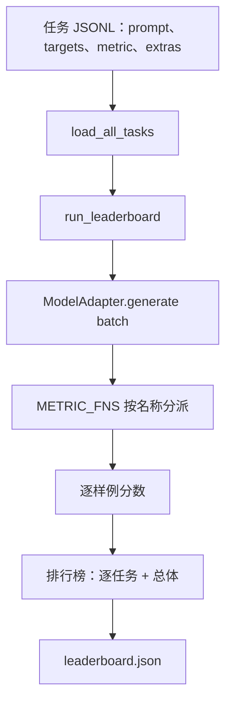

# 语言模型评测框架

> 无法定义任务的高分模型，可能只是偶然答对。评测框架把任务定义、指标、运行器和排行榜组成一个短小且可替换的整体。

**类型：** 构建
**语言：** Python
**前置课程：** Phase 19 第 42–45 课
**用时：** 约 90 分钟

## 学习目标

- 用包含 `prompt`、`targets`、`metric` 和可选 `extras` 的 JSONL 定义任务。
- 实现 exact match、rouge-l F1、可执行检查、多选和子串包含五种指标。
- 按任务批处理样例，并分派给可替换的模型适配器。
- 输出含任务分数、延迟和可复现总体平均分的排行榜 JSON。

## 问题

每周都会出现新的语言模型，营销说它表现很好；诚实的问题是：在哪些任务上好？诚实的答案应该来自你自己写的排行榜，因为供应商的排行榜只覆盖他们专门调优过的那一组任务。

没有仓库内的 harness，你只能凭感觉比较两个模型；有了 harness，就可以在固定任务集、固定指标和可 diff 的 JSON 输出上比较。harness 是昨天运行和今天运行之间的契约；没有它，回归就会随版本一起发布。

另一个陷阱是把 harness 过拟合到单个模型。解决方案是让 harness 足够小，十五分钟内读完；让任务足够小，可以随仓库发布；从头编写指标，方便同事审计；并把所有模型相关代码限制在 adapter 中。更换 adapter，排行榜移动；更换任务，排行榜移动；其他部分不应移动。

模型每周都在更新，真正的问题不是“它表现好不好”，而是“在哪些任务上好”。没有仓库内的框架，就只能凭感觉比较；有了固定任务、固定指标和可 diff 的 JSON，回归才会被发现。

框架不应过拟合单个模型：任务和指标足够小以便审查，模型相关代码只存在于适配器中。替换适配器或任务时，其他部分都不应改变。

## 概念



### 任务规范

每个样例占一行：

```json
{"id": "arith-00", "prompt": "compute: 2 + 2", "targets": ["4"], "metric": "exact_match"}
```

需要辅助数据的指标将其放入 `extras`：

```json
{
  "id": "code-00",
  "prompt": "python: write a function f that doubles its input",
  "targets": ["ok"],
  "metric": "code_exec",
  "extras": {"io_pairs": [[1, 2], [3, 6]]}
}
```

任务是 `outputs/tasks/` 下的 `.jsonl` 文件，同文件共享一个指标。

### 五个固定任务

| 任务 | 指标 | 测试内容 |
|------|------|---------|
| arithmetic | exact_match | 确定答案的 token 级正确性 |
| summary | rouge_l | 与单行摘要参考的最长公共子序列 F1 |
| code-exec | code_exec | 输入输出对上的可执行测试 |
| multiple-choice | multiple_choice | 预测首字母是否为允许字母 |
| generation | substring_contains | 自由文本是否含目标子串 |

### 指标契约

每个指标都是从 prediction、targets、extras 映射到 [0.0, 1.0] 浮点数的函数。exact_match 会转小写、折叠空白并比较相等；substring_contains 使用同样规范化后做子串判断；multiple_choice 检查大写后的首字符；rouge_l 计算最长公共子序列长度、precision、recall 和 F1；code_exec 则在受限命名空间中执行预测，对每个输入输出对调用 f(x) 并统计匹配。

code_exec 使用移除过的 builtins 命名空间。测试断言 import os 会失败，因为 os 不在该命名空间中；代码预测不能通过这个指标接触文件系统。

每个指标都是 `(prediction, targets, extras) -> float in [0.0, 1.0]`。框架先平均样例分数，再平均任务分数：`exact_match` 和 `substring_contains` 做规范化；`multiple_choice` 比较大写首字符；`rouge_l` 计算 LCS F1；`code_exec` 在受限命名空间执行预测并检查每个输入输出对。

### 模型适配器

adapter 是唯一的模型接缝。课程提供的 ToyAdapter 是一个确定性的模式匹配器，能对五个 fixture 任务返回正确答案；真实 adapter 负责调用模型并返回输出，harness 不关心它是哪一种模型。

```python
class ModelAdapter(Protocol):
    def generate(self, prompts: Sequence[str]) -> List[str]: ...
    @property
    def name(self) -> str: ...
```

适配器是唯一的模型接缝。`ToyAdapter` 为五个固定任务确定性地产生正确答案，真实适配器只需返回模型输出。

### 运行器

run_task 每次取 batch_size 个 prompt，调用 adapter，再将每个输出分派到指标函数。run_leaderboard 遍历全部任务并求平均。write_leaderboard 写出带 schema 字符串的 JSON，避免未来格式变化静默破坏仪表盘。

`run_task` 按 `batch_size` 分批并调用指标；`run_leaderboard` 遍历任务并求平均；`write_leaderboard` 写出带 schema 字符串的 JSON。


```figure
eval-harness-matrix
```

## 构建

五个固定任务由 seed_fixture_tasks 写入 outputs/tasks/ 下的 .jsonl 文件；load_all_tasks 会读取每个文件并跳过以 # 开头的注释行和空行；每项指标都有单元测试，整套测试共有 13 个用例，覆盖规范化、部分重叠、代码执行和不安全代码拒绝。run_task 产生带分数、正确数、总数和延迟的 TaskResult，run_leaderboard 产生带总体平均值的 Leaderboard，--include-per-example 则附加逐样例记录，便于对比上一次运行。

### 第 1 步：写入固定任务

`seed_fixture_tasks(target_dir)` 写出五个 `.jsonl` 文件。

### 第 2 步：加载任务

`load_all_tasks(task_dir)` 读取所有 `.jsonl`；以 `#` 开头的注释和空行会跳过。

### 第 3 步：实现指标

每个指标都是带单元测试的小函数，测试覆盖规范化、部分重叠、代码执行和不安全代码拒绝。

### 第 4 步：编写运行器

`run_task` 产生含分数、正确数、总数和延迟的 `TaskResult`；`run_leaderboard` 产生总体平均值。

### 第 5 步：输出 JSON

`write_leaderboard` 序列化排行榜；`--include-per-example` 可输出逐样例记录。

```bash
python3 code/main.py
```

首次运行会生成固定任务并写入 `outputs/leaderboard.json`；ToyAdapter 的总体分数为 1.0。

## 使用

接入真实模型时，可以将 ToyAdapter 替换成 HttpAdapter，而不改变 harness、任务、指标和排行榜。发布到真实项目时还应固定任务文件或随排行榜携带它们，比较预测而不只是分数，并限制 batch size 以适应不同供应商的速率限制。

接入真实模型只需编写适配器：

```python
class HttpAdapter:
    name = "vendor.v1"

    def __init__(self, endpoint, api_key):
        self.endpoint = endpoint
        self.api_key = api_key

    def generate(self, prompts):
        out = []
        for prompt in prompts:
            response = http_post(self.endpoint, prompt, self.api_key)
            out.append(response["text"])
        return out
```

替换 `ToyAdapter` 后，任务、指标和排行榜保持不变。生产中应固定任务文件、比较预测而不只是分数，并限制批次大小以适应供应商速率限制。

## 交付

`outputs/skill-lm-eval-harness.md` 记录 JSONL 规范、五种指标、可替换适配器、批处理运行器和带 schema 的排行榜格式。

## 练习

1. 添加一个从零实现的第六种指标。
2. 让 `code_exec` 捕获 stdout 并接受预期输出列表。
3. 添加比较两个排行榜并打印任务变化的命令。
4. 为每个样例增加延迟上限和 `timeouts` 列。
5. 在排行榜中写入任务内容 sha256。

## 关键术语

| 术语 | 常见说法 | 实际含义 |
|------|---------|---------|
| Task spec | “评测格式” | 每个样例含 prompt、targets、metric、可选 extras 的 JSONL |
| Metric | “如何评分” | 将预测、目标和辅助数据映射到 [0,1] 的函数 |
| Adapter | “模型客户端” | 提供 `generate(prompts) -> list[str]` 的对象 |
| Leaderboard | “计分板” | 含任务分数、计数、延迟和总体平均值的 JSON |
| Code exec metric | “运行并检查” | 在受限命名空间执行预测并比较输入输出对 |

## 延伸阅读

- 原始 lm-evaluation-harness：规模更大但形状相同的生产参考实现。
- HuggingFace lighteval：同一契约的另一种实现。
- Phase 19 第 46 课的梯度累积模式。
- Phase 19 第 47 课的检查点格式。
- Phase 19 第 48 课的分布式训练栈。
