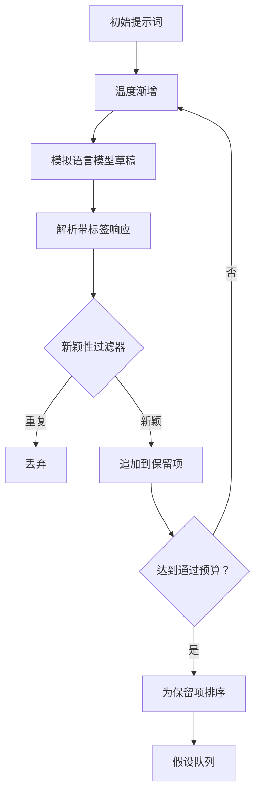

# 假设生成器

> 研究代理如果两次提出同一个问题，就是在浪费令牌。关键在于迫使每次草稿都落到新的方向上。

**类型：** 构建
**语言：** Python
**前置条件：** Phase 19 Track A 第 20–29 课
**用时：** 约 90 分钟

## 学习目标
- 从种子提示驱动采样器，并把输出转换为类型化的假设记录。
- 每轮提高采样温度，使下一份草稿进一步偏离上一份。
- 使用小型嵌入模型和余弦距离阈值过滤近似重复项。
- 用融合新颖性、具体性和可测试性的评分函数给幸存项排序。
- 让每一步都保持确定性，从而相同种子始终产生相同队列。

## 为什么要先生成再过滤

一个规划器只问模型一次，只会得到一个假设，这对演示足够，但不适合研究循环。研究循环需要有深度的排序队列，这样第一个假设失败时，运行器可以直接使用下一个，而不必再次支付完整采样的成本。

队列由两个想法共同产生。第一是温度递增：采样器每轮提高一点温度，鼓励后续草稿探索更远。第二是新颖性过滤：每份草稿生成后，生成器都会测量它与所有既有幸存项的嵌入距离，并拒绝落在聚类内部的内容。

本课提供一个针对固定提示返回脚本化 token 序列的模拟语言模型。它足以走完整条路径：输入种子提示、应用温度递增、解析候选项、执行新颖性过滤，最后输出排序队列。

## 假设的数据形状

```text
Hypothesis
  id             : int           (monotonic within a run)
  text           : str           (the claim)
  variables      : list[str]     (what changes between conditions)
  metric         : str           (what the runner will measure)
  baseline_ref   : str | None    (which paper or run the comparison cites)
  draft_pass     : int           (which sampler pass produced this)
  temperature    : float         (the sampler setting at draft time)
  novelty_score  : float         (distance from prior survivors, 0..1)
  rank_score     : float         (weighted sum used for ordering)
```

`variables` 和 `metric` 不是自由文本，解析器会从带标签的响应中提取它们。第 52 课的运行器会直接读取这些字段来构建实验配置。

`baseline_ref` 可选但推荐填写。第 53 课的评估器需要基线进行比较；若假设没有提供基线，评估器会回退到同一指标的上一次运行。

```figure
cg-novelty-ramp
```

## 架构



循环本身很直接，真正重要的是每个方框都有明确的硬性契约。

## 温度递增

从 `t_min` 开始，到 `t_max` 结束，步长为 `(t_max - t_min) / (n_passes - 1)`。每轮以当前温度调用采样器，由 `GeneratorConfig.schedule()` 产生 `n_passes` 个等间隔值。模拟模型根据 `(prompt, temp_bucket)` 切换脚本响应。桶采用开区间，因此温度的微小变化也可能选择不同草稿。生产环境中这里会换成传入 `temperature=t` 的真实模型。

默认计划从 `0.2` 到 `1.2` 共六轮，足以填满队列，也不会为最终被过滤的样本浪费成本。低于 `0.2` 时模型倾向复述种子，高于 `1.2` 时则容易跑题并无法通过解析器。

## 新颖性过滤

每份草稿解析后，生成器都会嵌入其文本，并与所有已接受假设比较。嵌入是归一化到单位长度的、基于词 token 的小型哈希词袋。两个单位向量的余弦距离是 `1 - dot(a, b)`。当草稿到任一既有幸存项的最小距离大于 `novelty_threshold` 时，它才会通过；默认阈值为 `0.25`。

这种哈希嵌入并不复杂，但确定、零依赖，足以捕获两个草稿共享大多数名词这一明显情况。生产部署可以替换成小型句子模型，接口保持不变。

## 排名分数

```text
rank_score = w_novelty * novelty_score
           + w_specificity * specificity_score
           + w_testability * testability_score
```

分数由三个子分数组成。`novelty_score` 是与既有幸存项的最小嵌入距离；`specificity_score` 是具体变量数量除以目标数量；`testability_score` 在假设同时指定指标和基线时为一，仅有指标时为二分之一，否则为零。

默认权重是 `0.4`、`0.3`、`0.3`。权重位于生成器配置中，下游课程可以调整它们而无需分叉代码。

## 模拟语言模型

```python
class MockLLM:
    def sample(self, prompt: str, temperature: float, seed: int) -> str:
        ...
```

采样器由 `(prompt, temperature, seed)` 三元组确定。模拟模型维护以 `(prompt_signature, temperature_bucket)` 为键的脚本响应表。若没有对应项，采样器返回无法通过解析器的回退内容；测试会覆盖这条路径。

种子会混入响应，因此相同的 `(prompt, temperature)` 配上不同种子会产生不同草稿。测试固定种子以保证可复现，真实部署则可以使用系统时钟或计数器提供种子。

## 输出队列

输出是按 `rank_score` 降序排列的 `Hypothesis` 记录列表。第 52 课的运行器取出队首执行实验，第 53 课的评估器写回判定。若判定假设错误，运行器会取出下一个。

队列是有限的。队列为空时，编排器可以扩大种子提示后重新运行生成器，也可以停止并报告预算耗尽。

## 如何阅读代码

`code/main.py` 定义 `Hypothesis`、`MockLLM`、`HypothesisGenerator` 和确定性演示。生成器公开单一的 `run(seed_prompt)` 方法，返回排序队列；轮数从 `GeneratorConfig.n_passes` 读取，而不是作为参数传入。嵌入采用 token 哈希词袋，新颖性过滤和排名分数各由一个函数完成。代码不依赖 `numpy`，嵌入数学全部使用标准库，因而保持可移植。

`code/tests/test_generator.py` 覆盖线性路径、重复拒绝路径、解析失败路径、温度递增边界和排名顺序。

## 它在整体流程中的位置

第 50 课产生队列，第 51 课取队首进行文献检索以确认或反驳它，第 52 课对同一假设执行实验，第 53 课读取两类输出并写出判定。四课组成一个无需人工介入的研究循环；人工可以在任何边界介入。
