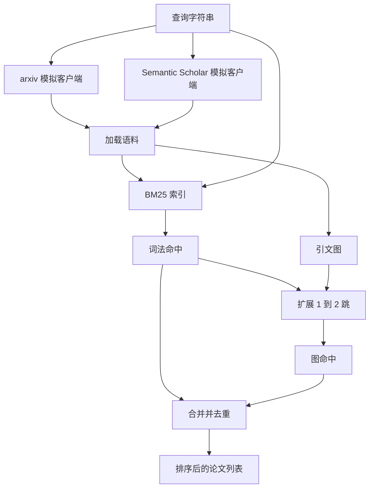

# 文献检索

> 假设很便宜；确认是否已有研究证明它，才是昂贵的部分。在运行器启动沙箱前，先构建回答这个问题的检索层。

**类型：** 构建
**语言：** Python
**前置条件：** Phase 19 Track A 第 20–29 课
**用时：** 约 90 分钟

## 学习目标
- 建模一个包含下游循环所需字段的小型论文记录。
- 仅使用标准库数据结构构建摘要上的 BM25 索引。
- 遍历引文图，找出词法搜索遗漏的论文。
- 按稳定论文 ID 合并两条路径中的重复命中。
- 将两个模拟外部 API 封装为单一客户端，真实端点接入时无需改调用方。

## 为什么需要两轮检索

关键词搜索摘要会找到与查询共享词汇的论文，覆盖大部分表面结果，但至少漏掉两类。第一，基础论文可能使用不同词汇，例如查询 sparse attention 可能漏掉标题为 block selection in transformer routing 的论文。第二，相关论文可能是引用已知锚点的后续工作；找到锚点再向前遍历，比穷举整个摘要池更高效。

摘要关键词搜索会返回与查询共享词汇的论文，覆盖了大部分表面结果，但会漏掉基础论文使用不同术语的情况，也会漏掉引用已知锚点的后续论文。先找到锚点再向前遍历，比穷举所有摘要更高效。

本课实现两条路径：摘要上的 BM25 捕获词法命中；引文图从种子集合向前、向后扩展一到两跳。最后按论文 ID 去重，并用组合分数排序。

## 论文的数据形状

```text
Paper
  id          : str           (stable identifier, "p001" for the mock corpus)
  title       : str
  abstract    : str
  year        : int
  authors     : list[str]
  references  : list[str]     (paper ids this paper cites)
  citations   : list[str]     (paper ids that cite this paper)
  source      : str           (which mock api supplied it, "arxiv" or "s2")
```

`references` 和 `citations` 构成有向引文图。两个模拟 API 返回的字段并不完全相同，因此语料加载器按 `id` 做并集。

```figure
cg-citation-hops
```

## 架构



检索客户端负责两条路径和合并。调用方传入查询，得到排序列表；每个条目都带有 `bm25_score`、`graph_distance`、`recency_score`、`final_score`，用于解释排序。

## 从零实现 BM25

实现采用标准 Okapi BM25，默认参数为 `k1=1.5`、`b=0.75`。索引由两个字典组成：`term -> doc_frequency` 和 `term -> list of (doc_id, term_count)`。文档长度是摘要 token 数，平均长度在建索引时计算一次。查询分数是各查询词 `idf * tf_norm` 的总和。

```text
idf(t)      = log((N - df + 0.5) / (df + 0.5) + 1.0)
tf_norm(t)  = (f * (k1 + 1)) / (f + k1 * (1 - b + b * dl / avgdl))
score(d, q) = sum over t in q of idf(t) * tf_norm(t)
```

分词器先 `lower`，再按非字母数字字符切分，不做词干提取。生产系统可替换为小型词干器，接口不变。

## 引文图遍历

图上的前向边表示论文指向参考文献，后向边表示其他论文指向该论文。两跳是刻意的上限：一跳常常太浅，智能体需要立即的祖先或后代；三跳会在连通图上爆炸结果规模并逐渐偏题。跳数暴露为配置项，下游循环可以按需要收紧。

语料加载后一次性建立图。前向边从论文指向其参考文献，后向边从论文指向引用它的论文。遍历以 BM25 排名前列为种子，使用广度优先搜索，最多两跳。

两跳是有意设置的上限：一跳过浅，三跳会在连通图上放大结果并偏离主题。跳数暴露为配置项，便于下游循环收紧。

## 去重与排序

两条路径返回的集合会重叠，合并按稳定 paper id 建键。bm25_score_norm 是合并集合中 BM25 分数除以最大值，因此落在 0 到 1；graph_score 对直接词法命中取 1，一跳取 0.6，两跳取 0.3，其他为 0；recency_score 从语料最小年份的 0 线性增长到最大年份的 1。默认权重 0.5、0.3、0.2 是配置项：主题陈旧时可以降低 recency，变化快速时可以提高它。

两条路径会返回重叠集合，合并时按论文 ID 建键，最终分数为加权组合。

```text
final_score = w_bm25 * bm25_score_norm
            + w_graph * graph_score
            + w_recency * recency_score
```

`bm25_score_norm` 除以合并集合中的最大 BM25 分数；`graph_score` 对直接词法命中为一、一跳为 `0.6`、两跳为 `0.3`；`recency_score` 从语料最小年份的零线性递增到最大年份的一。默认权重为 `0.5`、`0.3`、`0.2`。

## 模拟语料

两种客户端读取同一百篇论文语料，但字段暴露不同。ArxivMockClient 返回标题、摘要、年份和作者；SemanticScholarMockClient 增加 references 和 citations。检索客户端按 id 做并集，两个客户端字段不一致时如何处理留到后续课程。

`build_corpus()` 生成一百篇论文，覆盖稀疏注意力、检索增强、低秩适配器、数据集蒸馏和评测工具五个主题。每个主题形成连通子图，并带有少量跨主题边。

两个模拟客户端读取同一语料但暴露不同字段：Arxiv 返回标题、摘要、年份和作者；Semantic Scholar 另外返回参考文献和引用。检索客户端按 ID 合并，字段冲突留待后续课程处理。

## 第 52、53 课读取的内容

运行器还会记录检索结果中的命中数、平均分、最高分和总墙钟时间，使下游观测阶段能够随时间绘制质量曲线。

第 52 课读取 `paper.id`、`paper.title` 和摘要前三句作为实验上下文；第 53 课读取 `paper.year`、`paper.references`，将基线归因到具体论文。检索客户端还返回带命中数、平均分、最高分和总耗时的 `RetrievalResult`，运行器会记录它们。

## 如何阅读代码

`code/main.py` 定义 `Paper`、两个模拟客户端、`BM25Index`、`CitationGraph`、`RetrievalClient` 和确定性演示。模拟客户端与语料位于同一文件以保持可移植；BM25 是一个约六十行的类，图遍历是一个方法。

`code/tests/test_retrieval.py` 覆盖词法路径、图路径、合并、去重和空查询。

## 它在整体流程中的位置

第 50 课产生假设；第 51 课检索文献判断假设是否已有定论；第 52 课对未解决假设执行实验；第 53 课读取检索结果和实验指标并写出判定。检索客户端是四个阶段中成本最低的阶段，在编排器中首先运行。
