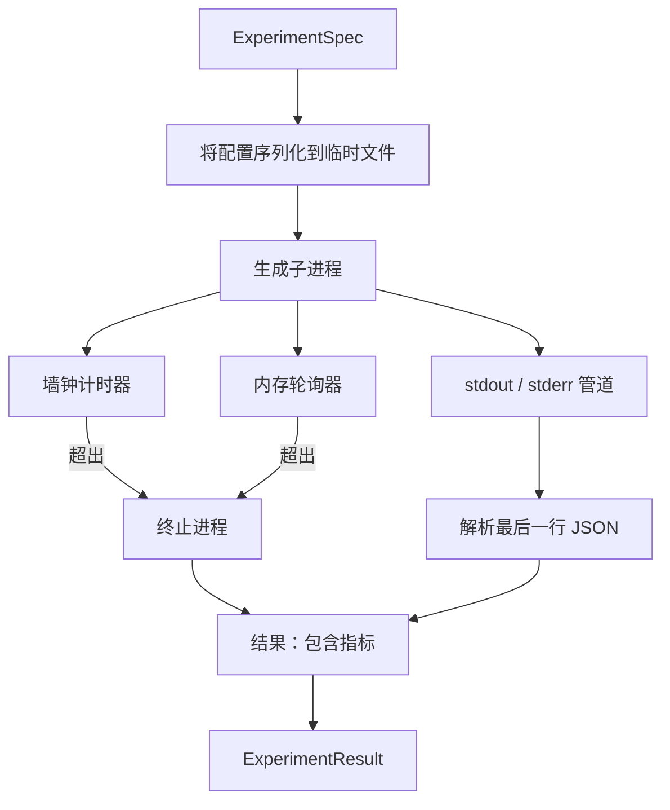

# 实验运行器

> 循环的诚实程度取决于测量结果。构建一个接收规格、在沙箱子进程中执行，并输出评估器可以信任的 JSON 指标块的运行器。

**类型：** 构建
**语言：** Python
**前置条件：** Phase 19 Track A 第 20–29 课
**用时：** 约 90 分钟

## 学习目标
- 将实验编码为可序列化给子进程的类型化规格。
- 启动带硬性墙钟超时和软内存上限的子进程，并将二者作为终止条件呈现。
- 将 stdout、stderr 和结构化指标块收集到单一结果记录中。
- 在固定基础规格上每次只扫描一个配置旋钮，构建消融表。
- 对给定种子的每个结果保持确定性，使评估器在各次运行中看到相同数字。

## 为什么使用子进程

研究循环会运行不受信任的代码。假设来自采样器，实验脚本也来自同一条路径；把任意一方当作进程内安全代码，等于请求一次会拖垮编排器的崩溃。子进程是语言本身提供的最简单隔离方式：独立进程、独立地址空间，以及父进程一侧的信号句柄。

本课不实现完整沙箱。这里没有 cgroup、seccomp 过滤器或命名空间重映射，只有墙钟超时、监控内存增长的轮询循环，以及任一限制触发时终止进程的路径。这就是更复杂沙箱都可以扩展的运行时契约。本课将契约控制在一次学习中能够读完的范围内。

## ExperimentSpec 的形状

```text
ExperimentSpec
  spec_id        : str            (stable id, "exp_001")
  hypothesis_id  : int            (link back to the queue from lesson 50)
  script_path    : str            (path to the python script to run)
  config         : dict           (passed to the script as one json arg)
  seed           : int            (deterministic seed for the experiment)
  wall_timeout_s : float          (hard timeout, killed on exceed)
  memory_cap_mb  : int            (soft cap, polled; killed on exceed)
  metric_keys    : list[str]      (which fields the evaluator will read)
```

脚本位于磁盘上；运行器将配置写入临时文件路径，脚本再读取该文件。脚本应在 stdout 输出一行 JSON，其键是 `metric_keys` 的超集。stdout 中的其他内容会被收集，但指标解析器会忽略它们。

```figure
cg-runner-limits
```

## 架构



运行器是一个带一个主方法的类。轮询器是一个小线程，每个轮询间隔唤醒一次；在可用时从 proc 文件系统读取子进程的 `psutil` 等价信息，在平台不提供该能力时退化为空操作。

## 为什么是软内存上限

硬内存上限需要 `resource.setrlimit`，且只在 POSIX 上可用。本课提供可移植方案：轮询平台报告的常驻集大小，超过上限就终止子进程。它是软上限，因为轮询器有非零间隔；进程可能在两次轮询之间短暂超过上限，随后又降回去。运行器记录观测到的最大 RSS，让评估器知道运行距离上限有多近。

在不支持进程检查的系统上，轮询器记录一次警告并停用自身，墙钟超时仍然生效。测试覆盖这两条路径。

## 捕获 stdout 和 stderr

运行器在完成时读取并排空两条管道。它逐行扫描 stdout；最后一行能解析为 JSON 且包含全部必需 `metric_keys` 的内容，会被作为指标块。更早的 JSON 行保存在结果的 `intermediate_metrics` 中，评估器可以用它们绘制学习曲线。

stderr 原样收集到结果中。运行器不会因非零退出码抛出异常，而是将退出码记录在结果里。任何非零退出都会被标记为 `"crash"`，即使脚本输出了指标；因此评估器默认将部分运行视为失败。

## 消融表

```python
def ablate(base: ExperimentSpec, knob: str, values: list[Any]) -> list[ExperimentSpec]:
    ...
```

给定基础规格和旋钮名称，该辅助函数会为每个值返回一个规格，并覆盖 `config[knob]`。每个规格都会得到派生的 `spec_id`（`f"{base.spec_id}_{knob}_{value}"`）。运行器提供 `AblationRunner`，按顺序执行这些规格，并返回以旋钮值为键的 `AblationTable`。

为什么一次只扫描一个旋钮？全因子扫描会指数级膨胀，并产生评估器无法解释的结果。一次一个旋钮会形成清晰的轴，评估器可以据此绘图。本课只支持将多旋钮扫描作为重复的单旋钮消融，由调用方组合。

## 确定性

每个规格都携带一个种子。运行器通过配置字典把种子传给脚本（`config["__seed"] = spec.seed`）。`code/experiments/` 中的模拟实验脚本遵守该种子，在不同运行中产生相同指标。第 53 课的评估器依赖这一点；没有确定性，“回归”可能只是换了一个随机初始化。

## 模拟实验脚本

本课提供一个实验脚本：`code/experiments/sparsity_experiment.py`。它是真实脚本，会读取配置文件，使用 numpy 随机过程模拟小型训练，并输出 JSON 指标块。脚本遵守 `sleep_s` 旋钮以测试超时，也遵守 `allocate_mb` 旋钮以测试内存轮询器。

模拟并未训练真实模型，而是模拟训练循环的形状：损失曲线、最终困惑度和墙钟时间。本课重点是运行器，不是模拟过程；真实实验脚本会导入模型。

## 结果形状

```text
ExperimentResult
  spec_id              : str
  hypothesis_id        : int
  exit_code            : int
  terminal             : "ok" | "timeout" | "oom" | "crash"
  wall_time_s          : float
  peak_rss_mb          : float | None
  metrics              : dict
  intermediate_metrics : list[dict]
  stdout_tail          : str
  stderr_tail          : str
```

评估器首先读取 `metrics` 和 `terminal`。如果 terminal 不是 `"ok"`，实验就算失败，评估器自动给出判定；否则指标会进入显著性检验。

## 如何阅读代码

`code/main.py` 定义 `ExperimentSpec`、`ExperimentResult`、`ExperimentRunner`、`AblationRunner` 和确定性演示。子进程管理集中在一个类中，内存轮询器是一个小线程，消融辅助函数是单一函数。

`code/experiments/sparsity_experiment.py` 是测试使用的模拟实验。它从 argv 读取配置文件路径，在完成时写出一行 JSON 指标。

`code/tests/test_runner.py` 覆盖成功、超时、崩溃、消融表，以及两次运行之间的确定性检查。

## 它在整体流程中的位置

第 50 课生成假设；第 51 课过滤文献已经解决的问题；第 52 课运行剩余假设的实验；第 53 课读取结果、执行显著性检验，并写出编排器按假设 ID 保存的判定。
