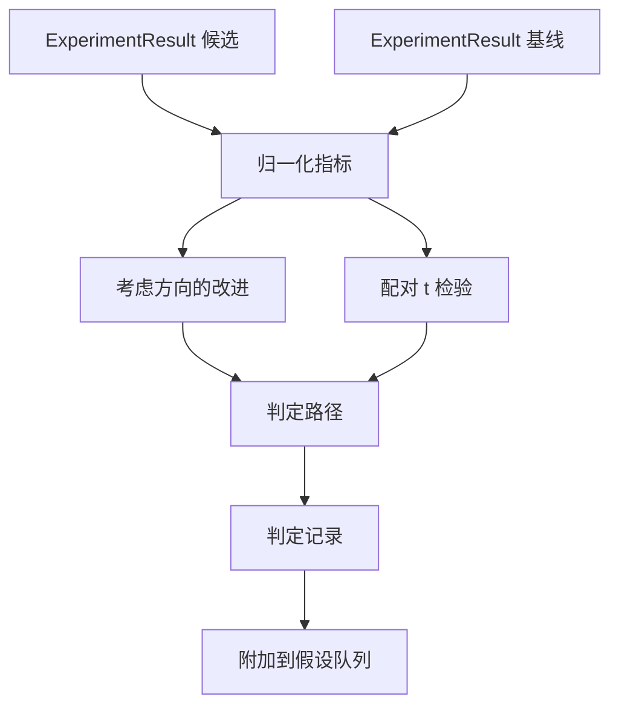

# 结果评估器

> 运行器产出了数字。评估器判断这些数字代表改进、回归还是噪声，并将指标转成一句结论。

**类型：** 构建
**语言：** Python
**前置条件：** Phase 19 Track A 第 20–29 课
**用时：** 约 90 分钟

## 学习目标
- 用考虑方向的改进值和固定阈值比较候选运行与基线。
- 从零对各随机种子的指标执行配对 t 检验并读取 p 值。
- 归一化对数尺度指标，使下游报告能与线性指标混合。
- 为每个假设输出判定，供编排器挂接到第 50 课的队列。
- 保持每一步纯函数化，使相同输入始终产生相同判定。

## 为什么使用配对检验

运行器的一个数字无法说明变化是否真实。同一配置换一个种子会得到不同困惑度，变化可能只是噪声。正确比较方式是配对：相同种子、相同数据下，候选和基线各运行一次。每个种子贡献一个差值，差值均值是效应，差值标准误是噪声底线。

本课从零实现该检验，不使用 `scipy.stats`。数学内容很少，一屏就能读完。

```text
diffs    = [a_i - b_i for i in seeds]
mean     = sum(diffs) / n
variance = sum((d - mean) ** 2 for d in diffs) / (n - 1)
t_stat   = mean / sqrt(variance / n)
df       = n - 1
p_value  = two_sided_p(t_stat, df)
```

双侧 p 值使用正则化不完全 beta 函数。本课提供采用 Lentz 连分式的小型实现，全部代码约六十行标准库数学代码。

## 考虑方向的改进

有些指标越高越好（准确率、吞吐量），另一些越低越好（损失、困惑度、墙钟时间）。评估器为每个指标携带 `direction` 字段。

```text
if direction == "higher_is_better":
    improvement = (candidate - baseline) / abs(baseline)
elif direction == "lower_is_better":
    improvement = (baseline - candidate) / abs(baseline)
```

改进值带符号。对于越高越好的指标，负改进意味着候选更差。判定路径同时读取符号和幅度。

固定阈值（`improvement_threshold=0.02`，即百分之二）决定变化是否大到值得判定。低于阈值时，无论 p 值如何，判定都是“噪声”；循环不关心用户无法测量的变化。

```figure
cg-paired-verdict
```

## 架构



评估器运行三个相互独立的计算，并在判定路径中合并它们。每个计算都是没有共享状态的纯函数。

## 对数归一化

困惑度是损失的指数函数，损失下降 0.1 对困惑度的影响并不相同。直接跨配置比较困惑度没有问题，但要在同一报告中把它和线性指标混合，就需要归一化。

当指标的 `scale` 为 `"log"` 时，本课先取自然对数，再计算改进值，随后在对数空间应用阈值。困惑度从 32 降到 28 时，`log(28) - log(32) = -0.133`；对于越低越好的指标，这远高于百分之二阈值。

```text
if scale == "log":
    a = log(candidate)
    b = log(baseline)
else:
    a = candidate
    b = baseline
```

`scale="linear"` 的指标（默认值）跳过变换，同一代码路径即可处理两种尺度。

## 按种子配对检验

第 52 课的运行器每次运行输出一个最终指标块。配对检验需要候选和基线各自按种子提供一个指标块。编排器在一组种子上以两种配置运行同一实验，并将两组 `ExperimentResult` 记录交给评估器。

评估器按种子配对（种子位于 `result.metrics["seed"]`），再读取指定指标。如果两组种子不一致，评估器抛出 `PairingError`；编排器应重新运行。

## Verdict 的形状

```text
Verdict
  hypothesis_id          : int
  metric                 : str
  direction              : "higher_is_better" | "lower_is_better"
  scale                  : "linear" | "log"
  candidate_mean         : float
  baseline_mean          : float
  improvement            : float       (signed, fraction; see direction rules)
  p_value                : float | None  (None if n < 2)
  significance_threshold : float
  improvement_threshold  : float
  verdict                : "improved" | "regressed" | "noise" | "failed"
  rationale              : str
```

判定路径是一张小型决策表：

```text
1. If any candidate result has terminal != "ok": verdict = "failed"
2. else if |improvement| < improvement_threshold:  verdict = "noise"
3. else if p_value is None or p_value > significance: verdict = "noise"
4. else if improvement > 0:                          verdict = "improved"
5. else:                                             verdict = "regressed"
```

`rationale` 是供编排器记录在假设 ID 旁的一行人类可读说明。

## 如何阅读代码

`code/main.py` 定义 `MetricSpec`、`Verdict`、`Evaluator`、t 统计量和不完全 beta 辅助函数，以及确定性演示。t 检验使用纯标准库数学实现；只有读取指标列表并计算均值、方差时使用 numpy。

`code/tests/test_evaluator.py` 覆盖改进、回归、小改进噪声、样本量过低噪声、失败终止、对数归一化、已知参考值的 t 检验和配对错误。

## 它在整体流程中的位置

第 50 课产生假设队列；第 51 课过滤文献已解决的内容；第 52 课在各个种子上运行候选和基线实验；第 53 课读取这些运行并写出判定。编排器将四课串起来：

```text
for hypothesis in queue:
    literature = retrieval.search(hypothesis.text)
    if literature_settles(hypothesis, literature):
        attach(hypothesis, verdict="settled")
        continue
    candidates = runner.run_all(specs_for(hypothesis))
    baselines  = runner.run_all(baseline_specs_for(hypothesis))
    metric_spec = MetricSpec("perplexity", direction=LOWER, scale=LOG)
    verdict = evaluator.evaluate(hypothesis.id, metric_spec, candidates, baselines)
    attach(hypothesis, verdict)
```

该编排器不在本课中；四课通过各自定义的数据类组合起来，不需要额外胶水。
