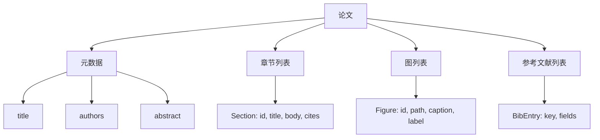
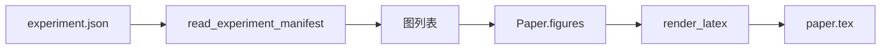
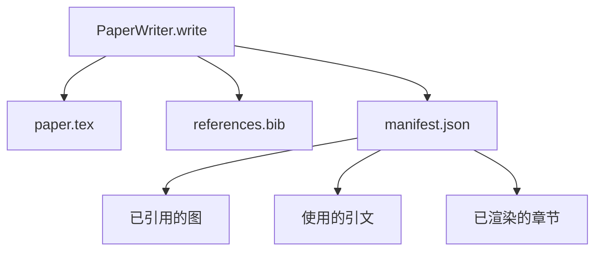

# 论文写作者

> LaTeX 骨架是研究者与排版者之间的契约。契约一旦破坏，文档就无法编译，而且失败会明确暴露。先构建骨架，再填入内容。

**类型：** 构建
**语言：** Python
**前置条件：** Phase 19 第 50–53 课
**用时：** 约 90 分钟

## 学习目标
- 将论文视为具有明确章节图的结构化产物，而不是自由文本。
- 生成 LaTeX 骨架，在写正文前声明摘要、章节、图位和参考文献键。
- 通过确定性的槽位机制，将实验输出中的图（路径和标题）注入骨架。
- 接入从结构化提纲填充各章节的模拟文本生成器，使测试无需模型即可完成。
- 输出一个 `paper.tex`、一个 `references.bib` 和一个列出所有引用图片及引文的清单。

```figure
ch-paper-skeleton
```

## 为什么先做骨架

从正文开始的草稿会积累结构债务：引言长出本该属于相关工作的三段文字，图片在定义前就被引用，参考文献中同一论文出现三个键。作者发现时，重写成本已经高于写作成本。

骨架将这一过程倒转：结构预先作为数据声明。章节是带名称和顺序的槽位，图片是带 ID 和标题的槽位，参考文献键在顶部连同指向的条目一起声明。正文一次填入一个槽位。即使还没有写正文，测试框架也能验证每张图都有槽位、每个引文都有条目、每个章节都出现在目录中。

这与前面课程应用于计划、工具调用和追踪的纪律相同：结构就是契约。

## Paper 的形状



每个字段都是普通 Python 数据。渲染器是从 `Paper` 到 LaTeX 字符串的纯函数。渲染前测试框架可以检查论文：统计章节、列出缺失图片文件，并验证每个 `\cite{key}` 都有匹配的 `BibEntry`。

## 渲染契约

渲染器保证三项属性。第一，骨架中的每个图片槽位都会输出一个带稳定 `fig:<id>` 标签的 `\begin{figure}` 块。第二，每个章节都会输出一个带稳定 `sec:<id>` 标签的 `\section{}`，以支持交叉引用。第三，参考文献会输出 `\bibliography` 块，而 `references.bib` 恰好包含论文声明的全部条目，不多不少。

违反任一项都会产生渲染错误，而不是警告。骨架就是契约；悄悄丢掉图片的渲染属于契约破坏。

## 从实验注入图片

本轨前面的课程将实验输出为 JSON 清单。每份清单带有包含路径和简短标题的产物列表。论文写作者读取清单并生成 `Figure` 记录。



注入是确定性的。图片 ID 由实验名称和单调递增计数器生成；标题来自清单。路径会相对于论文输出目录归一化，因此即使实验输出位于磁盘其他位置，LaTeX 也能编译。

## 模拟文本生成器

本课不调用模型。`MockProseGenerator` 读取提纲形状并确定性地产生正文。提纲为每个章节提供一个短字符串，生成器将其扩展为两段短文，并把章节标题织入其中。当提纲声明图片和引文时，生成正文会准确点名它们。

这足以测试写作者的全部行为。真实实现只需把生成器替换为模型调用；模型测试替换为确定性生成器，生产环境再替换为模型，其余管线无需变化。这就是将文本生成器声明为可调用对象的价值。

## 清单输出

写作者向输出目录写出三个文件。



下游评估器或批评循环读取清单，而不是解析 LaTeX。下一课的批评循环以此清单为输入并产生反馈列表，因此清单和 LaTeX 一样属于契约。

## 验证门

写入任何文件前，写作者运行四道门：

1. 论文内每个图片 ID 都唯一。
2. 每个章节的 `cites` 字段都引用论文声明的参考文献键。
3. 摘要非空。
4. 标题非空。

验证失败会抛出带精确原因的 `PaperValidationError`。测试框架将原因呈现为失败模式。不会部分写入：要么三个文件全部产生，要么一个也不产生。

## 如何阅读代码

`code/main.py` 定义 `Paper`、`Section`、`Figure`、`BibEntry`、`PaperValidationError`、`MockProseGenerator`、`PaperWriter` 和 `render_latex` 函数。`write` 方法接收输出目录，并写出 `paper.tex`、`references.bib` 和 `manifest.json`。`read_experiment_manifest` 辅助函数将实验清单列表转换为 `Figure` 记录。

`code/tests/test_paper_writer.py` 覆盖：无章节的骨架渲染、含两个章节和两张图的完整渲染、缺失引文门、重复图片 ID 门、清单内容，以及 LaTeX 字符串契约（每个章节输出 `\section{}`，每张图输出 `\begin{figure}`）。

## 进一步扩展

真实实现会需要两个扩展。第一，多格式渲染：相同的 `Paper` 形状编译为博客用 Markdown 和预览用 HTML，渲染器成为 `Paper` 上的策略。第二，引文增强：给定本地 DOI 缓存，写作者按引文键获取 BibTeX 条目。两者都能在不触碰骨架契约的情况下增加价值。

骨架是核心押注：章节、图片和引文作为数据声明，正文生成到槽位中，清单与 LaTeX 一起输出。其他改进都可以在此基础上组合。
