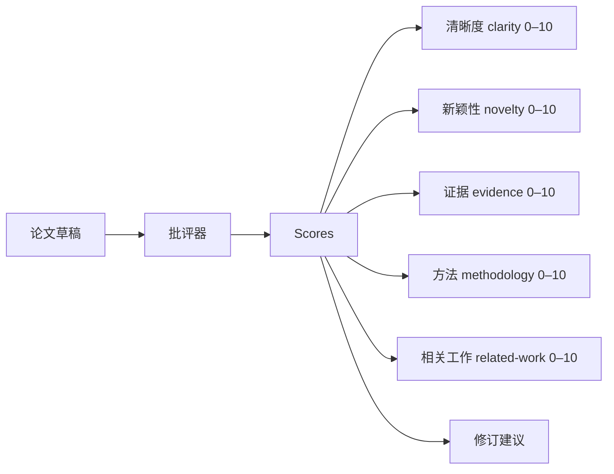
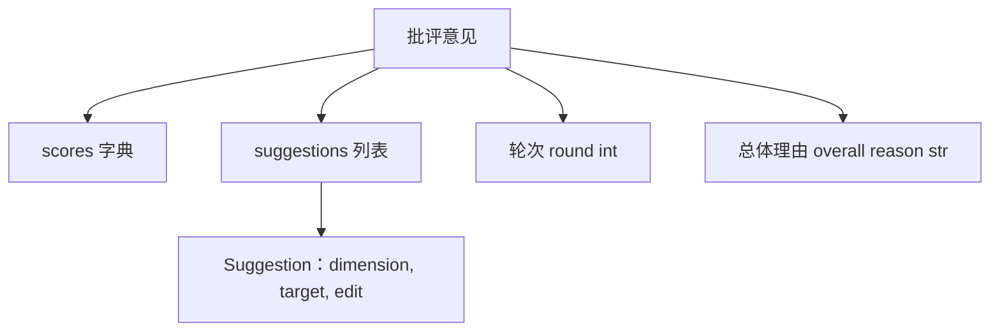
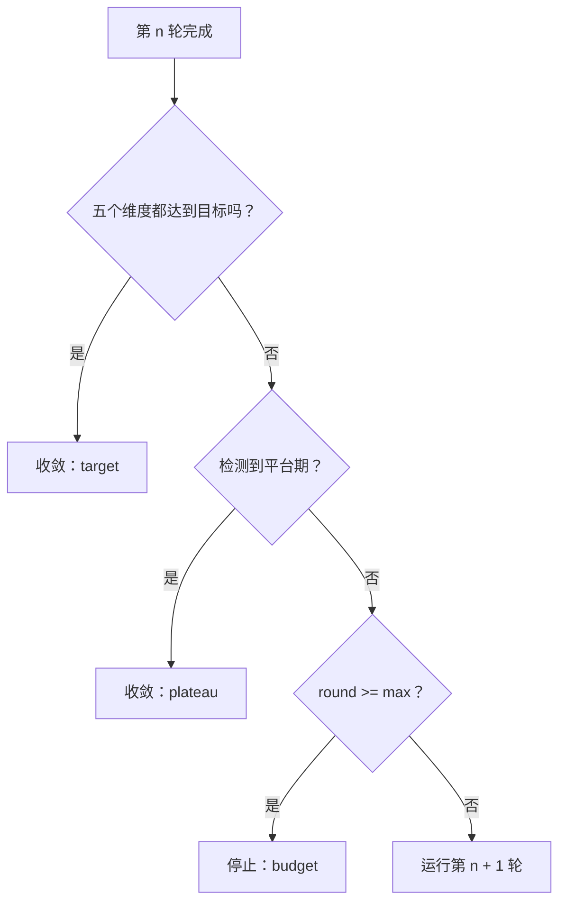
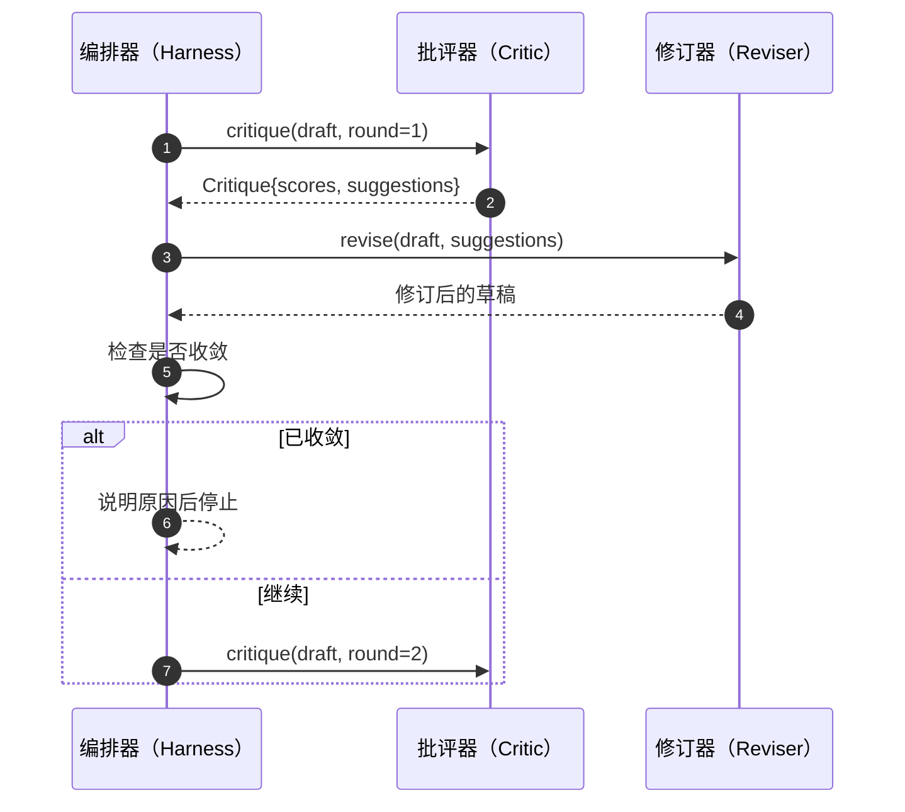

# 批评器循环

> 第一次就返回“看起来不错”的批评器坏了；永远返回“需要修改”的批评器也坏了。真正有意思的是能够收敛的批评器，而收敛需要工程设计。

**类型：** 构建
**语言：** Python
**前置课程：** Phase 19 课程 50–53
**时间：** 约 90 分钟

## 学习目标

- 在清晰度、新颖性、证据、方法论、相关工作五个固定维度上为论文草稿评分。
- 将每轮批评应用为结构化修订差异，而不是自由改写。
- 通过比较各轮分数检测收敛；在达到平台期、目标或预算耗尽时停止。
- 用最大迭代预算限制轮数，避免不收敛的批评器无限运行。
- 输出逐轮轨迹，让仪表盘或下一阶段能够绘制分数变化。

```figure
ch-critic-converge
```

## 为什么使用五个固定维度

自由形式的批评器只返回一段建议，下一轮修订把这段话当作周边上下文。由于批评从未结构化，我们无法验证改写是否真正回应了批评。

五个维度为工具提供了契约。



分数是一个向量。工具会观察每个维度跨轮次的变化：如果修订提高了清晰度却让证据分下降，那么证据维度发生了回归，收敛检查会发现它。仅由模型给出批评无法提供这种保证。

## Critique 的结构



每条建议都携带它要改善的维度、目标章节，以及修订器能够执行的 `edit` 指令。修订器本身也是可调用对象。本课提供一个确定性修订器，把编辑指令解释为“追加到章节”；模型驱动的修订器则会把同一字段解释成提示词，但契约不变。

## 收敛规则（按顺序）

批评器循环在以下三个条件任一触发时终止。



目标是最严格的情况：五个维度都必须达到 `>= target_score`（默认 `8.0`），循环才返回成功。平均分很高但有一个弱项仍然不够。平台期检测比较当前轮和上一轮的平均分；如果连续两轮提升低于 `plateau_epsilon`（默认 `0.1`），循环以 `plateau` 退出。预算是轮数的硬上限（默认 `5`），以 `budget` 退出。

顺序很重要：目标优先于平台期，平台期优先于预算。如果第三轮同时达到目标并触发平台期，结果是 `target`，不是 `plateau`。

## 为什么平台期要观察两轮

单轮平台期可能只是噪声。即使评分是确定性的，真实批评器在固定草稿上每次迭代也可能略有不同，因为应用建议的顺序不同。要求连续两轮平台期可以滤掉噪声；工具报告平台期时，草稿确实已经停止改进。

## 本课的确定性批评器

本课不调用模型。提供的批评器根据三个信号为草稿评分：章节正文平均长度（清晰度）、图和引用数量（证据），以及论文元数据中的 `originality_tag` 字段（新颖性）。修订器知道如何提高每项分数。

```text
clarity      grows when the average section body length increases
novelty      grows when originality_tag is set to "high"
evidence     grows when a section's figure_refs is non-empty
methodology  grows when a section titled "Method" exists with body
related-work grows when a section titled "Related Work" exists with body
```

修订器把每条建议解释为定向追加。第一轮之后，工具可以观察到分数上升；测试利用这一性质断言循环缩小了差距。

## 完整循环契约



工具拥有轮次计数器、轨迹和收敛检查；批评器拥有评分；修订器拥有差异。三者都不触碰其他组件的状态。

## Trace 输出

每轮输出一个轨迹事件，包含轮次、分数向量、建议数量和收敛判定。完整轨迹与最终草稿一同返回，下游仪表盘可以绘制逐轮分数图；下一课的迭代调度器会读取轨迹，决定是否保留该分支。

## 保护坏批评器的预算

如果批评器给出的建议始终不能提高分数，循环会锁定在最大迭代上限。轨迹会明确显示：五轮、分数持平、判定为 `budget`。用户可以据此判断是批评器有问题，而不是草稿有问题。只展示最终草稿会隐藏诊断信息；优先记录轨迹能够暴露它。

## 如何阅读代码

`code/main.py` 定义 `Critique`、`Suggestion`、`Critic` 协议、`Reviser` 协议、`CriticLoop`，以及返回确定性批评器和匹配修订器的 `make_deterministic_critic_pair` 工厂。文件还包含最小 `Paper` 结构，使本课可以独立运行。

`code/tests/test_critic_loop.py` 覆盖：第一轮后的单调改进、调优草稿上的目标收敛、两轮平坦后的平台期检测、没有建议改善时的预算耗尽、修订器应用建议，以及轨迹结构。

## 进一步探索

真实实现通常还需要两个扩展。第一是维度权重：研讨会论文可以提高新颖性的权重，期刊论文则可能相反；收敛检查改为加权平均。第二是成对批评器：一个负责评分，另一个在修订器看到建议前进行仲裁。两者都有价值，并且都能在不改变 `Critique` 结构的情况下组合进来。

核心押注是分数向量。一旦批评结构化，其他改进、收敛规则、仪表盘和成对批评器都能直接加入，而无需改变循环。
