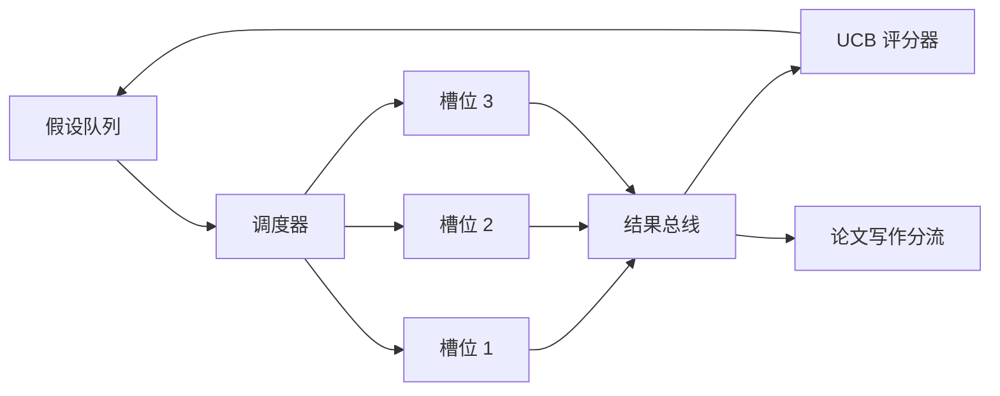
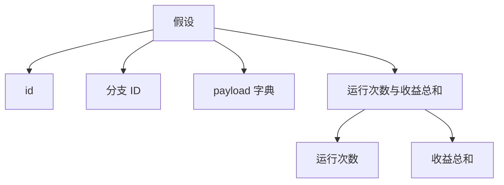
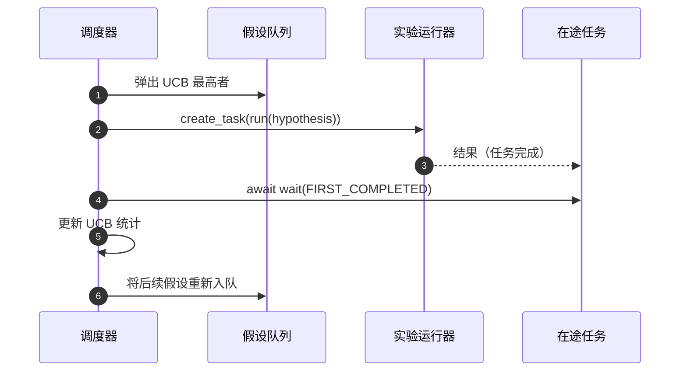

# 迭代调度器

> 没有调度器的研究循环只是一个自以为是的队列。调度器决定停止探索什么，而这项决定就是整个游戏。

**类型：** 构建
**语言：** Python
**前置课程：** Phase 19 课程 50–53
**时间：** 约 90 分钟

## 学习目标

- 将研究工作流建模为假设队列：队列向并行实验槽供给任务，结果再汇合回来。
- 使用 asyncio 并发运行多个实验，让调度器保持所有槽位忙碌。
- 使用 UCB 为假设分支评分，在保留探索的同时剪掉低收益分支。
- 将完成的结果分流到论文写作和重新入队阶段，让高收益分支产生后续假设。
- 输出逐迭代轨迹，展示分支分数、槽位占用和剪枝决策。

```figure
ch-ucb-scheduler
```

## 为什么需要调度器，而不是工作列表

扁平工作列表按提交顺序运行任务；当任务彼此独立时这没问题。但研究并不独立：实验三的发现会改变实验四、五的优先级。能够读取结果汇合并重新排序队列的调度器，能在每单位计算量上完成更多有用工作。

真正有意思的设计选择是评分规则。贪心评分器总选当前领先者，从不探索；均匀评分器又从不利用优势。UCB（上置信界）走中间路线：利用领先分支，同时为尝试较少的分支保留容量。

## 系统结构



队列保存假设。槽位释放时，调度器选择 UCB 最高的假设。每个槽异步运行一个实验，完成后将结果放到总线上。总线更新原分支的 UCB 统计；当分支收益超过阈值时，再把结果分流到论文写作阶段。

## Hypothesis 结构



`branch` 是 UCB 统计的键。多个假设可以共享一个分支（分支代表研究方向，假设代表其中一次试验）。`runs` 是该分支完成的实验数，`reward_sum` 是累计收益；UCB 会读取两者。

## UCB 评分

本课使用经典的 UCB1 公式。

```text
ucb(branch) = mean_reward(branch) + c * sqrt( ln(total_runs) / runs(branch) )
```

`total_runs` 是所有分支完成的实验总数，`c` 是探索权重，课程默认值为 `sqrt(2)`。运行次数为零的分支得到 `+inf`，因此未尝试分支总会优先调度。平均收益高的分支会保持高分，直到其他分支追上；多次运行却收益不高的分支会被尝试较少的候选超越。

剪枝门槛与选择器分开：当分支至少完成 `prune_after_runs` 次试验（默认 `3`）后，如果平均收益低于绝对下限（默认 `0.2`），就从后续调度中移除该分支，以保持队列有界。

## 使用 asyncio 的并行槽位

调度器通过 `asyncio.create_task` 驱动实验。每个任务运行一个返回 `Result` 的异步实验运行器（`async def` 可调用对象）。主循环用 `asyncio.wait(..., return_when=asyncio.FIRST_COMPLETED)` 等待在途任务集合，并在每个任务完成时触发评分更新。



三个槽位并发运行，主循环不会阻塞在单个实验上。只要有槽位释放，调度器就启动新任务，直到队列为空且没有在途任务。

## 分流：论文触发器

当分支平均收益超过 `paper_threshold`（默认 `0.7`）且尚未产出论文时，调度器会向输出列表加入 `paper.trigger` 事件。下一课的论文写作者会接收它；本课把触发器捕获为列表，以便测试断言。

## 分流：后续假设

高收益结果到达时，调度器可以调用用户提供的 `expander`，在同一分支上生成一个或多个后续假设。`expander` 是从 `Result` 到 `list[Hypothesis]` 的纯函数。本课提供的确定性扩展器会为任何收益超过论文阈值的结果生成两个后续假设。

## 预算

两个预算防止调度器失控。

```text
max_experiments    : total count of experiments run across all branches
max_seconds        : wall-clock cap (asyncio time)
```

任一预算触发时，调度器停止安排新任务，等待在途任务完成，并返回最终轨迹。轨迹包含 `stop_reason`。

## 轨迹和最终报告

每次调度决策（选择、派发、结果、剪枝、分流）都会输出一个事件。最终报告汇总各分支统计、运行总数、总墙钟时间和触发的论文事件。下一课的端到端演示会读取该报告来驱动论文写作者。

## 如何阅读代码

`code/main.py` 定义 `Hypothesis`、`Result`、`BranchStats`、`IterationScheduler`，以及返回可预测收益的 asyncio 实验运行器工厂 `make_deterministic_runner`。运行器会休眠固定的 `delay_ms`（默认 `5ms`），因此可以观察到并发。

`code/tests/test_scheduler.py` 覆盖：UCB 优先选择未尝试分支、并行槽位占用、达到阈值时触发论文、低收益试验后的分支剪枝、后续假设分流，以及实验数量和墙钟时间两种预算退出。

## 进一步探索

真实实现通常需要三个扩展。第一是跨会话持久化 UCB 统计：当前统计存在内存中，真实调度器会保存检查点，使重启后仍保留已经消耗的探索预算。第二是多目标评分：每个结果输出向量，UCB 变成 Pareto 式选择器。第三是上下文 bandit：选择器根据假设特征（长度、复杂度）决策，让相似假设共享探索。

调度器让研究不再只是工作列表。接入 UCB 并行运行槽位后，其他改进都可以在其上组合。
