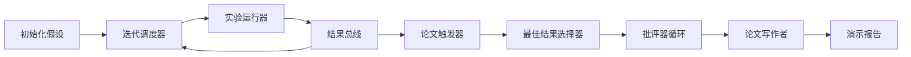
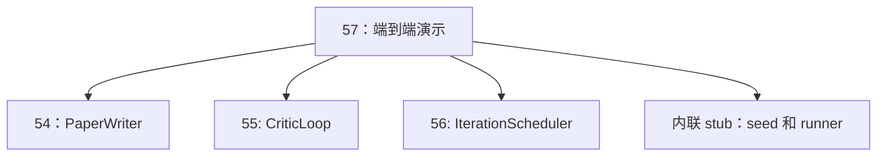
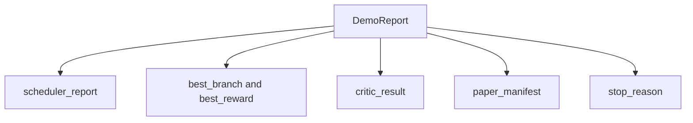

# 端到端研究演示

> 演示是检验此前所有契约能否组合的地方。只要其中一个契约泄漏，演示就会把问题捕捉出来。

**类型：** 构建
**语言：** Python
**前置课程：** Phase 19 课程 50–53
**时间：** 约 90 分钟

## 学习目标

- 端到端连接自动研究循环：假设种子、实验运行器、调度器、批评器循环和论文写作者。
- 通过普通 Python 导入组合前四个 Track D 课程的原语，而不是使用框架。
- 运行循环直到自行终止，并输出列出每个阶段结果的单一演示报告。
- 保持演示确定性，使测试套件能够断言最终结构。
- 当任一阶段契约损坏时暴露清晰的失败模式，避免下一阶段使用坏输入继续运行。

```figure
ch-research-pipeline
```

## 这里组合了什么



共有五个阶段。种子是三个假设的列表；调度器用三个并行槽运行六个实验；总线报告一个或多个论文触发器；选择器挑出唯一最佳结果；批评器循环修订由该结果构建的草稿；论文写作者输出最终 LaTeX、BibTeX 和清单。

## 为什么导入，而不是复制

每个前置课程都通过 `main.py` 提供公开数据类和函数。演示调整 `sys.path`，从各课程的父目录导入它们。这不是框架接线，而是前置课程测试文件已经使用的同一种导入方式。



内联桩替代课程 50–53：它生成少量种子假设和同步收益函数。调整两个导入即可换成那些课程的真实原语。

## 确定性保证

演示从设计上就是确定性的：实验运行器使用带种子的 numpy；批评器修订器按固定维度和固定顺序遍历；论文写作者使用课程 54 的模拟文本生成器；UCB 选择器按迭代顺序处理平局，而不是随机选择。

给定相同种子，演示会输出相同报告。测试通过运行两次演示并比较清单来断言这一性质。

## 演示报告结构



每个字段都原样来自上游阶段。演示不转换输出，只负责组合；这正是演示要测试的内容。

## 失败模式处理

每个阶段要么成功，要么抛出类型化错误。

```text
Scheduler ........ returns SchedulerReport with stop_reason
                   in {queue_empty, max_experiments, deadline}
Best-result pick . raises NoTriggerError if no paper trigger fired
Critic loop ...... returns LoopResult with status converged or stopped
Paper writer ..... raises PaperValidationError on contract break
```

任一阶段失败都会以类型化异常短路演示。测试固定了这一契约：当没有分支触发事件时，`test_no_triggers_raises_typed_error` 和 `test_best_picker_raises_when_no_triggers` 断言选择器抛出 `NoTriggerError` / `BestResultError`，且写作者不会被调用。

## 最佳结果选择器

调度器按分支输出论文触发器。选择器从所有触发器中选取平均收益最高的分支；平局按分支 ID 的字母顺序打破，使演示保持确定性。选择器是小型纯函数，测试会用固定调度器报告固定它的行为。

## 接入批评器循环

课程 55 的批评器循环处理 `MiniPaper`。演示用选中的分支构建它：将分支 ID 放入摘要，预置 Introduction 和 Results 两个章节，并根据分支平均收益设置 `originality_tag`（`>= 0.8` 为 high，`>= 0.6` 为 medium，否则为 low）。

修订器随后让草稿迭代至收敛，输出交给论文写作者。

## 接入论文写作者

课程 54 的论文写作者处理带图和参考文献的完整 `Paper`。演示通过 `mini_to_full_paper` 升级收敛后的 `MiniPaper`：为选中分支附加一幅图，并根据批评器建议的引用键并集建立小型合成参考文献。演示添加的每个引用也会加入参考文献列表，因此验证能够通过。

## 如何阅读代码

`code/main.py` 定义 `BestResultError`、`NoTriggerError`、`DemoReport`、`pick_best_branch`、`build_mini_paper`、`mini_to_full_paper` 和 `run_demo`。文件顶部只调整一次 `sys.path`，然后从对应课程导入 `PaperWriter`、`CriticLoop` 和 `IterationScheduler`。

`code/tests/test_e2e.py` 覆盖：端到端演示及五个非空字段、两次运行的确定性、没有分支越过阈值时的 `NoTriggerError`、写作者契约损坏时的 `PaperValidationError`、清单包含选中分支的图，以及调度器停止原因属于预期集合。

## 进一步探索

演示稳定后值得接入三个扩展。第一是持久化状态：各阶段结果写入小型 JSON 存储，重启时无需重复运行便宜阶段。第二是仪表盘：把调度器和批评器循环的轨迹事件绘制成一条时间线。第三是真实模型调用：替换模拟文本生成器和确定性批评器，接线方式无需改变。

演示的任务是证明组合就是架构：五个课程、四次导入、一个报告。下次增加阶段时，接线恰好多一行。
