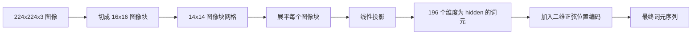

# 视觉编码器图块

> 能读取像素的视觉模型需要一个像素 tokenizer。图块嵌入就是这个 tokenizer：把图像切成方格，展平每个方格，用一个线性层投影，再加入二维位置信号，让 transformer 知道每个方格在原图中的位置。

**类型：** 构建
**语言：** Python
**前置课程：** Phase 19 课程 30–37（Track B 基础）
**时间：** 约 90 分钟

## 学习目标

- 将图像标记化为固定长度的图块嵌入序列。
- 实现基于 `Conv2d` 的图块投影，并与先 unfold 再 linear 的数学结果一致。
- 构建确定性的二维正弦位置嵌入，让 token 顺序编码空间位置。
- 在合成夹具上验证图块数量、嵌入形状，以及 `Conv2d` 与 unfold 的等价性。

## 问题

Transformer 接收向量序列，而图像是三通道网格。把每个像素都当作 token 会让序列长度爆炸：224x224 RGB 图像有 150,528 个 token，12 层 transformer 无法承担其注意力开销；把图像读成一个巨大平坦向量又会丢失局部性，注意力层无法从中恢复。编码器前端的任务，是将像素网格压缩成几百个 token，每个 token 概括一个方形区域。

图块嵌入用一次线性投影解决这个问题。224x224 图像切成 16x16 图块后得到 14x14、即 196 个图块。每个图块从 `(3, 16, 16) = 768` 个像素值展平为向量，再由线性层映射到模型隐藏维度。Transformer 看到的是 196 个、维度为 `hidden`（通常为 768）的 token，外加 CLS token。

## 概念



### 为什么使用图块，而不是像素

注意力的计算量与序列长度平方成正比。196-token 序列每个头每层需要 `196 * 196 = 38,416` 个注意力分数；150,528-token 序列需要 `150,528 * 150,528 = 22.6 billion` 个。图块让注意力计算量降低 590,000 倍，而一个 16x16 区域已经携带高层视觉任务所需的足够信号。代价是单个图块内部的细粒度空间信息损失，因此需要精确定位时，下游多模态系统常会再运行高分辨率分支。

### 为什么线性投影就足够

每个图块被视为独立向量。投影层学习一组基：边缘检测器、颜色滤波器和简单纹理。单个线性层很小（ViT-Base 中 `768 * 768 = 589,824` 个参数），训练也快。更深的卷积 stem 也存在，但平坦线性投影是标准做法。

### `Conv2d` 技巧

不加 padding 的 `Conv2d(in_channels=3, out_channels=hidden, kernel_size=patch_size, stride=patch_size)` 与先 unfold 再 linear 得到的数值结果相同，因为每个输出位置都用一个滤波器对图块像素做点积。卷积就是图块投影；生产代码通常这样实现，因为 GPU 上更快，还少一次 reshape。

### 位置嵌入

投影输出的 token 没有顺序信息。二维正弦嵌入为每个 token 提供编码 `(row, col)` 位置的固定信号。嵌入维度的一半用多种频率编码行，另一半编码列。该编码确定性强，因此无需重新训练即可更换分辨率，也能平滑插值到训练时未见过的网格。

| 组件 | 形状 | 参数 |
|-----------|-------|------------|
| 图块投影（`Conv2d`） | `(hidden, 3, patch, patch)` | `3 * P * P * hidden + hidden` |
| 位置嵌入（固定） | `(num_patches, hidden)` | 0（计算得到，不学习） |
| CLS token（学习得到） | `(1, hidden)` | `hidden` |

对于 224 分辨率的 ViT-Base/16：投影层有 590,592 个参数，CLS token 有 768 个参数，正弦位置没有参数。下一课（59）会在此前端之上堆叠 12 层 transformer。

### 用等价性进行健全性检查

图块步骤有两种写法：`Conv2d` 投影，以及显式 unfold 后接 linear。相同权重必须产生相同输出；否则 unfold 数学有误，后面的编码器就建立在错误基础上。本课测试会检查这种等价性。

```figure
ch-patch-tokenizer
```

## 构建

`code/main.py` 实现：

- `PatchEmbed`：用 `Conv2d` 完成图块投影的 `nn.Module`。
- `sinusoidal_2d(grid_h, grid_w, dim)`：构建二维位置表的无状态函数。
- `VisionFrontEnd`：把图块嵌入、CLS 前置和位置相加组合成一次前向传播。
- `synthesize_image(seed)`：用 `numpy.random` 生成确定性的 224x224x3 夹具。
- 一个演示：运行夹具图像并打印输出形状、CLS token 范数和一行位置嵌入。

运行：

```bash
python3 code/main.py
```

输出中，224x224 夹具会被标记化为 `(1, 197, 768)`；第一个 token 是 CLS，后面 196 个是图块 token。同一行内的位置嵌入范数一致，这是正弦编码的特征。

## 使用

相同的图块前端出现在现代视觉语言模型中：CLIP ViT-L/14、SigLIP、DINOv2、Qwen-VL 系列和 InternVL 都从 `Conv2d` 图块投影加位置编码开始。家族之间的差异在下游：CLS 或无 CLS 池化、register token、14 与 16 等不同图块大小，以及通过插值位置支持动态分辨率。本课前端是这些模型共同依赖的底座。

## 测试

`code/test_main.py` 覆盖：

- 图块数量符合 `(image_size / patch_size) ** 2`
- 输出形状符合 `(batch, num_patches + 1, hidden)`
- 小型夹具上 `Conv2d` 投影等于手工 unfold-then-linear
- 正弦位置表多次调用保持确定
- CLS token 在 batch 维广播且不发生泄漏

运行：

```bash
python3 -m unittest code/test_main.py
```

## 练习

1. 将正弦位置替换为学习得到的 `nn.Parameter`，比较小型合成分类任务的首轮损失。在固定分辨率上学习位置更好；训练后改变分辨率时正弦位置更好。
2. 用显式 `nn.Unfold` 加 `nn.Linear` 替换 `Conv2d`，断言输出在浮点容差内一致。
3. 支持非方形图块（例如宽画幅输入的 32x16），验证位置表能处理非方形网格。
4. 在 batch size 1、8、64 下分析图块步骤；瓶颈通常不在投影，而在下游注意力层。
5. 将前端作为冻结特征提取器训练于四类合成形状数据集（圆、方、三角、星形），CLS 输出应当能够线性分离。

## 关键术语

| 术语 | 含义 |
|------|---------------|
| 图块（Patch） | 图像中的方形子区域，通常为 14x14 或 16x16 |
| 图块嵌入 | 将一个展平图块线性投影到隐藏维度 |
| 序列长度 | 图块标记化后的 token 数，通常还要加 CLS |
| 正弦位置 | 编码二维网格坐标的固定 sin/cos 信号 |
| CLS token | 前置到序列、作为池化头的学习向量 |

## 延伸阅读

- An Image is Worth 16x16 Words（ViT，2021）：原始图块嵌入框架。
- Attention Is All You Need（2017）：本课改写为二维形式的正弦位置公式。
- DINOv2：register token 及练习 6 可扩展的内容。
