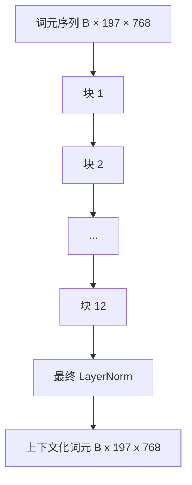
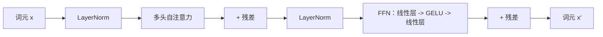

# Vision Transformer 编码器

> 只有图块还看不懂图像。一个拥有 12 层、12 个注意力头的 pre-LN transformer，能把图块序列变成上下文 token 序列，并让 CLS token 在最终隐藏状态中汇聚整幅图像特征。本课是现代视觉语言模型的引擎室。

**类型：** 构建
**语言：** Python
**前置课程：** Phase 19 课程 30–37（Track B 基础）
**时间：** 约 90 分钟

## 学习目标

- 实现带多头自注意力和前馈子层的 pre-LN transformer block。
- 堆叠 12 个、每个含 12 个头的 block，形成 ViT-Base 编码器。
- 将课程 58 的图块前端接入编码器并运行前向传播。
- 验证 CLS token 汇聚了来自每个图块的信息。

## 问题

图块嵌入产生 197 个 token，每个向量都不知道其他图块的内容。猫的图像需要每个图块知道哪些区域有胡须、哪些是背景、哪些包含眼睛。Transformer 通过一层层注意力建立这种感知；没有它，图块前端只是一个聪明的 tokenizer，并不理解图像。

标准方案是 12 层深、12 头宽，使用 pre-LayerNorm、GELU 和 4 倍前馈扩展。这一方案构成了 CLIP ViT-L、SigLIP、DINOv2、Qwen-VL 系列、InternVL 以及 2025–2026 年其他开放权重视觉编码器的骨架。除非论文明确另说，否则可以假定它们采用这一 block 形状。

## 概念





### Pre-LN 与 post-LN

原始 Transformer 把 LayerNorm 放在残差之后。现代视觉语言模型都使用 pre-LN（每个子层之前做 LayerNorm），因为它无需学习率预热技巧也能稳定训练。区别只在前向传播的一行，但在 12 层以上深度时梯度流差异巨大。

### 多头自注意力

每个头把 token 向量投影为自己的 `(query, key, value)` 三元组，维度为 `head_dim = hidden / num_heads`。当 `hidden = 768`、`heads = 12` 时，每个头的维度是 `64`。12 个头并行注意，再将输出拼回 768 维并通过输出投影。多头的意义在于，一个头可以学习“关注猫眼”，另一个头可以学习“关注背景渐变”，互不干扰。

### 为什么前馈层扩展 4 倍

FFN 依次执行 `hidden -> 4 * hidden -> hidden`，中间使用 GELU。自 2017 年以来，4 倍因子在语言和视觉 transformer 中都很稳定。较小的 2 倍容易欠拟合，固定数据预算下较大的 8 倍容易过拟合。MLP 存储了模型大部分学习到的事实，而更宽的中间层就是这些事实所在的空间。

| 组件 | ViT-Base 规模的参数 |
|-----------|------------------------------|
| 每个 block 的 qkv 投影 | `3 * 768 * 768 = 1.77M` |
| 每个 block 的输出投影 | `768 * 768 = 590K` |
| 每个 block 的 FFN（4 倍扩展） | `2 * 768 * 4 * 768 = 4.72M` |
| 每个 block 的 LayerNorm | `4 * 768 = 3K` |
| 每个 block 合计 | 约 7.1M |
| 12 个 block | 约 85M |
| 加上前端 | 总计约 86M |

ViT-Base 是一个 86M 参数的编码器。按 2026 年标准这并不大（SigLIP-So400M 为 400M，Qwen-VL ViT 为 675M），但除宽度和深度外，架构是相同的。

### 要不要因果掩码

Vision Transformer 是仅编码器且双向的：token `i` 可以关注任意 token `j`，因此不需要掩码。课程 61 的解码器交叉注意力会使用因果掩码；在视觉编码器内部，注意力是完全连接的。

### CLS token 学会什么

CLS token 起初是一个学习参数，本身没有图块内容；它在每个 block 中通过注意力从所有图块累积信息。到最终层时，CLS 行是整幅图像的向量摘要；下游头会把这个单向量投影为分类 logits、对比嵌入，或文本解码器的交叉注意力 key。

```figure
ch-cls-funnel
```

## 构建

`code/main.py` 实现：

- `MultiHeadSelfAttention`：包含 `qkv` 和输出投影、缩放点积注意力数学及形状断言。
- `FeedForward`：4 倍扩展的 GELU MLP。
- `Block`：用残差连接组合注意力和前馈子层的 pre-LN block。
- `ViT`：堆叠 12 个 block 并接最终 LayerNorm。
- `VisionEncoder`：将课程 58 的 `VisionFrontEnd` 接到 ViT 堆栈，并提供返回上下文序列和池化 CLS 向量的 `forward()`。
- 一个演示：运行合成的 224x224 夹具图像，打印输入形状、输出形状、参数量及每隔一层的 CLS 范数。

运行：

```bash
python3 code/main.py
```

输出中，夹具会被编码为 `(1, 197, 768)` 张量。随着层叠组合，CLS 范数逐渐增大，最终在 LayerNorm 处稳定；总参数量约为 86M。

## 使用

这里的编码器（调整宽度和深度后）与 2025–2026 年各种开放权重 VLM 内部的 block 堆栈相同。差异体现在：

- **宽度和深度。** ViT-Large 为 `hidden=1024, depth=24, heads=16`；SigLIP So400M 为 `hidden=1152, depth=27, heads=16`，block 相同。
- **池化头。** 本课使用 CLS 池化；SigLIP 使用平均池化，较新的 VLM 使用注意力池化。
- **位置处理。** 固定正弦（课程 58）、学习型一维、ALiBi 或二维 RoPE；block 数学不变。
- **Register token。** DINOv2 在 CLS 后再前置 4 个学习 token，只需一行代码。

这个 block 堆栈是底座，下一组课程（60–63）都建立在其上。

## 测试

`code/test_main.py` 覆盖：

- 单个 block 保持形状，并且对输入 batch size 不敏感
- 注意力分数沿 key 轴求和为 1（softmax 健全性）
- 残差路径已接通（零输入仍会因 CLS token 产生非零输出）
- 4 层堆叠前向传播得到正确形状
- 梯度从 CLS 输出流向图块投影

运行：

```bash
python3 -m unittest code/test_main.py
```

## 练习

1. 添加 register token（CLS 后前置 4 个学习向量），比较最后一层 softmax 分布熵所反映的注意力图平滑度。
2. 将 pre-LN 换成 post-LN，在合成形状分类器上训练一个 epoch，观察哪种方案无需学习率预热也能稳定训练。
3. 将因果掩码作为 `attn_mask` 参数实现，使同一 block 能复用为解码器 block；掩码形状为 `(seq, seq)` 的下三角矩阵。
4. 用 `torch.profiler` 在 batch size 1、8、64 下分析前向传播；MLP 层耗时占主导，而不是注意力。
5. 用低秩 LoRA 适配器替换一个注意力头的 q-k-v 投影，冻结其余部分，验证梯度只流向预期位置。

## 关键术语

| 术语 | 含义 |
|------|---------------|
| Pre-LN | 在每个子层之前应用 LayerNorm，而不是之后 |
| 自注意力 | 每个 token 关注同一序列中的其他 token |
| 多头 | 将隐藏维度拆分到 `H` 个相互独立的注意力头 |
| FFN 扩展 | 前馈层先扩展到 `4 * hidden`，再压回原维度 |
| CLS 池化 | 使用第一个 token 的最终隐藏状态作为图像摘要 |

## 延伸阅读

- An Image is Worth 16x16 Words（ViT，2021）：编码器方案。
- DINOv2（2023）：register token 和自监督预训练目标。
- SigLIP（2023）：平均池化变体，以及课程 62 使用的 sigmoid 对比损失。
