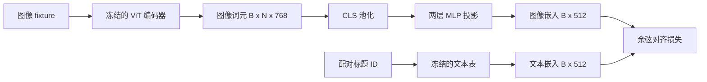

# 用于模态对齐的投影层

> 视觉编码器产生图像 token，文本解码器消费文本 token；二者位于不同向量空间。一个小型两层 MLP 将图像 token 投影到文本嵌入空间，配对标题上的余弦对齐损失则把两个空间拉到一起。这是视觉语言模型中最小、也最关键的迁移组件。

**类型：** 构建
**语言：** Python
**前置课程：** Phase 19 第 30–37 课（Track B 基础）
**用时：** 约 90 分钟

## 学习目标

- 构建把图像特征映射到文本嵌入空间的两层 MLP 投影。
- 构造模拟文本嵌入表（不使用预训练 tokenizer 或真实语料）。
- 计算投影图像 token 与配对标题嵌入之间的余弦对齐损失。
- 在冻结视觉编码器和文本表的情况下单独训练投影层。

## 问题

视觉编码器（第 58–59 课）产生维度为 `vision_hidden = 768` 的 token；文本解码器的嵌入维度为 `text_hidden = 512`。解码器需要文本形状的 token，但图像 token 位于视觉预训练学到的基底中，与解码器的词向量没有关系。两层 MLP（线性层、GELU、线性层）负责搭桥。它约有 `768 * 1024 + 1024 * 512 = 1.3M` 个参数，可在单 GPU 上快速训练；对齐阶段只有它学习，视觉编码器和文本表保持冻结。这正是 LLaVA 在 2023 年采用、BLIP-2 改写成 Q-Former、后来开放权重 VLM 普遍采用的方案。

## 概念



### 投影前的池化

视觉编码器输出 197 个 token，而文本侧只有一个标题级嵌入。对齐时每个样本需要一个图像级向量。最简单的方法是 CLS 池化：取第一个 token 后投影；也可以对 197 个 token 做平均池化。两种方法都会把 197 个向量压成一个。

### 为什么用两层而不是一层

单个线性投影能旋转和缩放，却不能修复两个空间的曲率差异。两层线性层之间加入 GELU 后，投影具备一个非线性弯折，经验上足以把 CLIP 风格特征对齐到语言模型嵌入。更深的投影（例如 LLaVA-NeXT 使用 GLU、Qwen-VL 使用多层注意力）是扩展方案；两层 MLP 是标准基线，也是 BLIP-2 的 Q-Former 在底层所使用的投影头类比。

| 层 | 形状 | 参数量 |
|---|---|---|
| fc1 | `(vision_hidden, projection_hidden)` | `768 * 1024 + 1024` |
| activation | GELU | 0 |
| fc2 | `(projection_hidden, text_hidden)` | `1024 * 512 + 512` |

`768 -> 1024 -> 512` 投影头约有 130 万个参数。

### 余弦对齐损失

对齐并不意味着 `image_emb == text_emb`，而是二者在联合空间中指向同一方向。余弦损失为 `1 - cos_sim(image, text)`，范围是 0（完全对齐）到 2（方向相反）。训练会让每一对的损失趋近于零。第 62 课会把它推广为批量对比学习（InfoNCE）：每幅图像都必须比批次中的其他标题更接近自己的标题；本课先使用逐对版本，让训练动态更清楚。

### 冻结编码器是关键技巧

视觉编码器有 8600 万个参数，文本表还有几百万个参数。冻结二者后，只有 130 万参数的投影层变化；合成样本上的几百步训练就足以降低损失。这也是适配器式 VLM 的实际形态：重组件冻结，轻量桥接层训练。

```figure
ch-projection-bridge
```

## 构建

`code/main.py` 实现：

- `MLPProjector(in_dim, hidden_dim, out_dim)`：带 GELU 激活的两层线性 MLP。
- `MockTextEmbedding(vocab_size, dim)`：使用 seed 确定性初始化的冻结嵌入表。
- `make_pair(seed, vocab_size)`：合成一个图像—标题配对；标题是短 ID 序列，标题嵌入由 token 嵌入平均池化得到。
- `cosine_alignment_loss(image_emb, text_emb)`：逐对的 `1 - cos_sim` 目标。
- 训练循环：在 32 个循环使用的合成配对上训练投影层 200 步，视觉编码器和文本表保持冻结，并每 25 步打印损失。

运行：

```bash
python3 code/main.py
```

输出会显示损失从约 1.07 降至约 0.80，并打印每对样本的最终余弦相似度，说明仅投影层也能把图像 token 拉向文本空间。

## 应用

LLaVA 1.5 从 CLIP-ViT-L 隐藏维度到 LLaMA 嵌入维度使用两层 GELU MLP，先冻结视觉编码器和 LLM、只训练投影层，第二阶段再解冻 LLM。BLIP-2 让 Q-Former 使用 32 个 learned query token，通过交叉注意力读取图像 token，再投影到 LLM 嵌入维度；Q-Former 末端的投影头就是本课 MLP 的类比。MiniGPT-4 使用从 BLIP-2 Q-Former 输出到 Vicuna 嵌入维度的单线性投影。Qwen-VL 使用多层交叉注意力适配器，但最后仍要投影到 LM 嵌入维度。形状虽不同，职责都相同：池化图像 token，投影到文本维度，单独训练。

## 测试

`code/test_main.py` 覆盖输出形状、冻结文本表、余弦损失边界值、投影梯度，以及训练前后损失下降。

```bash
python3 -m unittest code/test_main.py
```

## 练习

1. 用 196 个 patch token 的平均池化替换 CLS 池化，比较 200 步后的最终损失；在合成数据上平均池化通常更快，而自然图像上 CLS 往往更省样本。
2. 在余弦损失中加入可学习标量温度 `cos / tau`，观察 `tau` 过小时的梯度噪声，以及 `tau` 过大时损失在高位进入平台期。
3. 用单线性层替换两层 MLP，量化损失差距。
4. 给投影权重加入小的 L2 惩罚，观察它与余弦对齐的关系；由于余弦相似度对尺度不敏感，惩罚主要会压缩未使用方向。
5. 持久化投影权重，重新加载后运行推理，不对视觉编码器做反向传播，以验证部署时只需要投影层。

## 关键术语

| 术语 | 含义 |
|---|---|
| 模态对齐 | 让图像和文本嵌入能在共享空间中比较 |
| 投影头 | 把一个空间映射到另一个空间的小型模块，通常是两层 MLP |
| 余弦相似度 | 点积除以两个 L2 范数的乘积 |
| 冻结编码器 | 所有参数均设置 `requires_grad=False` 的视觉或文本模型 |
| 模拟语料 | 不依赖下载数据集的合成配对样本 |

## 延伸阅读

- LLaVA 论文：先训练投影、再解冻语言模型的两阶段训练。
- BLIP-2 论文：作为可学习投影替代方案的 Q-Former。
- Qwen-VL 技术报告：更深交叉注意力投影头。
