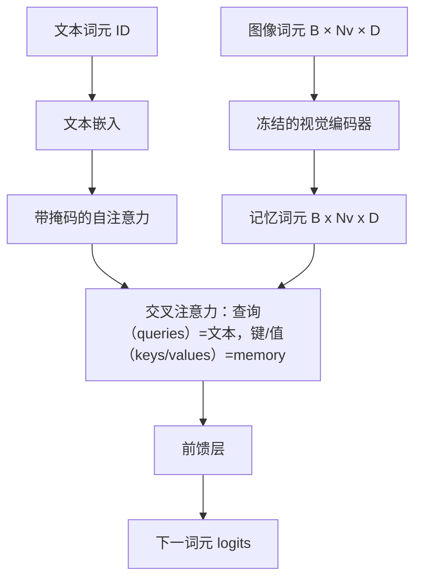
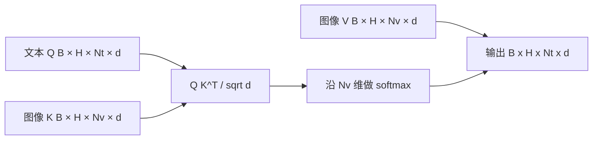

# 交叉注意力融合

> 投影层把一个图像向量与一个标题向量对齐；真正的视觉语言解码器需要让每个文本 token 关注每个图像 patch，从而把每个词落到图像区域上。文本提供查询，视觉提供键和值。本课构建交叉注意力、因果文本自注意力，以及保证二者合法的掩码形状。

**类型：** 构建
**语言：** Python
**前置课程：** Phase 19 第 30–37 课（Track B 基础）
**用时：** 约 90 分钟

## 学习目标

- 实现文本为查询、视觉为键和值的多头交叉注意力。
- 组合因果自注意力、交叉注意力和前馈层组成解码器块。
- 正确处理掩码：自注意力使用因果掩码，交叉注意力不使用掩码。
- 用批量文本 token 和固定图像 token 池运行前向传播。

## 问题

把图像和文本拼成一条序列是早期融合；交叉注意力则是晚期融合。晚期融合中，文本解码器只处理文本 token，并在每一层通过交叉注意力访问图像流。这样既保留文本能力，又能一次计算图像流并复用于每个解码步骤，代价是每个块多一个注意力子层。

## 概念





### 掩码形状

| 注意力 | 查询长度 | 键长度 | 掩码 | 原因 |
|---|---|---|---|---|
| 自注意力 | `Nt`（文本） | `Nt`（文本） | 因果：下三角 `(Nt, Nt)` | 自回归时不能看未来 |
| 交叉注意力 | `Nt`（文本） | `Nv`（视觉） | 无 | 每个文本位置都能看整幅图像 |

本课包含一个掩码形状校验函数；如果把两种掩码混用，它会抛出清晰的 `ValueError`，而不是让错误悄悄表现为损失曲线异常。

### 为什么交叉注意力不需要掩码

整幅图像在文本生成前已观测完毕，caption 的 token `t` 可以关注图像中的任意 patch；图像 patch 没有时间顺序。某些 Flamingo 变体在交错多幅图像和多个文本片段时会加入逐样本掩码，但对单幅图像加一个标题的情况，交叉注意力应看到全部图像。

### 键/值缓存

解码开始时计算图像键和值并保存到缓存；后续每个文本 token 直接复用缓存而不重新计算。这正是推理时标题生成很快的原因：沉重的 ViT 只运行一次，交叉注意力在每一步复用键和值。本课公开该缓存，并测试缓存命中路径。

### 块组合

解码器块依次执行：pre-LN → 自注意力 → 残差 → pre-LN → 交叉注意力 → 残差 → pre-LN → 前馈层 → 残差。三个子层各自拥有一个 LayerNorm。Flamingo 论文在交叉注意力上加入可学习门控，使模型出于训练稳定性考虑可以暂时跳过图像路径；本课采用的标准基线不带门控。

```python
class DecoderBlock:
  def forward(self, text_tokens, image_tokens, text_mask, cross_mask):
      text_tokens = text_tokens + self.self_attn(self.ln1(text_tokens),
                                                 mask=text_mask)
      text_tokens = text_tokens + self.cross_attn(self.ln2(text_tokens),
                                                  image_tokens,
                                                  mask=cross_mask)
      text_tokens = text_tokens + self.ffn(self.ln3(text_tokens))
      return text_tokens
```

```figure
ch-crossattn-fan
```

## 构建

`code/main.py` 实现：

- `CrossAttention(hidden, heads)`：带独立 `q` 与 `kv` 投影的多头交叉注意力。
- `CausalSelfAttention(hidden, heads)`：标准解码器中的带掩码自注意力。
- `DecoderBlock`：用 pre-LN 残差组合三个子层。
- `VisionLanguageDecoder`：由模拟视觉编码器输出和小型文本嵌入表驱动的四层解码器。
- `causal_mask(length)`：返回形状为 `(length, length)` 的下三角布尔张量。
- 批量 demo：输入两个长度为 10 的文本序列和长度为 197 的图像 memory，打印输出形状、自注意力掩码形状以及每个位置的交叉注意力输出范数。

```bash
python3 code/main.py
```

解码器输出形状为 `(2, 10, text_vocab)`，自注意力掩码为 `(10, 10)`，缓存和非缓存路径的 logits 应一致。

## 应用

交叉注意力主要出现在两类生产方案中：Flamingo 和 IDEFICS 每隔 K 个语言模型块插入一个交叉注意力子层，并冻结语言模型，视觉语言适配器就是交叉注意力块加其门控；BLIP-2 则让固定的 32 个查询 token 通过交叉注意力读取图像特征，再把查询投影到 LM 嵌入空间。本课块的形状可以直接映射到两者，掩码纪律（自注意力用因果掩码、交叉注意力不用）也相同。

## 测试

`code/test_main.py` 覆盖：因果掩码是下三角且布尔形状正确；无论键长度如何变化，交叉注意力输出形状都是 `(B, Nt, hidden)`；KV 缓存路径与非缓存路径在浮点容差内一致；文本流与图像流形状不匹配时抛出清晰的 `ValueError`；完整解码器前向传播返回正确的批量与序列形状。

```bash
python3 -m unittest code/test_main.py
```

## 练习

1. 给交叉注意力残差添加可学习的 tanh 门控（Flamingo 技巧），并验证从接近零的初始门控开始训练仍能收敛：门控从 0 开始，模型先恢复纯文本行为，再逐渐混入图像流。
2. 实现多图像、多文本片段的交错注意力及逐样本交叉注意力掩码，防止文本片段 2 访问图像 1。
3. 在 `Nt=64, Nv=576`（高分辨率下的 24×24 网格）时比较交叉注意力与自注意力成本；交叉注意力成本为 `Nt * Nv`，高分辨率下会成为主导。
4. 对交叉注意力图加入查询侧 dropout，测量 demo 的标题多样性；交叉注意力图上的 dropout 增大时，标题样本方差应上升。
5. 用 Q-Former 风格的固定 32-token 查询池替换交叉注意力层，使查询池在每层只访问一次图像特征。

## 关键术语

| 术语 | 含义 |
|---|---|
| 晚期融合 | 文本与视觉分流，由每个块中的交叉注意力桥接 |
| 交叉注意力 | Q 来自一个流，K、V 来自另一个流 |
| 因果掩码 | 防止自回归过程查看未来的下三角布尔掩码 |
| KV 缓存 | 一次保存并复用图像键和值 |
| memory token | 解码器访问的冻结图像 token |

## 延伸阅读

- Flamingo（2022）：带门控交叉注意力的晚期融合设计。
- BLIP-2（2023）：把交叉注意力包装成可学习查询池的 Q-Former。
- IDEFICS（2023）：Flamingo 方案的开放权重复现。
