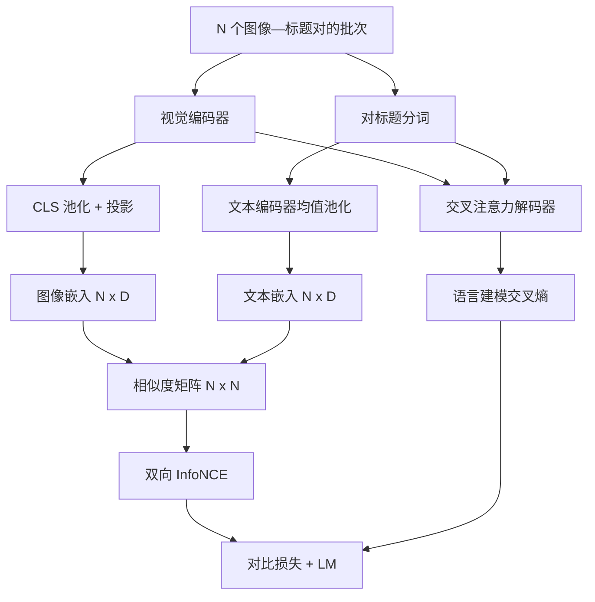

# 视觉语言预训练

> 编码器、投影层和解码器已经接好，现在把它们一起训练。两个目标驱动学习：对比图像—文本损失 InfoNCE 把匹配对拉近，语言模型损失要求解码器为图像生成标题。二者同时教会网络检索正确图像和写出图像标题。

**类型：** 构建
**语言：** Python
**前置课程：** Phase 19 第 30–37 课（Track B 基础）
**用时：** 约 90 分钟

## 学习目标

- 实现批量图像—标题对上的 InfoNCE 对比损失。
- 将对比损失与自回归语言模型损失组合。
- 合成 200 对、无需下载真实数据集的图像—标题语料。
- 运行 50 步演示训练并观察两种损失下降。

## 问题

视觉语言模型既要排序，也要生成：给定标题找图像，给定图像写标题。只训练一种能力只能得到半个系统。InfoNCE 处理排序：N 个匹配对是正样本，其余 `N^2 - N` 个组合是负样本，在 `(N, N)` 相似度矩阵上执行交叉熵。LM 损失处理生成：以图像为条件进行下一 token 预测。两者可共享编码器、投影层和解码器权重。

## 概念



### InfoNCE

将 N 个图像嵌入和 N 个文本嵌入分别按行堆叠并做 L2 归一化，计算 `S = I T^T / tau`，其中 `tau` 是可学习的温度。对角线是匹配对，非对角线是负样本；以对角线为目标执行行方向交叉熵，使第 `i` 行的最高值位于第 `i` 列，再沿列方向对称执行一次，取两者平均。这就是八行左右的 CLIP 损失。

### 温度

温度 `tau` 控制 softmax 的尖锐程度。太小（例如 `tau = 0.01`）时，梯度几乎只来自最难的负样本，训练会很嘈杂；太大时 softmax 变平，梯度会消失。CLIP 把 `tau` 作为参数学习，本文演示也采用同样做法。

### 语言模型损失

解码器通过交叉注意力读取图像 memory，在每个位置预测下一个文本 token。损失是以 next-position target 为目标的标准交叉熵，padding 位置会从损失中屏蔽。

### 组合两种损失

总损失为 `total = contrastive + lm_weight * lm`，其中 `lm_weight` 是标量，常取 1.0。两种损失都会把梯度传入编码器和投影层，但只有 LM 损失还会产生流向解码器的梯度；对比损失则影响编码器、投影层和文本侧 head。这是 CoCa、BLIP 和 SigLIP 风格模型使用的多任务方案，只是权重各有不同。

**损失权重的选择：**

调整两项损失的权重可以控制检索能力与生成能力之间的平衡。

### 为什么演示 50 步就足够

模拟语料包含 200 对随机图像与随机 caption id。batch size 为 16，运行 50 步 SGD 后，即使绝对损失仍高于真实数据模型，两项损失也应明显下降。demo 的目的只是端到端确认梯度连接正常，并验证加入 LM 损失不会使对比目标失稳，不代表模型已达到真实数据性能。

```figure
ch-infonce-diagonal
```

## 构建

`code/main.py` 实现：

- `MultimodalModel`：组合小型 ViT 编码器、MLP 投影层、对嵌入 ID 做均值池化的微型文本编码器，以及第 61 课的交叉注意力解码器。
- `info_nce_loss(image_emb, text_emb, temperature)`：双向、CLIP 风格的对比损失。
- `lm_loss(logits, target_ids, padding_id)`：屏蔽 padding 的下一 token 交叉熵。
- `make_mock_corpus(seed, n_pairs)`：返回 200 对确定性的 `(image, caption_ids)` 样本。
- 训练循环：使用 batch size 16、Adam 优化器和可学习的 log-temperature 参数运行 50 步，每 5 步打印两种损失。

```bash
python3 code/main.py
```

输出应显示对比损失和 LM 损失均下降；合成数据上的数值重点是验证梯度路径和目标组合。

## 应用

这正是以下方案使用的损失配方：CLIP（2021）只做图像—文本对比，并用独立的冻结编码器标题探针；CoCa（2022）把图像—文本对比和图像标题生成 LM 损失放在同一个模型中；BLIP（2022）和 BLIP-2 组合对比、LM 及图像—文本匹配头，共三种损失；SigLIP（2023）用 sigmoid 成对损失替换 InfoNCE，但承担相同的对比角色；LLaVA 系列分两阶段训练，第一阶段是在冻结 LM 上做对齐，第二阶段解冻 LM 并加入 LM 损失，第 60 课对应第一阶段，本课对应第二阶段。

## 测试

`code/test_main.py` 覆盖相似度形状、匹配对优于错配对、温度梯度、LM loss 的 padding 屏蔽、联合训练前向传播。

```bash
python3 -m unittest code/test_main.py
```

## 练习

1. 用 SigLIP 风格的 sigmoid 成对损失替换 InfoNCE，比较其在模拟语料上的收敛。
2. 加入 hard-negative mining：每隔一个 batch，从上一批选择最难的非对角错配对并追加进去，观察对比损失是否下降更快。
3. 加入第三个图像—文本匹配头，复现 BLIP 的三头设置。
4. 用由图像 hash 条件化的 Markov 链生成标题，比较可学习信号的作用。
5. 分别用 `lm_weight = 0` 和 `lm_weight = 1` 训练同一模型并比较对比损失；加入 LM 损失后，排序目标不应退化。

## 关键术语

| 术语 | 含义 |
|---|---|
| InfoNCE | 在相似度矩阵上执行交叉熵的噪声对比估计 |
| 温度 | 控制对比 softmax 尖锐程度的标量 |
| hard negative | 模型容易混淆的非对角错配对 |
| LM loss | 标题生成侧的下一 token 交叉熵 |
| 联合嵌入空间 | 图像与文本投影后共同所在的空间 |

## 延伸阅读

- CLIP：原始对比训练方案。
- CoCa：对比与标题生成的联合模型。
- SigLIP：可扩展性更好的 sigmoid 成对损失。
