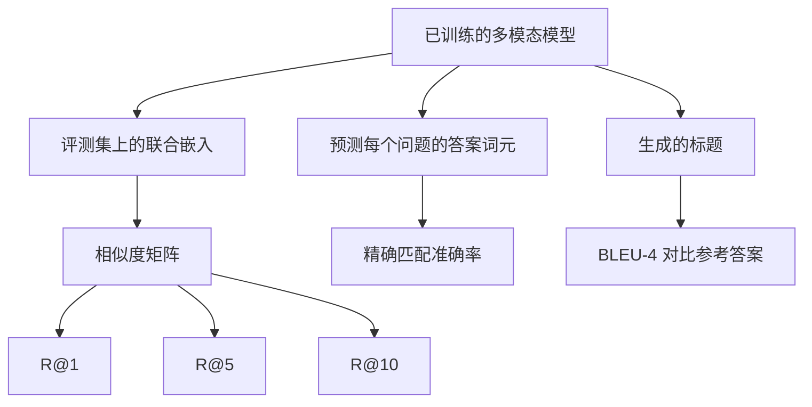

# 多模态评测

> 训练只是循环的一半，另一半是测量。本课从基础原语构建三个评测面：图像—标题检索的 R@1、R@5、R@10；视觉问答的 exact match；以及图像标题生成的 BLEU-4。每个指标都作用于模型输出，合成评测套件可在数秒内运行。

**类型：** 构建
**语言：** Python
**前置课程：** Phase 19 第 58–62 课（编码器、transformer、投影、交叉注意力融合、预训练）
**用时：** 约 90 分钟

## 学习目标

- 从图像与标题嵌入的相似度矩阵计算 Recall@K。
- 计算固定答案词表上的视觉问答 exact-match 准确率。
- 不依赖外部库，从生成和参考 token 序列计算 BLEU-4。
- 用第 62 课训练模型运行三项评测。

## 问题

训练损失平台期不代表模型完成。训练损失只反映训练分布上的拟合，不能说明模型能否在留出批次中排序、回答问题或写出可接受的标题。检索报告 R@1/R@5/R@10，VQA 报告答案 token 与参考答案相等的比例，标题生成报告带 brevity penalty 的 BLEU-4。每项都是薄函数，真实的 MS-COCO、VQA v2、GQA 和 OK-VQA 也可接入同样的接口。

## 概念



### Recall@K

构建 `(N, N)` 余弦相似度矩阵，按行降序排列列索引；若对角线索引位于前 K 个位置，该查询得分为 1，否则为 0。对转置矩阵做同样计算即可得到标题到图像的对称指标。比如 `N=100` 时，`R@1 = 0.6` 表示 100 个标题中有 60 个把正确图像检索为第一名。

### VQA exact match

对于每个 `(图像, 问题, 答案)`，编码图像、嵌入问题，经解码器融合后读取下一个 token；预测 token id 与参考 id 相等即记为正确，最后在评测集上取平均。真实 VQA 数据集每个问题通常有多个人工答案，并使用 soft accuracy：10 名人类标注中至少 3 人同意时得 1，否则按同意人数的比例缩放；本课为保持清晰使用单答案 exact match。

### BLEU-4

BLEU-4 为：

```text
BLEU-4 = BP * exp(mean(log p1, log p2, log p3, log p4))
```

其中 `p_n` 是修正后的 n-gram precision：生成 n-gram 中出现在任一参考答案里的部分，按参考答案中的最大计数进行 clipped count，再除以生成 n-gram 总数；`BP` 是 brevity penalty：

```text
BP = 1                if generated length > reference length
   = exp(1 - r/g)     otherwise, where r is reference length and g is generated
```

小样本中零 precision 需要平滑；实现采用 Chen and Cherry method 1，在零计数时给分子和分母都加 1。

### 合成评测套件

内存中生成 50 个留出样本，沿用第 62 课的 mock corpus 模式，并使用独立的 held-out seed：

- `pairs`：50 个 `(image, caption_ids)` 配对，用于检索；
- `vqa`：50 个 `(image, question_ids, answer_id)` 三元组，用于问答；
- `caps`：50 个 `(image, [reference_caption_ids, ...])` 条目，每幅图最多 3 个参考标题。

套件由 seed 确定性生成，且与训练语料留出，因此模型从未见过这些评测数据。把套件持久化为 JSON 留作练习。

| 指标 | 范围 | N=50 随机基线 |
|---|---|---|
| R@1 | 0 到 1 | 0.02（1 / N） |
| R@5 | 0 到 1 | 0.10 |
| R@10 | 0 到 1 | 0.20 |
| VQA EM | 0 到 1 | 1 / vocab |
| BLEU-4 | 0 到 1 | 较小但非零 |

在合成数据上训练 50 步时，指标不应期待很高；demo 检查的是它们高于随机基线。

```figure
ch-recall-window
```

## 构建

`code/main.py` 实现：

- `recall_at_k(sim_matrix, k)`：为两个方向返回 `[0, 1]` 内的浮点数；
- `vqa_exact_match(predictions, references)`：对整数相等取均值；
- `bleu4(generated, references, smoothing=True)`：支持多参考标题；
- `build_eval_suite(seed, n_samples, vocab_size, max_len)`：返回三个确定性的评测列表；
- `evaluate(model, suite)`：运行三个指标并返回数字字典；
- demo：加载第 62 课刚初始化的多模态模型，先评测，再训练 50 步后再次评测，打印前后指标。

```bash
python3 code/main.py
```

演示会打印训练前后表格；指标应从接近随机上升到高于随机基线。

## 应用

每个指标都能直接映射到生产基准：检索可使用 MS-COCO 5K val、Flickr30K 或 ImageNet zero-shot，替换合成评测文件即可保持函数签名；VQA v2、GQA 和 OK-VQA 使用相同的 exact-match 形状（VQA v2 另用 soft accuracy）；MS-COCO captioning、NoCaps 和 Flickr30K captioning 使用 BLEU-4，并通常加上 CIDEr 与 METEOR。真实基准只需把 `build_eval_suite` 换成加载器，函数主体不变。

## 测试

`code/test_main.py` 覆盖：完美单位相似度矩阵与翻转矩阵的 recall@k、`k <= N` 上界、BLEU 完全匹配与不相交词表、VQA 相等对的比例，以及评测套件中 pairs、vqa 和 caption 条目的数量。

```bash
python3 -m unittest code/test_main.py
```

## 练习

1. 在标题指标中加入 CIDEr；它对 n-gram 使用 TF-IDF 加权，更奖励信息量大的 token。
2. 实现 soft-accuracy VQA：为每题保留多个人工答案，若有匹配则准确率为 `min(human_count / 3, 1)`，复现 VQA v2。
3. 增加 NaN-safe 的 `bleu4` 变体，处理空生成序列而不崩溃。
4. 在 R@K 之外计算平均倒数排名（MRR）；MRR 关注正确项在 top-K 之后的具体位置，R@K 关注它是否进入 top-K。
5. 在训练第 0、10、20、30、40、50 步的五个检查点（共六个时间点）运行评测并绘制学习曲线，确认指标轨迹跟随损失轨迹。

## 关键术语

| 术语 | 含义 |
|---|---|
| R@K | 正确匹配位于前 K 个结果的查询比例 |
| Exact match | 预测答案等于参考答案 |
| BLEU-4 | 1–4 gram precision 几何平均并带 brevity penalty |
| Multi-reference | 一幅图像接受多个参考标题 |
| Held-out | 与训练语料 seed 不相交的评测集 |

## 延伸阅读

- VQA v2 的 soft-accuracy 公式。
- CIDEr 的 TF-IDF n-gram 标题评测。
- Papineni 等（2002）的 BLEU 原论文。
- MS-COCO 标准评测脚本。
