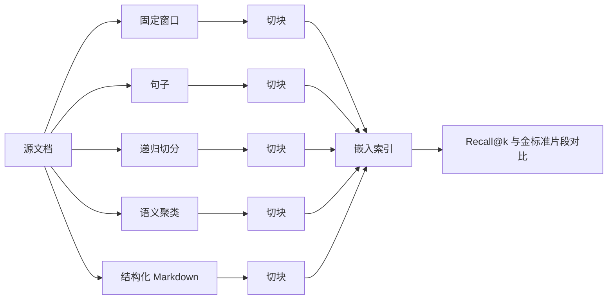

# 切块策略比较

> 切块决定检索器最终能发现什么。边界错了，后续没有 embedding 模型、重排器或 LLM 能修复损失。

**类型：** 构建
**语言：** Python
**前置课程：** Phase 11 第 04、06、07 课；Phase 19 Track B 基础（第 20–29 课）
**用时：** 约 90 分钟

## 学习目标

- 从零实现固定窗口、句子、递归切分、语义聚类和 Markdown 结构标题五种策略。
- 在带答案跨度的 fixture 语料上测量 recall@k，并解释不同语料上的胜者。
- 读取切块长度分布，识别孤立句、中途切断符号、只有标题的块和语义漂移。
- 根据文档类型、平均段落长度及是否有显式结构选择默认策略。

## 问题

RAG 要把文档切成既能放入 embedding 模型、又能表达完整想法的片段。切在哪里不是普通超参数，而是检索器可能返回内容的上限。

如果查询问“预算中止阈值是什么样的”，只有在包含该阈值的块可被检索到时才可能答对。若固定窗口把阈值从周围上下文切开，embedding 会落入别的簇，BM25 分数下降，重排器看到噪声，LLM 最终生成错误答案。LongRAG 研究显示，仅切块选择就能造成 35 个百分点的检索召回差异；2025 年关于 contextual chunk headers 的后续工作缩小了差距，但并未消除差距。

本课把五种策略并排实现，在带金标准答案跨度的 fixture 语料上运行，并让你直接阅读 recall 数字。

## 概念



### 固定窗口

这是暴力基线：每 N 个字符切一次，也可以设置重叠，让在位置 N 被切开的句子完整出现在从 `N - overlap` 开始的块中。它速度快、确定性强，却很不尊重边界，应作为对照而非默认策略。

### 句子

句子策略可以用正则或简单状态机识别句子边界，再把一个或多个句子装入不超过目标字符预算的块中。它不会切断单词，却仍可能切断段落和章节，是没有其他结构线索时处理散文的合理选择。

### 递归切分

递归策略按分隔符层级工作：先尝试最强的分隔符（双换行、段落），再退回单换行、句子，最后退回字符。递归在块符合预算时终止；由于按区域自适应，它对结构不一致的文档很有韧性。

### 语义聚类

语义策略先嵌入每个句子，把主题相近的连续句按运行中的中心聚成一块，在与中心的相似度低于阈值时切开。边界反映含义而不是字符数，能应对段落内部换题，但构建更慢且依赖 embedding 模型。

### 结构化 Markdown 标题

对于带显式结构的文档（Markdown、reStructuredText、RFC 风格编号章节），在标题边界切分。每块包含标题及其下方内容，直到同级或更高标题出现。它能产生按主题最小的块，但前提是语料格式良好。

### recall@k 如何衡量边界

每个查询包含答案跨度的字符偏移。切块后检查 top-k 块是否与 gold span 重叠；重叠为 1，否则为 0，再对查询集平均。对五种策略执行同一评测，即可看出哪种边界策略适合当前语料。

```figure
ci-chunk-boundaries
```

## 构建

`code/main.py` 实现：

- `fixed_window(text, size, overlap)`：固定窗口基线；
- `sentence_chunks(text, target)`：简单的句子打包器；
- `recursive_split(text, separators, target)`：分层递归切分；
- `semantic_chunks(text, similarity_threshold)`：基于确定性模拟嵌入的中心聚类；
- `structural_markdown(text)`：识别标题的切分器；
- `mock_embed(text, dim)`：基于 hash 的嵌入，使循环可离线运行；
- `DenseIndex`：与 Phase 19 Track B 混合检索课程使用相同形状的索引；
- `eval_recall(strategy, corpus, queries, k)`：比较循环；
- `main()`：在 fixture 语料上运行所有策略并打印 recall@k 表格。

```bash
python3 code/main.py
```

输出是每种策略一行、每个 k 一列的小表格。句子策略在结构化 fixture 上会输；Structural Markdown 在 Markdown fixture 上胜出；递归切分在混合 fixture 上凭借区域自适应保持竞争力；没有有用结构线索的散文上，语义聚类会胜出。

## 不应隐藏的失败模式

**孤立句：** 句子打包可能漏掉主题句，使 embedding 指向错误簇。
**中途切断符号：** 固定窗口切开代码或 YAML 标识符，两个半片都会变成噪声。
**只有标题的块：** 结构化切分可能产生只含 `## Title` 的块，应过滤或附加下一块首段。
**语义漂移：** 统一主题的语料可能被切得过大。一个 5000 字符的块会把许多具体答案塞进同一个弥散 embedding，应把语义策略与硬字符上限结合。
**过期 embedding：** 语义聚类依赖 embedding 模型；更换该模型也会改变块。应单独固定切块模型与检索模型，或同时重建索引。

## 不运行 benchmark 也能选择默认策略

| 属性 | 取值 | 默认 |
|---|---|---|
| 文档类型 | 无结构散文 | Recursive split，target 800 |
| 文档类型 | Markdown / RFC / API 文档 | Structural markdown |
| 文档类型 | 代码 | AST-aware（超出范围） |
| 段落长度 | 长且单一主题 | Sentence，target 500 |
| 段落长度 | 短且主题混杂 | Semantic，threshold 0.6 |

不确定时选择递归切分，它是最强的单策略基线。

## 应用

- 上线新流水线前先运行评测，不要盲信库的默认策略。
- 更换 embedding 模型或语料混合时重新评测，因为胜者取决于语料。
- 把策略名写入每个块的 metadata，以便之后定位回归。

## 交付

第 69 课的端到端 RAG 会把这里选出的切块器作为第一阶段。第 68 课的评测框架读取本课 `eval_recall` 返回的同样形状的 recall@k。选择在你的语料上胜出的策略并把它传递到后续阶段。

## 练习

1. 用 `tiktoken` 添加 token-window 策略并与同一 fixture 上的固定窗口比较。
2. 在散文 fixture 中加入 30% 的代码块，重新运行表格，并解释为什么除 structural markdown 外的每种策略都会丢失召回。
3. 换成项目真实 provider 的 embedding，测量语义聚类的召回差异，并报告各策略之间的差距扩大还是缩小。
4. 为每块加入一句 `summary` 字段，作为中心主题描述；把摘要附加到块正文后重新评测，测量召回提升。

## 关键术语

| 术语 | 含义 |
|---|---|
| Recall@k | top-k 中任一块覆盖 gold answer span 的查询比例 |
| Chunk overlap | 把上块最后 N 个字符重新放入下一块 |
| Structural splitter | 在 H1/H2/H3 边界切分，标题属于该块 |
| Semantic chunker | 嵌入句子、按中心相似度聚类并在漂移时切分 |
| Centroid drift | 运行均值与下一句的余弦相似度跌过阈值 |

## 延伸阅读

- [LongRAG: Enhancing Retrieval-Augmented Generation with Long-context LLMs (arXiv 2406.15319)](https://arxiv.org/abs/2406.15319)
- [Anthropic, Contextual Retrieval](https://www.anthropic.com/news/contextual-retrieval)
- [LlamaIndex, Chunking strategies for production RAG](https://docs.llamaindex.ai/en/stable/optimizing/production_rag/)
- Phase 11 课程 06——RAG 基础
- Phase 11 课程 07——高级 RAG
- Phase 19 课程 65——为本课生成的切块排序的混合检索
- Phase 19 课程 68——在生产环境评估策略选择的评测框架
