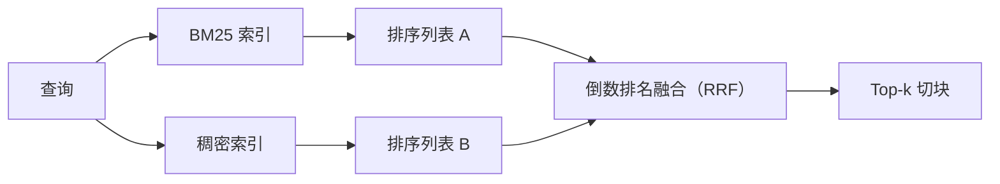

# 使用 BM25 与稠密嵌入的混合检索

> 词法检索和语义检索分别在相反的查询分布上占优。带倒数排名融合的混合检索不是插值，而是投票；这个投票能在每类查询上取胜。

**类型：** 构建
**语言：** Python
**前置课程：** Phase 11 第 04、06 课；Phase 19 Track B 基础（第 20–29 课）；Phase 19 第 64 课
**时间：** 约 90 分钟

## 学习目标
- 从 Robertson–Sparck Jones 公式实现 BM25，加入字段权重、文档长度归一化以及可调的 k1、b。
- 基于确定性的模拟嵌入构建离线可运行的稠密检索器。
- 按 2009 年论文的定义实现倒数排名融合，并解释它为何优于分数加权插值。
- 调整 RRF 常数 k 与各模态权重，在小型固定语料上观察取舍。

## 问题

当查询带有语料中原样出现的字面标识符时，词法搜索更强。查询 `AbortMultipartOnFail` 时，BM25 能在微秒内返回正确的 Go 函数；同一查询做嵌入后位于三个相似性簇的边界，稠密检索器反而会把错误文件排在第一位。

当查询改写成语料没有使用的说法时，稠密搜索更强。用户问“如何处理已取消的上传”时，没有输入 abort 或 multipart。BM25 会返回含有 uploads 一词的“大文件上传”文档块；稠密检索会找到摘要提到取消操作的 abort 函数。

二者的选择不是静态配置，变量是查询分布。生产 RAG 系统必须从同一端点处理两类查询，因此检索需要同时覆盖它们，这就是混合检索。真正需要正确实现的是合并步骤。

## 概念



### 用一段话理解 BM25

BM25 对查询–文档对打分：对每个查询词求和，把逆文档频率因子乘以带长度归一化修正的饱和词频因子。它有两个旋钮。`k1` 控制词频饱和；发布建议的默认值是 1.5，没有基准测试不要改动。`b` 控制文档长度的影响；默认 0.75 表示长文档会受惩罚，但不是线性惩罚。

IDF 使用平滑的 Robertson–Sparck Jones 定义：`log((N - df + 0.5) / (df + 0.5) + 1)`。对数内部的加一保证词项出现在超过一半语料时 IDF 仍为正，这对停用词很少的小语料尤其重要。

字段权重可以告诉 BM25：符号名中的匹配比正文中的匹配更重要。实现上是在索引阶段乘词项计数，而不是打分阶段再乘；这样数学公式不变，也不必为每个字段计算独立分数。

### 用一段话理解稠密检索

用嵌入模型把每个块编码成固定维度的向量。查询时编码查询，按余弦相似度为所有块排序，返回前 k 个。质量取决于模型，检索算法本身就是点积加排序。

本课使用确定性的基于哈希的嵌入，因此无需网络调用即可阅读融合数学。哈希把词元对应的偏移量累加到 96 维向量并归一化；余弦排序跨运行保持确定性，这是测试套件要求的性质。

### 倒数排名融合：论文中的公式

给定两份排序列表。对出现在任一列表中的每个候选项，累加其倒数排名贡献。2009 年论文使用 `1 / (k + rank)`，默认 k 为 60。按总分排序，算法就是这些。

常数 k = 60 并非随意选择：k = 60 时，排名 1 的贡献是 1 / 61，排名 10 的贡献是 1 / 70。贡献衰减较慢，深层候选仍能投票；较小的 k 让顶部结果占主导，较大的 k 会压平曲线。

实现中有两个可调旋钮：`k` 常数，以及一对模态权重，用于在已有证据表明某种模态更适合语料时提升 BM25 或稠密检索。用权重乘排名贡献是最简单且有原则的实现：它保留排名衰减形状并保持无尺度。

### 为什么融合胜过分数加权插值

BM25 分数无上界且依赖语料；余弦相似度被限制在 -1 到 1。线性组合 `alpha * bm25 + (1 - alpha) * cosine` 需要按语料调 alpha，重新索引后还可能失效。基于排名的融合不需要这样做，因为不同模态的排名可以比较。自 2010 年起，公开的 TREC track 中，已发布的 RRF 基线持续优于分数插值。

Vespa 与 Weaviate 文档中关于 RankFusion 与 RRF 的论证也是如此：除非有很强证据支持插值，否则保持基于排名。

```figure
rrf-fusion
```

## 构建

`code/main.py` 实现：
- `tokenize(text)`：快速正则分词器。
- `BM25Index`：支持字段权重、`add`、`search` 以及可调 k1、b。
- `mock_embed`、`DenseIndex`：与第 64 课相同的确定性嵌入，使块可比较。
- `rrf(rankings, k, weights)`：带多模态权重的论文公式融合。
- `HybridRetriever`：组合 BM25 与稠密检索。
- 示例 `main()`：载入小型固定语料，运行三条分别考察两种检索器长短处的查询，并打印各模态排名及融合列表。

运行：
```bash
python3 code/main.py
```

并排阅读示例输出：字面标识符查询的 BM25 排名为 1、稠密排名为 4、RRF 排名为 1；改写查询分别为 6、1、1；歧义查询分别为 3、3、1。融合不是平局裁决，而是在每类查询上取胜的系统。

## 调整旋钮

| 旋钮 | 默认值 | 何时调高 | 何时调低 |
|------|---------|----------------|------------------|
| BM25 k1 | 1.5 | 词项在文档中重复且希望频率更重要 | 文档较短且重复只是噪声 |
| BM25 b | 0.75 | 长文档确实每个词提供的信息更少 | 文档长度与主题无关 |
| RRF k | 60 | 希望深层候选继续投票 | 希望第一名占主导 |
| BM25 weight | 1.0 | 语料有字面标识符且查询会匹配 | 查询多为用户改写 |
| Dense weight | 1.0 | 查询多为改写 | 查询多为字面匹配 |

在保留查询集上重新运行第 68 课的评估工具来调参，不要凭直觉。

## 示例会隐藏的失败模式

**词表外词项。** BM25 的 IDF 从语料计算，因此只出现在查询中的词贡献为零；稠密嵌入仍会为它生成向量。在语料外标识符上，稠密模态会返回看似合理但错误的邻居。融合可以吸收这一点，因为 BM25 不返回结果、排名贡献消失；但前提是按文档而非按块去重。

**停用词支配。** BM25 对单词 “the” 会在语料上产生近乎均匀的排名。应在索引器中过滤停用词，或接受高 IDF 词项自然占优。

**模态中的内容完全相同。** 若语料足够小，BM25 与稠密检索的第一名相同，RRF 也会给出相同第一名及邻居。这是正确行为，不是失败；但它会让融合看起来不起作用。评估中加入一对对抗查询，确认融合确实生效。

## 使用

生产模式：
- 在进程内建立 BM25 索引；瓶颈是词频字典而非向量。
- 在独立存储中建立稠密向量索引（本课用平面列表，生产环境可用 HNSW）。
- 并行执行两种查询；融合只是对并集进行常数时间合并。
- 持久化每条命中结果的模态，让下游重排器知道是哪种模态投票。

## 发布

第 66 课接收本课的融合前 k，并用交叉编码器重排。第 68 课用 precision、recall、MRR 和 nDCG 评估完整流程。本课的混合检索器是第 69 课端到端系统的第一阶段。

## 练习
1. 用供应商提供的真实模型替换 `mock_embed`，重新运行示例，报告改写查询上的稠密排名变化。
2. 增加第三种模态：单独索引块摘要，并将第三份排名列表融合，测量收益。
3. 在 10、30、60、100、200 上扫描 RRF k，绘制第 68 课的 recall@k 曲线，报告语料上的峰值。
4. 正确实现 BM25F（按字段分别做长度归一化，而不是乘数技巧），在符号匹配最重要的语料上比较。

## 关键术语

| 术语 | 常见说法 | 实际含义 |
|------|----------|----------|
| BM25 | “词法搜索” | idf × 饱和 tf × 长度归一化的概率排序 |
| RRF | “排名融合” | 对各排序列表求 `1 / (k + rank)` 之和；默认 k = 60 |
| k1 | “TF 饱和” | 控制重复词项停止增加分数的速度 |
| b | “长度惩罚” | 0 表示忽略长度，1 表示完全归一化 |
| 字段权重 | “符号增强” | 索引时重复字段中的词项以提升匹配 |
| 基于排名与基于分数的融合 | “为何 RRF 胜过线性” | 排名可跨模态比较，分数不能 |

## 延伸阅读
- Cormack, Clarke, Buettcher, “Reciprocal Rank Fusion outperforms Condorcet and individual rank learning methods”, SIGIR 2009
- Robertson, Walker, Beaulieu, Gatford, Payne, “Okapi at TREC-3”（原始 BM25 论文）
- [Vespa: Hybrid Retrieval with BM25 and Embeddings](https://docs.vespa.ai/en/tutorials/hybrid-search.html)
- [Weaviate: Hybrid Search](https://weaviate.io/developers/weaviate/search/hybrid)
- Phase 11 第 06 课——RAG 基础
- Phase 19 第 64 课——本课索引的分块器
- Phase 19 第 66 课——消费融合前 k 的交叉编码器重排器
