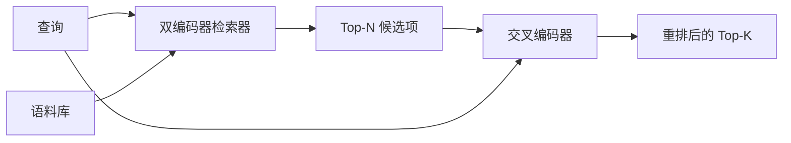

# 交叉编码器重排器

> 双编码器会独立嵌入查询和文档；交叉编码器把二者拼接起来同时阅读。交叉编码器是最聪明的读者，也是最慢的读者。把它放在双编码器的 top-k 之后作为第二阶段使用，通常物有所值。

**类型：** 构建
**语言：** Python
**前置课程：** 第 11 阶段课程 06（RAG）、第 11 阶段课程 07（高级 RAG）；第 19 阶段 Track B 基础（课程 20–29）；第 19 阶段课程 65（为本阶段提供候选的混合检索）
**用时：** 约 90 分钟

## 学习目标

- 根据输入形状、参数量和每次查询成本，区分双编码器检索器与交叉编码器重排器。
- 从头实现一个小型交叉编码器：它作为 Transformer 模块接收打包后的（查询、文档）序列，并输出一个相关性标量。
- 接通两阶段的“先检索、再重排”流水线：用廉价检索器检索 top-N，用交叉编码器把 N 项重排为 top-K，最后返回 K 项。
- 在小型 fixture 语料上测量延迟与质量的权衡，并为给定延迟预算选择合适的 N。

## 问题

双编码器把查询和文档映射到同一个向量空间，再按余弦相似度排序。两次编码从未见过彼此。模型必须把文档中所有有用信息压缩进一个向量，而这个向量与查询无关。这种方式很快：文档只需在索引时嵌入一次，每次查询也只需嵌入一次；它是唯一能在整个语料规模上排序的方式。

代价是精度。两个文档即使一个回答了查询、另一个没有，只要总体主题相同，它们也可能获得几乎相同的嵌入。双编码器无法把它们区分开。

交叉编码器通过同时阅读查询和文档解决这个问题。模型把 `[query] [SEP] [document]` 作为一个序列接收，在拼接处进行完整注意力，并输出一个相关性标量。文档中的每个词元都可以关注查询中的每个词元，模型据此在完整上下文中决定分数。

代价是吞吐量。双编码器只需嵌入一次、之后反复查询；交叉编码器却要对每一个（查询、文档）对运行一次。对于一个包含一千万篇文档的语料库，这意味着每次查询要做一千万次前向传播，在请求预算内无法运行。

解决方案是分阶段。先用双编码器检索 top-N，再用交叉编码器把 N 项重排成 top-K。N 通常很小（50 到 200），而交叉编码器的质量提升集中在真正重要的候选项上。总延迟仍能留在请求预算内，总体质量接近交叉编码器的质量，但上限受双编码器在 N 处召回率的限制。

## 概念



### 交叉编码器的输入形状

标准打包形式是 `[CLS] query_tokens [SEP] document_tokens [SEP]`。CLS 位置的输出会送入一个单独的线性头，输出相关性标量。有些实现使用平均池化而不是 CLS；差异不大。关键在于：模型对每个查询—文档对输出一个数字。

一个 2200 万参数的交叉编码器（已发布的 `ms-marco-MiniLM-L-6-v2` 权重规模）是典型的生产折中点。更小的模型会更快失去质量，而节省的延迟并不一定抵得上损失。更大的模型（例如 5.68 亿参数的 `bge-reranker-v2-m3`）通常留给离线重排，或用于 K 很小的首页重排。

### 为什么本课训练一个很小的模型

真实交叉编码器是经过微调的 encoder Transformer。在生产环境中，你会加载检查点并运行它。本课的目标是展示模型形状和延迟—质量曲线的形状，而不是训练一个最先进的排序器。因此我们构建一个很小的 `nn.Module`，包括一个 Transformer 模块、多头注意力（默认 4 个头）和一个回归头。模型用固定种子确定性初始化，不需要磁盘上的权重。

这个玩具模型从 fixture 语料中学到正确的结构：相关的查询—文档对应获得比不相关对更高的预测分数。端到端流水线会对双编码器输出重新排序，重排后的 top-k 与金标准标签相关。

### 延迟与质量

两阶段流水线只有一个可调参数：N。在留出的查询集上把 N 从 5 扫描到 100，就能得到如下曲线。

| N | 第二阶段 Recall@1 | 每次查询的交叉编码器前向次数 | 延迟 |
|---|--------------------|------------------------------|------|
| 5 | 0.62 | 5 | 低 |
| 20 | 0.81 | 20 | 中 |
| 50 | 0.86 | 50 | 高 |
| 100 | 0.86 | 100 | 很高 |

上面的数字只是说明曲线形状，并不是从这个 fixture 测得的结果。曲线形状是真实的：通常在 20 到 50 个候选项附近会出现拐点，之后重排带来的提升趋于饱和。越过拐点后，付出的成本没有换来收益。

根据评估曲线和延迟预算选择 N。交叉编码器不可能把召回率提高到双编码器在 N 处召回率以上，因此 N 较低限制的不只是延迟，也限制质量。

```figure
rerank-funnel
```

## 动手构建

`code/main.py` 实现：

- `CrossEncoder`：一个小型 `torch.nn.Module`，包含词元嵌入、带多头注意力和前馈层的 Transformer 模块，以及输出一个标量的平均池化头。
- `tokenize_pair(query, document)`：把两个字符串打包为一个 ID 序列，并使用标记边界的 type id；实现是确定性的，只依赖标准库。
- `train_tiny(pairs)`：在手工标注的（查询、文档、相关性）三元组列表上进行一次监督训练，让模型在 fixture 上输出合理分数。
- `rerank(query, candidates, top_k)`：生产接口。
- `pipeline(query, retriever, top_n, top_k)`：两阶段流程。
- `main()` 演示：按照第 65 课的模式加载语料，检索 top-N，重排为 top-K，并将两份列表并排打印，同时报告每个阶段的延迟。

运行：

```bash
python3 code/main.py
```

输出会显示双编码器的 top-N、交叉编码器的 top-K，以及计时摘要。交叉编码器每次调用更慢，但不会在整个语料库上运行。两阶段总耗时仍在请求预算内，同时可能把双编码器排在第二或第三位的答案挑出来。

## 演示会隐藏的失败模式

**交叉编码器不是对称的。** `rerank(q, d)` 和 `rerank(d, q)` 得到的是不同分数。始终把查询放在前面；如果误交换，召回率会崩溃。

**N 太低，暴露不出问题。** 如果设置 N = K，交叉编码器无法重新排序，只能重新加权，提升看起来就是零。N 至少应为 K 的三倍。

**训练数据泄漏到评估集。** 如果手工标注的训练对包含评估查询，重排器会看起来不可思议地好。即使只用 fixture，也要严格分开训练和评估。

**生产权重很密集。** 一个 2200 万参数的交叉编码器在 float32 下占 88 MB。在承诺 p95 低于 100 ms 之前，先规划模型服务器的内存。

**批处理很重要。** 真实交叉编码器会在一个 batch 中运行 N 个候选项。本课的 `_batch_encode` 会用 `torch.tensor(...)` 构建批量 ID 和 type-id 张量，再运行一次前向传播。不做批处理而逐项运行，延迟会乘以 N。

## 使用它

生产模式包括：

- 把双编码器、交叉编码器和 N 一起固定下来。任意一个发生变化，都需要重新评估。
- 按（查询、文档 ID）的哈希缓存重排器输出。稳定语料上，同一查询会得到同一排序；缓存命中可以免费降低延迟。
- 记录交叉编码器的 rank-1 分数。如果 top-1 分数低于语料特定的阈值，就把它视为域外命中，并向 LLM 暴露“我没有把握”。
## 发布

第 68 课会端到端评估这条两阶段流水线。第 69 课会把本课的重排器接在第 65 课混合检索器之后、答案生成器之前。重排器就是端到端系统的第二阶段。

## 练习

1. 将 N 从 5 扫描到 50，绘制重排输出的 recall@1。找出这个 fixture 上的拐点。
2. 不只训练一次，而是训练交叉编码器十个 epoch。测量每个 epoch 正例与负例之间的分数间隔。
3. 把平均池化换成 CLS 词元头。比较它在这个 fixture 上的收敛情况。
4. 增加第二个交叉编码器头，预测“文档中是否包含答案”这一二元标签。推理时同时使用两个头：一个用于排序，一个用于设定阈值。
5. 把确定性的模拟双编码器换成第 65 课的实现，串接两个阶段。测量与只使用双编码器相比 top-K 的变化。

## 关键术语

| 术语 | 常见说法 | 实际含义 |
|------------------------|-----------------|------------------------|
| Bi-encoder | “向量检索器” | 独立编码查询和文档，再按余弦相似度排序 |
| Cross-encoder | “重排器” | 联合编码（查询、文档），输出一个相关性标量 |
| Two-stage pipeline | “召回再重排” | 廉价检索器返回 N 项，昂贵重排器保留 K 项 |
| N (candidate budget) | “重排池” | 每次查询由交叉编码器评分的候选项数量 |
| Mean-pooling head | “最后隐藏层平均值” | 将编码器最后一层的输出平均成一个向量 |

## 延伸阅读

- Nogueira、Cho，《Passage Re-ranking with BERT》，2019——经典的交叉编码器排序论文。
- Reimers、Gurevych，《Sentence-BERT: Sentence Embeddings using Siamese BERT-Networks》，2019——介绍双编码器与交叉编码器。
- [SentenceTransformers Cross-Encoders 文档](https://www.sbert.net/examples/applications/cross-encoder/README.html)
- [BGE Reranker v2 模型卡片](https://huggingface.co/BAAI/bge-reranker-v2-m3)
- 第 19 阶段课程 65——为本课重排阶段提供候选的混合检索器。
- 第 19 阶段课程 68——衡量本课重排带来提升的评估。
