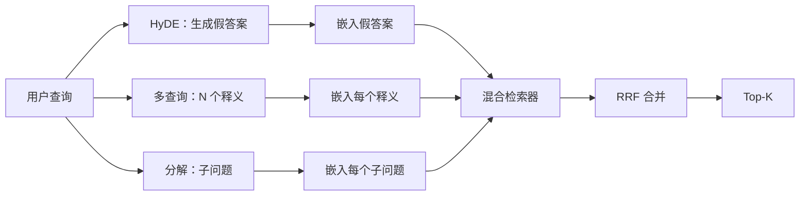

# 查询改写：HyDE、多查询与分解

> 用户输入的查询不一定是检索器真正想要的查询。改写发生在检索之前，弥合两者之间的差距，让索引看到更接近答案形态的表达。

**类型：** 构建
**语言：** Python
**前置课程：** Phase 11 第 04 课（嵌入）、第 06 课（RAG）；Phase 19 Track B 基础（第 20–29 课）；Phase 19 第 64、65 课
**时间：** 约 90 分钟

## 学习目标
- 实现假设文档嵌入（Hypothetical Document Embeddings，HyDE）：生成假答案，将其嵌入，并使用该向量而不是查询向量检索。
- 实现多查询扩展：把一个查询改写成 N 个释义，分别检索，再用倒数排名融合合并并集。
- 实现查询分解：把复杂问题拆成子问题，分别检索后合并结果。
- 在固定夹具上正面对比三种改写器，并解释每种策略何时占优。
- 接入一个输出确定性、基于固定夹具生成结果的模拟 LLM，使改写循环可以离线运行。

## 问题

用户输入：“上传失败且预算用完时，我们团队会做什么？”语料库中有一份文档写着：“AbortMultipartOnFail 会中止正在进行的 S3 分段上传，并在上传失败时减少每个存储桶的重试预算。”查询和文档没有共享的名词短语，所以 BM25 会漏掉它。双编码器可能把文档排在第三或第四位，因为查询向量落在更偏好“已取消作业”而不是“已中止上传”的嵌入空间区域。第 66 课的两阶段重排只有在答案位于前 N 时才能挽救它；如果它连前 N 都进不去，重排器根本看不到它。

解决办法是在查询接触检索器之前先改写它。2023 年 Gao 等人的论文《Precise Zero-Shot Dense Retrieval without Relevance Labels》提出了 HyDE：让 LLM 写出能够回答查询的文档，嵌入这份假想文档，再把它的嵌入作为检索向量。因为假想文档使用了语料库的写作方式，它会落在嵌入空间中更接近真实文档的区域；原始查询向量则不一定如此。

有两种与 HyDE 相近的技术。多查询扩展（Microsoft 的 GraphRAG 使用过这一术语）生成查询的 N 个释义，分别检索后再合并。分解（2024 年 Stanford DSPy 工作中推广的“子查询分解”）会把“上传失败且重试预算用完时我们做什么”拆成两个问题：“上传失败时会发生什么？”和“重试预算耗尽时会发生什么？”两次检索、一个合并结果，就能让答案的两个部分都被找到。

本课会实现三种方法，并让它们在同一个固定夹具语料库上运行。

## 概念



### HyDE 详解

HyDE 用 LLM 写出的假想文档向量替代用户的查询向量。提示词很短：

```
你是一名领域专家。请写一段回答下方问题的文字，长度为一个段落。
使用该领域文档通常使用的词汇和措辞。不要拒答，也不要说你不知道。

问题：{user_query}

段落：
```

由于 LLM 不知道你的语料库，它生成的答案作为事实答案可能是错的，这没有关系。检索器关心的不是事实正确性，而是词元分布。假想段落会包含“abort”“multipart”“bucket”“budget”等词，因为该主题的文档通常会这样写。嵌入这段文字后，向量就会落在真实段落附近。

在生产环境中，应把假想文档限制为两三句话。更长的假想文档会积累更多噪声；更短的文档又会丢失 HyDE 所需的词法信号。

### 多查询扩展详解

生成用户查询的 N 个释义。最简单的提示词是：

```
用 {N} 种不同方式改写下面的问题。每种改写都必须保留原始意图。
将它们编号为 1 到 {N}。不要添加解释。
```

对每个释义检索 top-k，再用 RRF（第 65 课中的同一算法）合并 N 个排序列表。它便宜、可并行且具有确定性。

当用户的措辞只是许多等价问法中的一种、而任意一个改写都可能表达得更好时，多查询扩展很有优势。如果原问题本身以同样方式有缺陷，所有改写也同样糟糕，它就会失效。

### 分解详解

一次检索无法满足多面的复杂问题。分解让 LLM 把问题拆成子问题，系统再针对每个子问题检索。提示词是：

```
下面的问题可能需要来自多个不同主题的信息。
请把它分解为子问题列表。每个子问题都必须能够独立回答。
如果问题已经是原子问题，请原样返回。

问题：{user_query}
```

针对每个子问题检索，再合并结果。对于包含并列关系、多子句比较或两个无关主题的问题，分解是正确工具；对于原子问题则不是。此时分解器应返回原问题，而不是凭空制造子问题。

### 为什么三者都存在

三种方法互相补充：HyDE 弥合查询与语料库之间的词元差距，多查询覆盖释义变化，分解覆盖多主题查询。生产系统可以同时运行三者，并针对每条查询选择策略；第 69 课的端到端系统会展示这个选择器。

## 模拟 LLM

本课离线运行。模拟 LLM 是一个以用户查询为键的小型查找表，并为未见过的查询提供回退逻辑。查找表包含：

- 每条固定夹具查询对应的一段假想文档、三个释义和一份分解结果。
- 对未知查询执行确定性变换：取出查询中的内容词，通过同义词表扩展，再返回扩展结果。

模拟器的形状比数据本身更重要。生产环境中可以将模拟器替换成真实模型调用，而不改变检索器。

```figure
cd-hyde-vector
```

## 构建

`code/main.py` 实现：

- `MockLLM`：上面描述的确定性替代品。
- `HyDERewriter`：调用 LLM 写假想文档，并返回包含假想文本和检索器应使用的查询的 `RewriteResult`。
- `MultiQueryRewriter`：调用 LLM 生成 N 个释义，并返回查询列表。
- `DecomposeRewriter`：调用 LLM 完成分解，并返回子问题。
- `retrieve_with_rewriter`：接收改写器与检索器，运行改写并融合结果。
- 一个在固定夹具上运行三种改写器的演示，打印哪种策略最先返回金标准答案文档。

检索器形状复用第 65 课的混合 BM25 + 稠密检索，融合也使用同一个 RRF。唯一新增的形状是很小的改写器接口。

运行：

```bash
python3 code/main.py
```

输出包含每种策略的排名和最终摘要。对于措辞不匹配的查询，HyDE 应占优；对于释义变化查询，多查询扩展应占优；对于多主题查询，分解应占优。没有改写器的回退路径至少会在三条查询中的一条上失败。

## 示例会隐藏的失败模式

**HyDE 错误地幻觉出语料库专属标识符。** 模型可能编造函数名。因为这个高权重词没有出现在索引中，假想文档对正确文档的 BM25 分数会骤降。应限制假想文档长度，并在融合中降低 BM25 权重。

**多查询改写全部收敛。** 弱模型会产生三个几乎相同的释义，N 次检索返回同一个 top-k，RRF 合并不会好于单次检索。应在改写提示中明确要求多样性，并用 Jaccard 检测重复。

**分解过度。** 分解器把原子问题变成列表，所有检索都返回同一文档却降低了它的排名，合并结果反而比原始查询更差。可以在扇出之前增加“这些子问题是否足够不同”的检查。

**延迟倍增。** HyDE 需要一次 LLM 调用；多查询扩展需要一次生成 N 个改写的 LLM 调用，然后进行 N 次检索；分解需要一次分解调用，然后进行 M 次检索。检索可以并行运行，但 LLM 调用构成延迟下限。

## 使用

生产模式包括：

- 按查询长度选择策略：原子短查询用多查询，复杂多子句查询用分解，术语密集的查询用 HyDE。
- 按查询哈希缓存改写器输出，因为很多查询会重复出现。
- 并行运行三种策略，再用 RRF 将三个结果集融合为一个；代价是三次 LLM 调用和一次融合，收益是三种策略覆盖范围的并集。

## 发布

第 69 课会把本课改写阶段接到第 65 课检索器之前，并把第 66 课重排器接在后面。第 68 课会评估改写器为检索召回带来的提升。

## 练习

1. 实现 RAG-Fusion（2024 年的多查询变体）：让改写器生成有意保持多样的释义，再由重排步骤（第 66 课）选择最终列表。
2. 添加第四种策略：step-back prompting（让 LLM 先提出更一般的问题，在其上检索，再缩小范围），并在固定夹具上比较。
3. 通过增加“问题是否为原子问题”的分类头，让分解器识别原子查询；比较改动前后的过度分解率。
4. 将模拟 LLM 替换为真实模型调用，测量你所用技术栈中每种策略的延迟。
5. 为每次改写增加置信度分数，丢弃低于阈值的改写，并测量对召回的影响。

## 关键术语

| 术语 | 常见说法 | 实际含义 |
|------|----------|----------|
| HyDE | “假文档检索” | LLM 写出答案，嵌入并检索该答案，而不是直接嵌入查询 |
| Multi-query | “释义扩展” | 将查询改写 N 次，检索 N 次，再用 RRF 合并 |
| Decomposition | “子查询拆分” | 把多主题查询拆成子问题，分别检索 |
| Atomic query | “单主题查询” | 无法拆分，否则会凭空制造子问题 |
| Step-back | “抽象查询” | 先询问更一般的问题，检索后再缩小范围 |

## 延伸阅读

- Gao、Ma、Lin、Callan，《Precise Zero-Shot Dense Retrieval without Relevance Labels》（HyDE），2023
- Microsoft Research，《Multi-Query Expansion for Retrieval》
- Stanford DSPy，《Subquery Decomposition for Multi-Hop QA》
- [LlamaIndex query transformations documentation](https://docs.llamaindex.ai/en/stable/optimizing/advanced_retrieval/query_transformations/)
- Phase 11 第 07 课：高级 RAG 模式
- Phase 19 第 65 课：本改写器所馈入的检索器
- Phase 19 第 68 课：衡量改写器提升幅度的评估课
