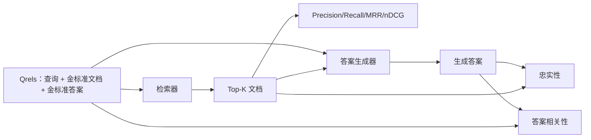

# RAG 评估：Precision、Recall、MRR、nDCG、忠实性与答案相关性

> 如果不能同时评估检索和答案，就不能交付这个系统。两者不是同一个指标，同一个提示词在不同维度上也可能失败。

**类型：** 构建
**语言：** Python
**前置课程：** Phase 11 第 06 课（RAG）、第 10 课（评估）；Phase 19 Track B 基础（第 20–29 课）；Phase 19 第 64、65、66、67 课
**时间：** 约 90 分钟

## 学习目标
- 从金标准 qrels 计算四个检索指标：precision@k、recall@k、MRR（平均倒数排名）和 nDCG@k。
- 计算两个答案质量指标：忠实性（每个声明都扎根于检索上下文）和答案相关性（答案确实回应问题）。
- 构建一个固定夹具 qrels 文件（查询、金标准文档 ID、金标准答案文本），让评估端到端读取它。
- 读取指标值，诊断流水线究竟在检索、排序、生成还是 grounding 环节失败。

## 问题

一个 RAG 系统至少有四个活动部件：分块器、检索器、重排器和生成器。任何一个部件都可能导致错误答案。没有分阶段指标时，你只能盲目排查。

用户报告了错误答案。是分块器切断了答案片段吗？是检索器没有把该块放进 top-k 吗？是重排器把正确块推到了第一位之后吗？还是生成器忽略了该块并编造内容？只看答案无法判断。你需要：

- 用检索指标评价检索器返回了什么。
- 用排序指标评价正确块在排序中的位置。
- 用忠实性评价生成器是否停留在检索上下文之内。
- 用答案相关性评价答案是否真正回应了问题。

本课在固定夹具 qrels 文件之上实现全部六项指标。评估离线且具有确定性；生产环境中可以把模拟的 LLM-as-judge 换成真实模型。

## 概念



### Precision@k

检索器返回的前 k 个文档中，有多少比例属于金标准集合？如果金标准有三个文档，而 top-3 返回其中两个和一个错误文档，那么 precision@3 就是 2 / 3。当无关检索块的代价很高时（生成器会在其上浪费词元，或该块会污染答案），应使用 precision。

### Recall@k

金标准文档中有多少比例出现在 top-k？如果金标准有三个文档，而 top-5 包含全部三个，那么 recall@5 就是 1.0。当漏掉答案的代价很高时，应使用 recall：宁可多看一个错误块，也不要完全错过答案块。

生产 RAG 中人们通常报告的指标是 recall@k。生成器很容易丢弃无关块，却无法从从未见过的块中凭空发明答案。

### MRR（平均倒数排名）

对每条查询，找出排序列表中第一个相关文档的位置。倒数排名是 1 / position，再对查询集合求平均。MRR 用一个数字概括检索器把最佳答案放到顶部的能力。

MRR 对位置 1 的权重很大。金标准文档排在第 1 位的查询贡献 1.0，排在第 2 位贡献 0.5，排在第 10 位贡献 0.1。这个指标主要由列表顶部决定。

### nDCG@k

归一化折损累计增益（Normalized Discounted Cumulative Gain）。完整公式为每个检索文档分配增益（通常相关为 1、不相关为 0），按位置的对数折损，求和后除以理想 DCG（完美排序时的 DCG），取值范围为 0 到 1。

nDCG 可以容纳分级相关性：金标准可以说“文档 A 是 3，文档 B 是 2，文档 C 是 1”。MRR 和 recall@k 会把一切压平为二值。语料库中每条查询有多个部分相关文档时，应使用 nDCG。

### 忠实性

对生成答案中的每个声明，检查它是否受到检索上下文支持。标准实现使用 LLM-as-judge 提示词，输入（声明、上下文）并返回 yes 或 no。指标就是通过检查的声明比例。

忠实性能够捕获生成器编造内容的失败模式。即使检索器返回了正确块，只要生成器产生幻觉，系统仍然是坏的。忠实性也称为 groundedness、support 或 attribution。

本课用确定性模拟 judge 实现忠实性：检查每个声明的词元与检索上下文的重叠是否达到阈值。生产环境中可替换为真实模型调用，指标的形状不变。

### 答案相关性

答案是否真的回应了问题？忠实性问“答案是否扎根于上下文”，答案相关性问“答案是否扎根于问题”。一个有依据但跑题的答案，忠实性高而相关性低；一个简短且切题、却忽略上下文的答案，相关性高而忠实性低。

标准实现同样使用 LLM-as-judge：输入（问题、答案），询问答案是否回应了问题。本课实现的是“词元重叠 + judge”的替代版本。

## 固定 qrels

```python
{
  "qid": "q1",
  "query": "what is the abort threshold for multipart uploads",
  "gold_doc_ids": ["d1", "d3"],
  "gold_answer_substring": "three failed parts",
  "graded_relevance": {"d1": 3, "d3": 2},
}
```

每条查询都携带：

- 查询字符串；
- 金标准文档 ID 集合（用于 precision / recall / MRR）；
- 分级相关性字典（用于 nDCG）；
- 金标准答案子串（作为每条 qrel 上的参考元数据保存；本课的忠实性是通过判断抽取出的声明是否被检索上下文支持来计算的，而不是与该子串比较）。

生产环境中需要由人工为这些数据打标。本课提供手工构建的固定夹具，使评估可以开箱即用。

```figure
ci-rag-metric-ladder
```

## 构建

`code/main.py` 实现：

- `precision_at_k(retrieved, gold, k)`：字面定义。
- `recall_at_k(retrieved, gold, k)`：字面定义。
- `mean_reciprocal_rank(retrieved_list_of_lists, gold_list)`：跨查询求平均。
- `ndcg_at_k(retrieved, graded_relevance, k)`：带二值或分级增益的 DCG / IDCG。
- `extract_claims(answer)`：将答案拆成句子形态的声明。
- `faithfulness(claims, context_texts, judge)`：被判断为有依据的声明比例。
- `answer_relevance(question, answer, judge)`：判断答案是否回应问题。
- `MockJudge`：确定性的词元重叠 judge，使评估可以离线运行。
- `evaluate_pipeline(pipeline_fn, qrels, ks)`：运行全部指标的编排器。
- 一个针对 qrels 运行三种流水线变体（分块器基线、混合检索、混合检索 + 重排）并打印指标表的演示。

运行：

```bash
python3 code/main.py
```

输出会在一张指标表中显示每种变体的 precision@k、recall@k、MRR、nDCG@k、忠实性和答案相关性。混合检索行的 recall 应超过分块器基线，重排行的 MRR 应超过混合检索。

## 用指标诊断失败

| 症状 | 可能原因 | 修复方向 |
|---------|-------------|-------------|
| recall@k、precision@k 都低 | 分块器切断答案，或检索器找不到答案 | 分块边界（第 64 课）或检索器模态（第 65 课） |
| recall@k 尚可但 MRR 低 | 正确块在 top-k 内，但不在第一位 | 重排器（第 66 课） |
| MRR 高但忠实性低 | 生成器在正确上下文中编造内容 | 生成提示；强制引用或拒答 |
| 忠实性高但相关性低 | 答案有依据，却跑题 | 查询改写器（第 67 课）或生成提示 |
| 四项都高但用户仍抱怨 | 评估集没有代表性 | 用真实用户查询扩充 qrels |

## 示例会隐藏的失败模式

**LLM-as-judge 偏差。** 模型可能把自己的输出判断得比实际更忠实。应让 judge 与生成器使用不同模型家族，或人工评分一个样本。

**Qrels 腐化。** 语料库变化时，金标准答案也会漂移。团队重命名函数后，2024 年 1 月 q1 的金标准文档可能在 2024 年 10 月不再是正确答案。应按季度审查 qrels。

**忠实性微检查漏掉宏观声明。** 逐句忠实性可能通过，但整个答案的结构仍然会误导读者。应在自动指标之上增加抽样级定性审查。

**Recall@k 掩盖逐查询失败。** 平均召回率 90% 可能掩盖某一类查询始终失败。应按查询类别（字面、释义、多主题）切分 qrels，并报告各切片指标。

## 使用

生产模式包括：

- 每次检索器或生成器变更都运行评估，把 recall@k 回归当作测试失败。
- 持久化每条查询的指标轨迹；用户投诉时，查找匹配的 qrels 条目，确认问题本应是否被捕获。
- 分层维护 qrels：20 条查询的 CI 冒烟集、每晚运行的 200 条回归集，以及每周运行的 2000 条深度集。

## 发布

第 69 课会把整条流水线（分块器、检索器、重排器、生成器）连接起来，并在端到端系统上运行本课评估。

## 练习

1. 添加第五个检索指标：hit-rate@k。与 recall@k 比较，并解释它们何时不同。
2. 实现分级忠实性：0（不支持）、1（部分支持）、2（完全支持），并相应更新指标。
3. 用真实模型调用替换模拟 judge，测量模拟 judge 与真实 judge 在固定夹具上的分歧。
4. 增加查询类别切片（“字面”“释义”“多主题”），报告每个切片的指标。
5. 增加“答案长度”指标，计算它与忠实性的相关性，并绘制曲线。

## 关键术语

| 术语 | 常见说法 | 实际含义 |
|------|----------|----------|
| Precision@k | “检索命中率” | 前 k 个结果中属于金标准的比例 |
| Recall@k | “金标准命中率” | 金标准文档出现在前 k 个结果中的比例 |
| MRR | “首次命中位置” | 第一个相关文档排名倒数的平均值 |
| nDCG@k | “分级排序质量” | 前 k 项的 DCG 除以理想 DCG |
| Faithfulness | “Groundedness” | 被检索上下文支持的答案声明比例 |
| Answer relevance | “是否回答了问题？” | 答案是否符合问题意图 |
| Qrels | “金标准标签” | 查询及其金标准文档与答案的标注集合 |

## 延伸阅读

- Buckley、Voorhees，《Evaluating Evaluation Measure Stability》，SIGIR 2000——排序指标稳定性的经典论文
- Jarvelin、Kekalainen，《Cumulated Gain-based Evaluation of IR Techniques》——nDCG 论文
- [Ragas: Automated Evaluation of RAG Pipelines](https://docs.ragas.io)
- [Anthropic, Evaluating RAG](https://www.anthropic.com/news/evaluating-rag)
- Phase 11 第 10 课：评估框架基础
- Phase 19 第 64–67 课：本课评估的组件
- Phase 19 第 69 课：本课要评价的端到端流水线
