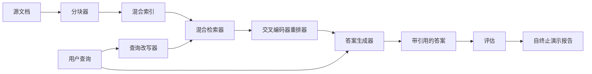

# 端到端 RAG 系统

> 六节课的组件，一条流水线，一个评估循环，一个自终止演示。这就是要交付的系统。

**类型：** 构建
**语言：** Python
**前置课程：** Phase 11 第 06 课（RAG）、第 10 课（评估）；Phase 19 Track B 基础（第 20–29 课）；Phase 19 第 64、65、66、67、68 课
**时间：** 约 90 分钟

## 学习目标
- 将分块器、混合检索器、查询改写器、交叉编码器重排器和答案生成器组合成一条端到端流水线。
- 实现按块锚点引用声明、在低置信度时拒答的答案生成器。
- 对组装后的流水线运行第 68 课评估，并证明分阶段构建在同一组组件上优于各个孤立阶段的全部指标。
- 构建一个自终止 CLI 演示：载入固定夹具语料库，运行固定查询集，以零状态码退出并打印摘要报告。

## 问题

六个单独有效的组件并不能证明系统有效。分块器可能在语料库上赢得 recall@5，却因为检索器无法对它产出的块排序而输掉系统 recall@5。重排器可能在合成候选池上提升 MRR，却因为双编码器在重排预算内的召回率太低而无法处理真实候选。查询改写器可能让一条查询变好，却因为模拟 LLM 生成退化的假想文档而破坏下一条查询。

集成测试必须使用同一份固定 qrels、同一个指标和一个负责连线的编排文件，端到端运行整条流水线。这正是本课构建的内容。如果集成流水线的指标优于每个阶段独立演示的指标，你才真正证明了系统。

## 概念



### 连接选择

这条流水线是一张小图。每个阶段都是具有清晰签名的函数。

| 阶段 | 输入 | 输出 |
|-------|------|------|
| Chunker | 文档文本 | Chunk 记录列表 |
| Retriever | 查询字符串 | 前 N 个 Chunk 记录 |
| Rewriter（可选） | 查询字符串 | 改写列表与假想答案 |
| Reranker | 查询、候选项 | 带交叉分数的前 K 个 Chunk 记录 |
| Generator | 查询、前 K 个 Chunk 记录 | 带引用的答案字符串 |

当每个签名都稳定时，组合就很直接。课程中的 `Pipeline` 类持有五个阶段和一个按顺序运行它们的 `query` 方法。每个阶段都可以替换：传入不同的分块器、检索器、改写器、重排器或生成器，流水线仍然能够运行。

### 带引用的答案生成器

生成器是最后一个阶段，也是最容易出问题的阶段。本课提供一个确定性的模拟生成器，它会：

1. 接收重排后的 top-K 块。
2. 选出至多两个与查询的内容词重叠最高的块。
3. 将每个选中块的一句话拼接成答案，并在每句话后附上 `[doc_id:chunk_index]` 锚点。
4. 如果没有块达到拒答阈值，就输出不带引用的 “I do not know”。

生产环境中可以用真实 LLM 调用替换模拟器，提示模板如下：

```
You are answering a question using only the snippets below.
Cite every claim with the anchor in parentheses.
If the snippets do not answer the question, say "I do not know".

Question: {query}

Snippets:
{enumerated chunks with anchors}

Answer:
```

低置信度拒答路径是记录交叉编码器 rank-1 分数的完整理由。如果该分数低于语料库阈值，生成器就拒答；这是防止幻觉答案的安全阀。

### 自终止演示

演示会端到端运行所有内容，打印一条查询的各阶段拆解，在四条固定夹具 qrels 上运行评估，打印指标表；当第 68 课的所有指标达到演示中设定的阈值时以状态码 0 退出。如果任何指标低于阈值，则以非零状态退出，并指出失败的指标。

这就是 CI 冒烟测试的形状。流水线离线、快速且具有确定性。夹具上的阈值有意设置得较紧，因此六节课中任一课回归都会使演示失败。

```figure
rag-pipeline-flow
```

## 构建

`code/main.py` 实现：

- `Chunk`：贯穿所有阶段的记录，在第 64 课形状上增加 `chunk_index` 和源文档 ID。
- `Chunker`：选择第 64 课的策略，默认使用递归切分。
- `HybridIndex`：打包第 65 课的 BM25 + 稠密检索 + RRF。
- `Rewriter`（可选）：根据查询长度和是否存在连接词，从第 67 课的 HyDE、多查询或分解中选择一种。
- `Reranker`：第 66 课训练的交叉编码器；使用更小的固定夹具训练集，使它可以在数秒内收敛。
- `Generator`：带引用和低置信度拒答的确定性模拟生成器。
- `Pipeline`：组合五个阶段；`query(question)` 返回 `Result(answer, top_k, latency_ms_per_stage)`。
- `run_demo()`：载入语料库，运行三条固定夹具查询，执行评估，打印结果，并根据阈值设置退出码。

运行：

```bash
python3 code/main.py
```

输出包含一条打印的查询轨迹、完整评估表和最终通过/失败状态。固定夹具上应返回状态码 0。

## 示例会隐藏的失败模式

**分块边界漂移。** 如果在 qrels 标注阶段和演示阶段更换分块策略，金标准文档 ID 就不再对应。应在 qrels 文件中锁定分块策略；演示会打印包含该策略名称的头部。

**重排器训练集泄漏到评估集。** 第 66 课的 14 个训练三元组包含与评估查询相似的查询。生产环境中必须严格留出评估查询；演示中的评估查询与重排训练集刻意不相交。

**模拟生成器隐藏幻觉风险。** 模拟生成器只能输出检索块中的文本，因此不可能产生幻觉。本课明确指出这一点，并把生产替换路径指向真实模型。

**没有流式输出。** 流水线在每个阶段结束后才返回完整答案。生产系统会流式输出生成器结果；流式处理不在本课范围内，但答案质量指标无论最终字符串如何产生都适用。

**离线延迟。** 模拟 LLM 调用是常数时间，真实 LLM 调用才会占主导。应在请求范围内规划延迟预算；本课的分阶段计时只测量 CPU 工作。

## 使用

生产模式包括：

- 将流水线文件放在一个带显式阶段接口的编排器中，避免把连线分散在整个仓库。
- 每次合并涉及某个阶段时都先运行评估；如果评估下降，就不合并。
- 持久化每次 CI 运行的指标轨迹，以便把回归归因到阶段替换。
- 增加一个 20 条查询的冒烟集（回归集的子集），确保在 30 秒内运行；完整回归集每晚运行。

## 发布

本课的流水线文件是 Phase 19 Track F 后续课程所假定的形状。后续课程可以在其上增加摄取自动化、增量重索引、遥测和服务层；检索、重排、改写和评估四个部分在这里完成。

## 练习

1. 在改写器内部增加逐查询策略选择器：用第 67 课的启发式（长度、连接词、术语比例）选择 HyDE、多查询或分解。
2. 在环境变量开关后接入真实 LLM 生成器，默认仍使用模拟器，并测量延迟差。
3. 让演示接受 `--corpus path` 参数以载入真实语料，重新运行评估和阈值检查。
4. 为分块器增加 `--strategy` 参数，测量每种策略对端到端召回的贡献。
5. 增加流式生成器接口并接入评估，确认忠实性是在最终字符串上计算，而不是在流式前缀上计算。

## 关键术语

| 术语 | 常见说法 | 实际含义 |
|------|----------|----------|
| Pipeline | “RAG 流水线” | 从摄取到带引用答案的组合阶段 |
| Citation anchor | “来源链接” | 附着在每个声明上的 `(doc_id, chunk_index)` 引用 |
| Refuse-on-low-confidence | “我不知道” | 重排第一名低于阈值时生成器不返回答案 |
| Smoke set | “CI 评估” | 每次 PR 检查都运行的最小 qrels 子集 |
| Stage interface | “函数签名” | 每个流水线阶段稳定的输入和输出类型 |

## 延伸阅读

- [Anthropic, Building search and retrieval](https://www.anthropic.com/news/contextual-retrieval)
- [Pinterest, MCP internal search](https://medium.com/pinterest-engineering)——生产架构参考
- [Ragas: Automated Evaluation of RAG Pipelines](https://docs.ragas.io)
- Phase 11 第 06 课：RAG 基础
- Phase 19 第 64–68 课：此处组合的组件
