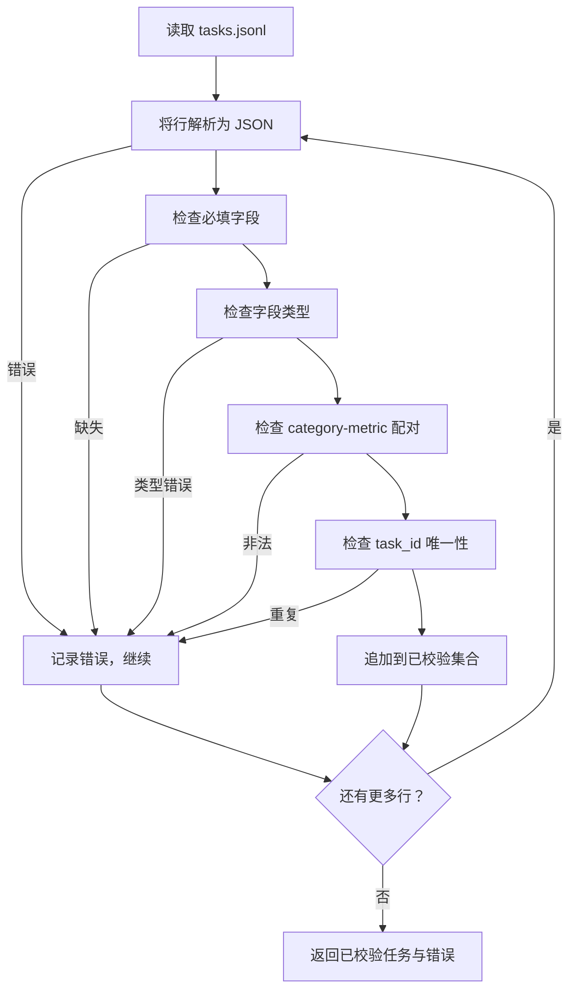

# 任务规格格式

> 评测框架的好坏取决于任务遵守的契约。在编写任何评分函数前，先冻结 JSONL 结构和指标词汇。

**类型：** 构建
**语言：** Python
**前置知识：** Phase 19 Track B 基础
**用时：** 约 90 分钟

## 学习目标

- 定义一种 JSONL 任务记录模式，用同一结构覆盖算术、选择题、代码执行、分类和自由文本摘要。
- 固定指标名称的封闭词汇表，让后续第 71–73 课只需根据一个字段分派。
- 把 few-shot 示例和后处理规则作为任务的一部分，而不是运行器的一部分，从而让同一个提示在不同模型上产生同一个目标。
- 实现严格校验器，在错误记录进入运行器前拒绝它们。
- 提供覆盖规格每个分支的 10 题 fixture 集合。

```figure
ci-task-spec-gate
```

## 为什么要冻结规格

研究代码库积累评测脚本的速度，往往快过积累测试的速度。半年后，每个 notebook 都有自己的 JSON 结构，每个指标都被重复实现，运行结果也无法比较。解决办法很朴素：选定模式，编写校验器，拒绝其他形式。本课正是这样做的。

这个结构借鉴 BIG-bench、HELM 和 lm-eval 风格运行器的思路，但字段名属于本项目。每个字段只有一个负责人：运行器读取任务，指标读取目标，后处理步骤规范化生成结果。流水线中途不能修改字段。

## 记录结构

任务是单行 JSON 对象。框架读取 `tasks.jsonl`，逐行独立校验；错误行只中止该条记录，不影响整次运行。

```json
{
  "task_id": "arith_001",
  "category": "arithmetic",
  "prompt": "Compute the result. Question: 17 + 24\nAnswer:",
  "targets": ["41"],
  "metric_name": "exact_match",
  "few_shot_examples": [
    {"prompt": "Question: 2 + 2\nAnswer:", "completion": "4"}
  ],
  "post_process": "strip_whitespace",
  "metadata": {"difficulty": "easy"}
}
```

必填字段是 `task_id`、`category`、`prompt`、`targets`、`metric_name`、`post_process`；`few_shot_examples` 和 `metadata` 可选。顶层未知字段会导致校验失败。

## 字段规则

`task_id` 是不含空白的字符串，校验器保证文件内唯一。

`category` 必须是 `arithmetic`、`mcq`、`code_exec`、`classification`、`summary` 之一。类别会约束合法的指标与后处理组合：`code_exec` 任务必须使用 `metric_name = code_exec`，而 `mcq` 任务必须使用针对单字母目标的 `metric_name = exact_match`。

`prompt` 必须是非空字符串。校验器禁止尾随空白，也拒绝已经在提示正文中包含 few-shot 区块的记录；few-shot 的渲染由运行器负责，而不是由作者预先拼接。

`targets` 是非空字符串列表。对于 `exact_match`，任一元素匹配即可；对于 `f1` 和 `rouge_l`，取目标中得分最高者；对于 `mcq`，列表必须恰好包含一个元素。

`metric_name` 只能取 `exact_match`、`f1`、`bleu_4`、`rouge_l`、`accuracy`、`code_exec`。这个词汇表是封闭的；新增指标必须同时新增课程，并在这里加入条目。

`few_shot_examples` 是由 `{prompt, completion}` 对组成的列表，校验器将其限制为最多 8 项，以控制提示词长度。

`post_process` 只能取 `none`、`strip_whitespace`、`lower`、`extract_letter`、`extract_code_block`、`extract_first_line`。每条规则都有唯一的确定性行为，校验器禁止组合规则。

## 校验器行为



校验器返回两个列表：通过校验的记录，以及包含出错行、违反规则和问题字段的错误记录。只要错误列表非空，运行器就拒绝启动，除非显式传入 `--allow-bad-tasks`。

## Few-shot 渲染

运行器用空行把 few-shot 示例拼接到提示词前。所有模型走同一代码路径，因此差异只来自模型本身；作者只需为每类任务写一次示例，而不用为每个提供商重复编写。

```python
def render(task):
    parts = []
    for ex in task.get("few_shot_examples", []):
        parts.append(ex["prompt"] + " " + ex["completion"])
    parts.append(task["prompt"])
    return "\n\n".join(parts)
```

## 后处理规则

后处理在生成完成后、指标计算前执行，具有确定性且无状态。

- `none` 原样返回字符串。
- `strip_whitespace` 去除首尾空白。
- `lower` 转为小写。
- `extract_letter` 返回首个匹配 `[A-E]` 的字符，用于选择题。
- `extract_code_block` 返回第一个三反引号代码块的主体，用于代码执行。
- `extract_first_line` 返回首个非空行，用于摘要分类。

需要列表之外规则的任务应归入新课程。

## 本课不做什么

本课不评分、不调用模型，也不运行代码；这些内容属于第 71、72 和 75 课。它冻结的是所有课程共同遵守的契约。10 题 fixture 覆盖两道算术题、两道选择题、两道代码执行题、两道分类题和两道摘要题；另一个坏样例会触发每条规则。

校验器对全部 10 条 fixture 都应通过；单独的 `tasks_bad.jsonl` 会触发每条规则，并返回恰好对应数量的错误。

## 如何阅读代码

`main.py` 定义 `TaskSpec`、`validate_task`、`validate_file` 和 CLI 入口；fixture 加载器是 `load_fixtures`，渲染与后处理辅助函数也紧邻校验逻辑。请从头读到尾，再阅读 `code/tests/test_spec.py`。文件底部的 demo 会校验捆绑的 fixture 并打印摘要。

## 进一步学习

评测套件会像数据库表增加列一样增加类别。稳妥做法是：没有同时新增指标、后处理规则和 fixture 任务，就拒绝新增类别。把规格变化当作数据库迁移，逐次评审、版本化并配套测试；本课的校验器就是这道闸门。
