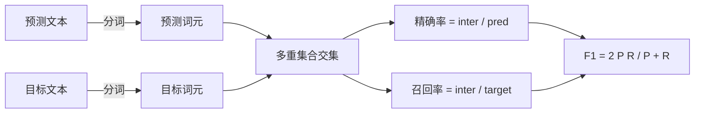
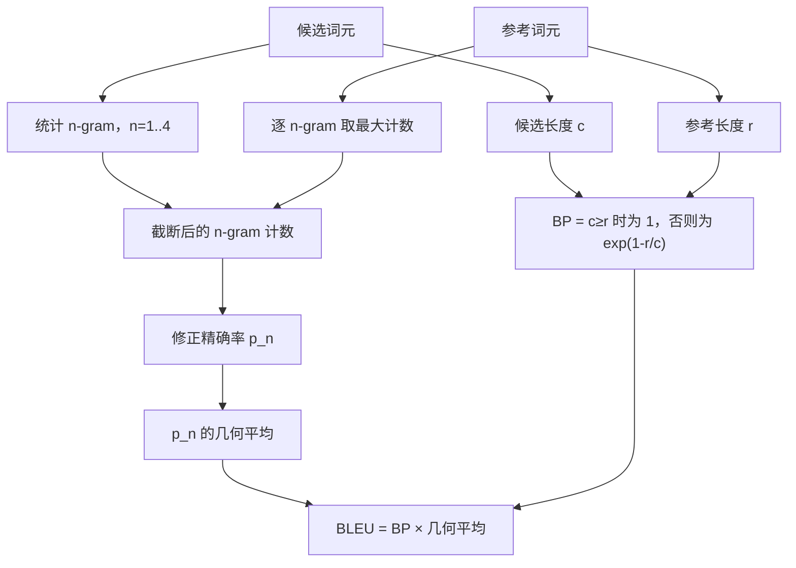

# 经典指标

> BLEU、ROUGE-L、F1、exact-match、accuracy。这五种指标仍覆盖大多数已发表的 LLM 评测数字。亲手从原理实现它们，才能知道数字究竟意味着什么。

**类型：** 构建
**语言：** Python
**前置知识：** Phase 19 Track B 基础，第 70 课
**用时：** 约 90 分钟

## 学习目标

- 按明确的分词规则实现 token 级 exact-match、F1 和 accuracy。
- 从零实现 BLEU-4：修正 n-gram 精确率、n=1 到 4 的几何平均和简短惩罚。
- 用最长公共子序列实现 ROUGE-L，并以 F-beta 合并精确率与召回率。
- 根据第 70 课的 `metric_name` 分派，让运行器与指标无关。
- 用来自推导示例而非第三方库的参考向量固定行为。

```figure
cd-bleu-overlap
```

## 为什么重新实现

你会看到一篇论文报告 BLEU 28.3，另一篇报告 BLEU 0.283；两个库的 ROUGE-L 也可能相差十分，因为一个先转小写，另一个不转。最直接的办法是自己写出指标，明确指出分词器和 smoothing 的位置。之后，跨论文比较数字就变成阅读指标配置，而不是争论库的名称。

标准库加 numpy 就足够：BLEU 是计数与截断，ROUGE-L 是动态规划，F1 是 token 集合的交集。最难的部分是选择分词器并承诺始终使用它。

## 分词

分词器是 `re.findall(r"\w+", text.lower())`：转小写，提取字母数字串，丢弃标点。本课所有指标都使用这一个分词器，运行器不能自行选择。更换分词器就等于运行另一个基准。

```python
TOKEN_RE = re.compile(r"\w+", re.UNICODE)
def tokenize(text):
    return TOKEN_RE.findall(text.lower())
```

这是有意的简化；生产系统会关注 CJK、缩写和代码标识符。本课要说明的是：分词器是契约，不是旋钮。

## Exact match

```python
def exact_match(pred, targets):
    return float(any(pred.strip() == t.strip() for t in targets))
```

它对每个任务返回 1.0 或 0.0，数据集聚合时取均值。它适用于算术、选择题和短分类任务。

## Token 级 F1

为预测与目标建立 token 多重集合。精确率是多重集合交集除以预测集合，召回率是同一交集除以目标集合，F1 是调和平均。实现需要处理空预测与空目标。



多目标任务取目标列表中的最高 F1，与文献中常见的 SQuAD 行为一致。

## BLEU-4

BLEU 是经典机器翻译指标，在摘要研究中仍很常见。本课采用语料级 BLEU-4、标准简短惩罚，以及修正 n-gram 计数的加一平滑，避免缺少一个 4-gram 就把分数压成零。

对每个候选—参考答案对，分别计算 n=1、2、3、4 的修正 n-gram 精确率。修正精确率会把候选 n-gram 的计数截断为该 n-gram 在任一参考答案中的最大计数，因此候选不能靠重复同一个短语刷分。四个精确率取几何平均，再乘以简短惩罚：候选长度为 `c`、参考长度为 `r` 时，`c >= r` 则惩罚为 1，否则为 `exp(1 - r/c)`。



采用 Lin 和 Och 的 method 1：每个 n-gram 精确率的分子、分母都加一后再取对数。这样，当参考答案没有匹配的 4-gram 时不会出现 `log 0`；对较长候选而言，它又会接近不平滑的结果。

## ROUGE-L

ROUGE-L 比较候选与参考 token 序列的最长公共子序列。LCS 保留词序但不要求连续，因此适合摘要。用动态规划求 LCS 长度，再计算召回率 `lcs / reference length`、精确率 `lcs / candidate length`，最后用 beta=1 的 F-beta 合并。

```python
def lcs_length(a, b):
    n, m = len(a), len(b)
    dp = numpy.zeros((n + 1, m + 1), dtype=int)
    for i in range(n):
        for j in range(m):
            if a[i] == b[j]:
                dp[i+1, j+1] = dp[i, j] + 1
            else:
                dp[i+1, j+1] = max(dp[i+1, j], dp[i, j+1])
    return int(dp[n, m])
```

`numpy` 表使实现更易读，纯 Python 列表也能完成同样工作。选择 ROUGE-L 的任务每题要付出 O(n m) 的计算成本；对典型摘要长度，这通常仍低于 1 毫秒。

## Accuracy

对于多目标分类，accuracy 可归结为与单个规范化目标做 exact-match。我们把它暴露为独立函数，让分派器可以根据 `metric_name` 分派，而不必在运行器内部比较字符串。

## 分派契约

唯一入口是 `score(metric_name, prediction, targets)`，返回 `[0, 1]` 内的浮点数。运行器不再按指标名分支，而是把调用交给这个入口；这正是第 75 课把第 70 课任务规格接起来的接口。`code_exec` 会在第 72 课接入。

```python
def score(metric_name, pred, targets):
    if metric_name == "exact_match":
        return exact_match(pred, targets)
    if metric_name == "f1":
        return max(f1_score(pred, t) for t in targets)
    if metric_name == "bleu_4":
        return max(bleu4(pred, t) for t in targets)
    if metric_name == "rouge_l":
        return max(rouge_l(pred, t) for t in targets)
    if metric_name == "accuracy":
        return accuracy(pred, targets)
    raise ValueError(f"unknown metric_name: {metric_name}")
```

## 本课不做什么

本课不调用模型，不超出第 70 课后处理规则规范化生成结果，也不计算置信区间。它不实现 BLEURT 或 BERTScore——二者需要模型，属于其他课程。目标是建立可审计、快速、可复现的五指标基础层。

## 如何阅读代码

`main.py` 以自由函数定义各指标，再定义分派器；参考向量位于底部的 `_reference_examples` 区块，demo 会通过分派器运行八个示例并打印每个指标的分数。请从头读到尾，再阅读 `code/tests/test_metrics.py`，其中固定参考值，并覆盖空预测、空参考、无重叠 token、精确匹配和重复短语截断等边界行为。

## 进一步学习

经典指标必要但不充分：它们奖励表面重叠，可能漏掉语义。等经典基础可信后，再叠加 BLEURT、BERTScore、GEval 等模型指标。现在先让五个指标通过测试，形成可审计的指标栈。

**练习检查：**
运行参考向量与测试，确认五种指标都返回 `[0, 1]` 范围内的可复现结果。
