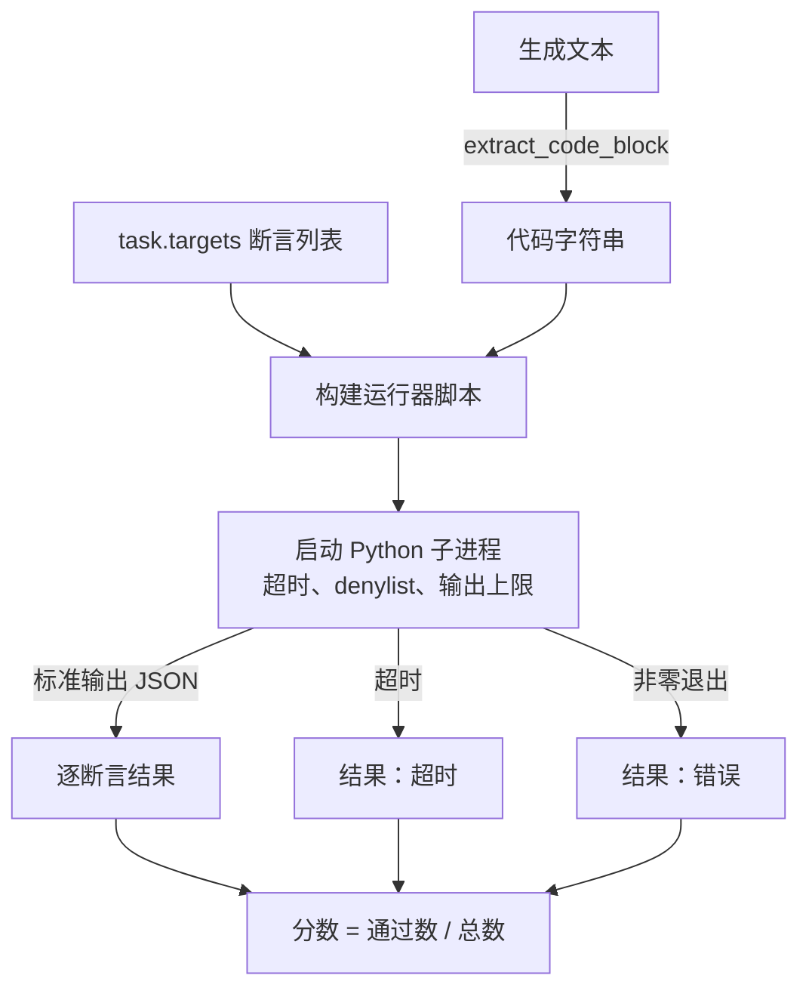
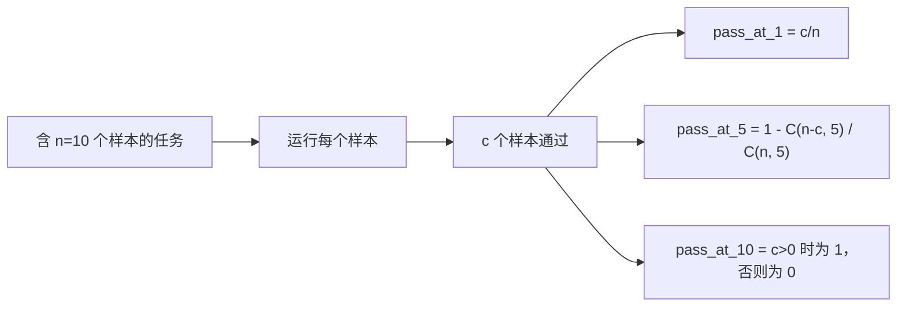

# 代码执行指标

> 生成代码只有通过测试才算正确。评测框架必须提取代码、在不撞垮主机的前提下运行它，并诚实统计通过率。本课构建这层能力。

**类型：** 构建
**语言：** Python
**前置知识：** Phase 19 Track B 基础，第 70、71 课
**用时：** 约 90 分钟

## 学习目标

- 按第 70 课的后处理规则从自由文本生成中提取代码块。
- 在隔离子进程中运行候选代码，设置超时、输出上限和导入 denylist。
- 把任务评分为通过断言字符串的比例。
- 为一次模型采样多个生成结果计算 pass-at-k。
- 将崩溃、语法错误和超时视为带不同退出码的明确失败模式。

```figure
sandbox-runner
```

## 为什么使用隔离子进程

内联 `exec` 会带来安全与稳定性风险：生成的 `while True: pass` 会永久卡住评测，生成的 `import shutil; shutil.rmtree('/')` 也确实可能造成灾难。做法是每个候选生成启动一个新的 Python 解释器，从标准输入传入代码，把断言结果写到标准输出，超时就杀掉子进程；这样主评测进程仍能继续运行。

HumanEval、MBPP、BigCodeBench 和 LiveCodeBench 等真实评测都采用子进程沙箱，有些还叠加 Docker。本课停在子进程层，是因为它可移植、只用标准库，并能覆盖教学评测所需的失败模式；生产部署还应增加 seccomp、网络隔离和只读文件系统。更完整的生产级加固属于本 Track 之外的后续课程。

## 代码执行任务的结构

`code_exec` 任务在 `targets` 中携带断言字符串。运行器从生成文本提取围栏代码，围绕它构建测试框架后执行。



分数位于 `[0, 1]`；三条断言通过两条时得分为 0.667。无论失败原因是什么，运行器都返回同样的结果形状，并把子进程崩溃映射为规范化错误码。

## Denylist

denylist 按导入处理：运行候选代码前，运行器脚本会把危险模块的导入改写为抛出 `ImportError("denied")` 的桩。名单包括 `os.system`、`subprocess`、`socket`、`requests`、`urllib`、`urllib.request`、`urllib.error`、`urllib.parse`、`ctypes`、`shutil`、`http.client` 和 `asyncio.subprocess`。我们不假装它是完美沙箱；真正承重的是墙钟超时和输出上限。

```python
DENIED = {
    "os.system": True,
    "subprocess": True,
    "socket": True,
    "shutil": True,
    "requests": True,
    "urllib": True,
    "ctypes": True,
}
```

运行器还会在候选代码前加上 `import sys` 和防护逻辑，把 `os.system` monkey-patch 为抛出异常；完整模板位于 `main.py`。

## Wall-clock timeout

每个子进程默认获得 3 秒的墙钟预算，运行器通过 `subprocess.run(..., timeout=t)` 执行。超时后捕获 `TimeoutExpired`、终止进程并记录该任务的 `timeout` 原因；该任务得分为零，但运行器会继续处理下一题。每个任务可通过 `task.metadata.timeout_s` 配置更长时间，但第 70 课校验器将上限设为 30 秒，以保持套件有界。

## Output cap

子进程可能向标准输出疯狂写入，耗尽主机内存。运行器把标准输出流式写入缓冲区，一旦累计超过 256 KB 就终止子进程；结果记为 `exit_code = error`，详情字符串为 `"output overflow"`。生成代码意外进入不断打印的循环时，就会触发这一情况。

## Pass-at-k

给定每题 `n` 个独立样本，其中 `c` 个通过，从 `n` 个中抽取 `k` 个至少包含一个通过解的概率是：

```
pass_at_k(n, c, k) = 1 - C(n - c, k) / C(n, k)
```

当 `n - c < k` 时结果为 1；实现直接处理该边界，并将 `pass_at_k` 暴露给第 74 课。



## 退出码

- `pass`：所有断言通过。
- `assertion_fail`：代码运行了，但至少一条断言失败。
- `syntax_error`：导入失败或出现 SyntaxError。
- `timeout`：超过墙钟时间。
- `error`：其他崩溃，包括 denylist 命中和输出溢出。

分数仍是比例，退出码只是元数据，下游可决定超时算零还是缺失。

## 本课不做什么

本课不提供真正的安全沙箱，不运行来自开放网络的不可信代码，也不处理文件 I/O 或网络等有状态任务；这些需要容器或 microVM。重点是隔离子进程、denylist、超时、输出上限、清晰退出码和 pass-at-k 数学。

## 如何阅读代码

`main.py` 定义 `extract_code`、`run_candidate`、`score_code_exec` 和 `pass_at_k`；子进程运行器脚本作为字符串构造后，以 `-c` 参数传给新的 Python 解释器。测试覆盖四种退出码及来自 HumanEval 风格工作示例的 pass-at-k。请从头读到尾，重点观察运行器模板；盯着断言循环，直到能预测它写回父进程的 JSON 外壳。

## 进一步学习

子进程结构运行起来后，下一个问题是可移植性：不同 Python 版本在 Windows 上处理 `SIGKILL` 的方式不同，最干净的修复是把运行器放进 Docker 镜像。再往后，可以用真实单元测试文件替代断言字符串，使评测更接近生产 CI；那时就不要再把断言字符串称为测试，它们只是会产生玩具级失败模式的玩具测试。

**练习检查：**
按顺序运行 demo 与测试，确认通过率、退出码和 pass-at-k 的边界行为与契约一致。

**结果记录：**
记录每个候选任务的分数与退出原因，便于下游排行榜区分失败类型。

**交付检查：**
确认不同失败模式都保留独立退出码，并能被运行器记录。
