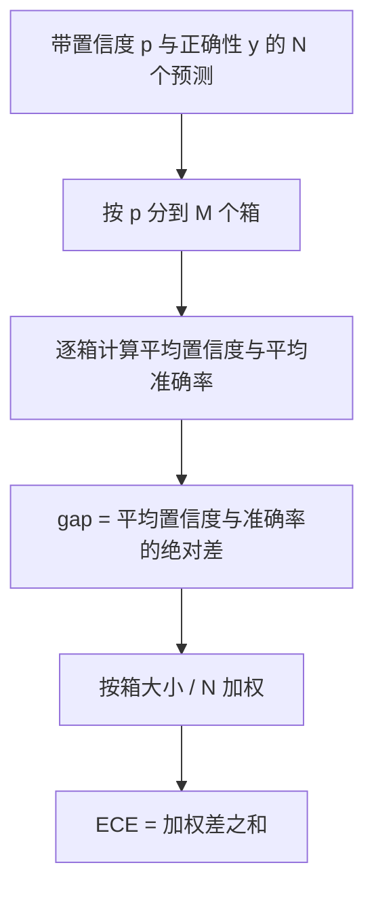
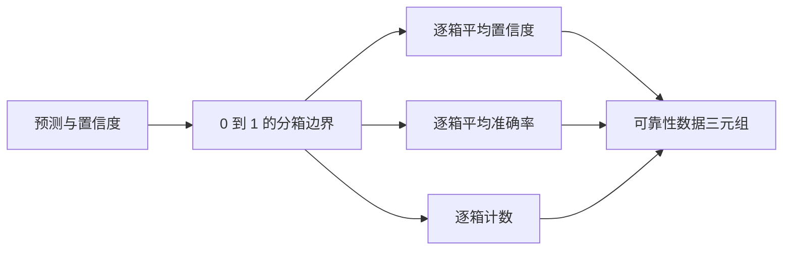

# 困惑度与校准

> 如果模型对一千个答案都说有 90% 把握，却只答对六百个，它就没有校准好。可信评测一半靠校准，另一半靠困惑度判断模型是否认为留出文本确实合理。

**类型：** 构建
**语言：** Python
**前置知识：** Phase 19 Track B 基础，第 70、71 课
**用时：** 约 90 分钟

## 学习目标

- 根据模型适配器提供的 token 负对数概率，计算留出语料的 token 级困惑度。
- 根据分箱后的预测概率计算 ECE。
- 计算 Brier 分数并说明它补充 ECE 的地方。
- 构建绘制置信度—准确率曲线所需的可靠性图数据。
- 将 perplexity、ece、brier 接入评测报告。

```figure
cd-reliability-diagram
```

## 困惑度的含义

困惑度是每 token 平均负对数似然的指数，越低越好。困惑度为 1 表示模型给每个实际 token 都赋予概率 1；接近词表大小则表示模型近似均匀分配概率，几乎没有学到东西。真实数字介于两者之间：2026 年较强的基础模型在 WikiText-103 上可能约为 8–12，而较差的模型在同一文本上可能超过 50。

框架不自行计算 log-probability，这些值由模型适配器提供。框架负责聚合：接收每个 token 的负对数概率列表和每个序列的 token 数列表，返回整个语料的困惑度。

```python
def perplexity(neg_log_probs, token_counts):
    total_nll = sum(neg_log_probs)
    total_tokens = sum(token_counts)
    return math.exp(total_nll / total_tokens)
```

实现处理零 token，并断言负对数概率非负；若适配器误传 `log p`，结果低于 1，会被识别为契约违规。

## ECE 衡量什么

期望校准误差（ECE）把预测按置信度分到固定数量的箱中，然后计算每个箱的平均置信度与平均准确率之差，并按箱大小加权。标准做法是在 `[0, 1]` 上使用十个等宽箱；实现支持任意正整数的箱数，运行器可以在发布约定的 10 箱与比较约定的 15 箱之间选择。



ECE 会受到箱数和样本量影响：在 10 个箱、100 个预测的情况下，无法把 0.02 的 ECE 与随机噪声可靠地区分开。因此实现同时返回非空箱数量，让运行器可以在样本太少时拒绝报告一个孤立的数字。

## Brier 分数能补充什么

ECE 只关注平均差距。一个模型可能在一半箱中过度自信、另一半箱自信不足，误差相互抵消后 ECE 仍然很低，但模型在局部并没有校准好。Brier 分数对每个预测相对于真实结果计算平方误差，因此会直接惩罚置信度的偏离。

对于二分类结果，Brier 分数是 `mean((p_i - y_i)^2)`。它可以分解为可靠性、分辨率和不确定性三部分。本课计算分数及其分解；运行器报告标量，同时把分解记录给仪表板。

```python
def brier(p, y):
    return float(np.mean((p - y) ** 2))
```

## 可靠性图数据

可靠性图把每个箱的预测置信度与经验准确率画在一起，对角线表示完美校准。函数返回三个数组：每箱平均置信度、每箱平均准确率和每箱计数；绘图代码位于下游，本课只冻结数据形状。



返回的三元组既能直接交给调用层绘图，也能用于计算自定义 ECE 变体，例如自适应 ECE 或 sweep ECE。返回 numpy 数组后，下游代码无需再次转换。

## 置信度来源

框架不假定置信度一定来自 softmax，只接受每个预测一个 `[0, 1]` 中的数。选择题可使用各选项 log-likelihood 的 softmax；自由文本可使用模型自报的概率，或平均 log-likelihood 的指数。评测只消费这个数字，数字如何产生属于适配器的职责。

## 边界情况

- 所有预测都错误：ECE 等于平均置信度，Brier 较高，困惑度则取决于模型如何评价留出文本。
- 所有预测都正确且置信度很高：ECE 接近零，Brier 也接近零。
- 完全不确定的预测器都给出 `p=0.5`：ECE 是 `0.5 - accuracy`，Brier 是 `0.25` 减去一个修正项。
- 空输入：ECE、Brier 和可靠性数据返回 `0.0`（或填零数组）；零 token 时困惑度返回 `NaN`。这些路径都不发出警告，由运行器检查数值并决定报告还是跳过。

这些情况都固定在测试中。真实模型在真实基准上未必会遇到它们，但有缺陷的适配器或很小的样本会遇到，运行器不应因此崩溃。

## 分派

校准不是像 F1 那样的逐任务指标，而是逐模型报告。运行器在整个评测过程中累积 `(confidence, correct)` 对，一次性计算 ECE、Brier 和可靠性数据；困惑度则在独立的留出文本语料上计算。

```python
report = CalibrationReport.from_predictions(confidences, correct)
report.ece          # float
report.brier        # float
report.reliability  # tuple of three numpy arrays
report.populated_bins  # int
```

`PerplexityResult.from_token_nll(neg_log_probs, token_counts)` 返回困惑度与每 token 平均负对数似然。校准是模型级报告；运行器汇总全评测的 `(confidence, correct)`，困惑度则独立计算留出语料。

## 本课不做什么

本课不调用模型，不实现 softmax，不从输出 token 推断置信度，也不做 temperature scaling 或 Platt scaling；这些是适配器或后处理修正的职责，属于其他课程。本课的目标是让困惑度、ECE 和 Brier 这三个数字可信且可复现。

## 如何阅读代码

`main.py` 定义 `perplexity`、`expected_calibration_error`、`brier_score`、`reliability_diagram`，以及 `CalibrationReport` 和 `PerplexityResult` 两个 dataclass。demo 在已知真实标签的合成预测上运行：一个校准良好的模型、一个过度自信的模型和一个自信不足的模型。`code/tests/test_calibration.py` 固定全部边界行为及这些合成预测的参考值。

请从头读到尾；函数顺序从标量、向量到报告，每个函数都有简短的数学说明和契约。

## 进一步学习

校准是发表评测中最容易被忽略的维度。很多排行榜只报告一个 accuracy 就结束了；如果一个模型 accuracy 更高但 Brier 更差，它可能不如 accuracy 略低、却能可靠表达不确定性的模型适合生产部署。校准管线稳定后，可以在留出验证片段上加入 temperature scaling，重新计算 ECE，观察差距是否缩小；那是后续课程，本课提供的是基础层。

**实验检查：**
用已知真实标签的合成预测运行测试，核对良好、过度和不足自信三种情形。

**结果记录：**
保存报告中的标量、非空箱数量和可靠性三元组，避免只留下一个无法解释的数字。

**复现提示：**
固定输入与箱数后，重复运行应得到相同的困惑度、ECE 和 Brier 结果。

**交付检查：**
确认模型适配器只负责提供概率与 token 负对数似然，聚合逻辑不偷偷改变输入定义。

**练习延伸：**
比较不同箱数对 ECE 的影响，并说明为什么不能脱离样本量解读它。

**交付检查：**
确认报告同时包含困惑度、ECE、Brier 和可靠性数据。
