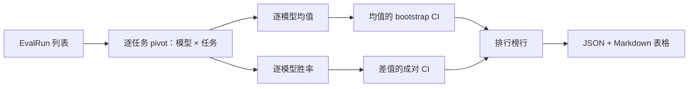
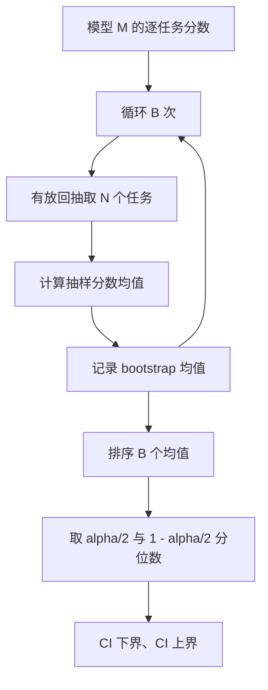

# 排行榜聚合

> 单任务分数很容易；跨异构任务给模型排名更难。千次预测排行榜上的统计显著性，是很多人都会跳过的部分，本课不会跳过。

**类型：** 构建
**语言：** Python
**前置知识：** Phase 19 Track B 基础，第 70、71、73 课
**用时：** 约 90 分钟

## 学习目标

- 把多个模型和任务的逐任务分数聚合为整洁的逐模型行。
- 规范化异构分数，避免 pass rate 或 BLEU 过度影响总分。
- 按均值和胜率给模型排名，并理解两者适用场景。
- 对模型均分和成对差异计算 bootstrap 置信区间。
- 输出 JSON 报告和可粘贴到 CI 评论中的 Markdown 表格。

```figure
ci-leaderboard-ci
```

## 输入结构

聚合器接收 `EvalRun` 列表；第 75 课运行器为每个 `(model, task)` 对输出一条记录，聚合器不关心分数如何产生，只要求其已规范化到 `[0, 1]`。

```python
@dataclass
class EvalRun:
    model_id: str
    task_id: str
    metric_name: str
    score: float          # in [0, 1]
    category: str
```

## 输出结构

输出包括三张表：逐任务 pivot、逐模型均值和逐模型胜率；均值的 bootstrap CI 与成对差异 CI 随后汇入排行榜行，最终形成 JSON 报告和 Markdown 表格。

每行排行榜包含 `model_id`、`mean_score`、`mean_ci_lo`、`mean_ci_hi`、`win_rate`、`tasks_completed`，以及可选的按类别均值 `categories` 映射。



## 规范化

如果一个任务分数在 `[0, 1]`、另一个在 `[0, 100]`，后者会悄悄支配均值。因此聚合器验证每个输入分数都在 `[0, 1]`，否则拒绝整次运行。修复发生在上游：指标本来就应返回比例，第 71–73 课共同维护这一契约。

## 均值与胜率

两种排名方式服务于不同目标。均值是某个模型逐任务分数的平均值，是排行榜常用的 headline 数字，但会受离群值和任务不平衡影响。胜率统计模型在同一任务上击败其他模型的次数：每个任务由最高分模型获胜，平局分摊胜利；胜率等于获胜次数除以该模型有分数的任务数。它对离群值和尺度差异不那么敏感，但会丢失分数的具体信息。

```python
def win_rate(model_id, runs_by_task, all_models):
    wins, total = 0, 0
    for task_id, runs in runs_by_task.items():
        scores = {r.model_id: r.score for r in runs if r.model_id in all_models}
        if model_id not in scores:
            continue
        total += 1
        best = max(scores.values())
        if scores[model_id] >= best:
            wins += 1
    return wins / total if total else 0.0
```

## Bootstrap 置信区间

模型均值的置信区间通过对任务做 bootstrap 有放回重采样估计：每次抽取同样数量的任务，计算重采样集合的均值，重复 `B` 次后取 `alpha/2` 与 `1-alpha/2` 分位数。成对比较则对逐任务差值 `score_A - score_B` 做 bootstrap 并取分位数区间；区间不包含零时，才认为在 alpha 水平上有显著差异，否则排行榜将两模型视为平局。



底层 helper（`bootstrap_mean_ci`、`bootstrap_pairwise_diff`）默认 `B=1000`，公共聚合器（`aggregate`、`pairwise_diffs`）默认 `b=500`，使 demo 和测试保持较快；默认 `alpha=0.05`，全程只用 numpy，不依赖 scipy。

## 类别

设置 `EvalRun.category` 后，报告还会给出每类均值。这是排行榜中显示 `math`、`reasoning`、`code`、`safety` 等类别的列，可以发现模型总体强但代码弱的情况，而这类信息会被 headline 均值隐藏。

## Markdown 渲染

Markdown 表按均值排序，CI 保留两位小数，过长的模型 ID 截断至 20 个字符。

```text
| Rank | Model | Mean | 95% CI | Win rate | Tasks |
|------|-------|------|--------|----------|-------|
| 1    | gpt   | 0.78 | 0.74-0.82 | 0.62 | 50 |
| 2    | claude| 0.75 | 0.71-0.79 | 0.34 | 50 |
| 3    | random| 0.10 | 0.07-0.13 | 0.04 | 50 |
```

## 本课不做什么

本课不运行模型，不调用指标层，不实现自适应 ECE，也不做任务加权。`weight` 字段作为扩展钩子保留，但聚合器暂时忽略它；如果需要加权，应在后续课程实现。

## 如何阅读代码

`main.py` 定义 `EvalRun`、`LeaderboardRow`、`aggregate`、`bootstrap_mean_ci`、`bootstrap_pairwise_diff` 和 `render_markdown`。demo 构造由三个模型和十二个任务组成的合成套件，聚合后打印排行榜和成对差异表。`code/tests/test_leaderboard.py` 固定 bootstrap、Markdown 渲染、胜率边界和空输入行为。

请从头读到尾：数据形状（`EvalRun`、`LeaderboardRow`）在最前，接着是聚合器、bootstrap，最后是渲染；每个函数都有聚焦的契约。

## 进一步学习

自然的下一步是使用成对任务显著性，而不是非成对 bootstrap。如果模型 A 和 B 都运行同一百道题，应对逐任务差异做成对 bootstrap；本课的 `pairwise_diffs` 已实现这一点。再往后可以使用尊重任务族结构的分层 bootstrap，因为数学题之间并不独立，同一种算术错误模式可能影响十道题。本课先把可辩护的基础评测层搭好。

**练习检查：**
用三种模型和十二个任务运行 demo，核对均值、胜率、CI 及 Markdown 排序。

**结果记录：**
保存 JSON 报告及成对差异表，并记录 bootstrap 次数与 alpha。

**解释排名：**
同时查看均值和胜率；两者不一致时，检查离群任务与任务覆盖范围。

**边界检查：**
测试空输入、缺失任务、平局和超出 `[0, 1]` 的分数，确认错误不会静默进入排行榜。

**复现提示：**
固定随机种子后，bootstrap 区间和渲染结果应保持稳定。
