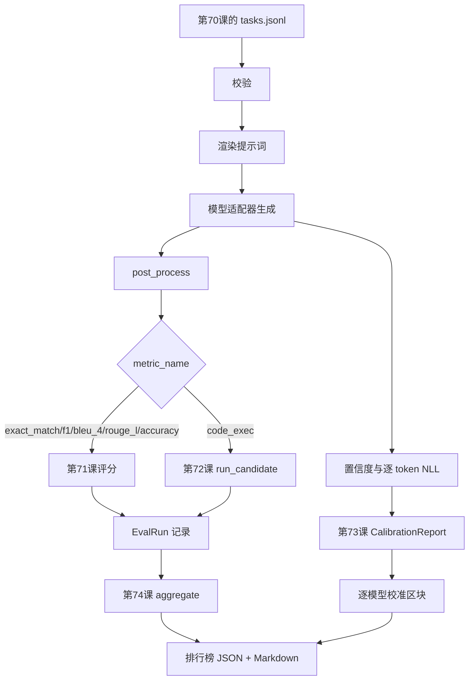

# 端到端评测运行器

> 前五课分别完成基础模块，本课把它们连接起来。运行器读取第 70 课的任务规格，通过适配器调用模型，用第 71、72 课评分，附加第 73 课的校准报告，并输出第 74 课的排行榜；演示会自行终止。

**类型：** 构建
**语言：** Python
**前置知识：** Phase 19 Track B 基础，第 70–74 课
**用时：** 约 90 分钟

## 学习目标

- 定义一个小而稳定的 `ModelAdapter` 接口，使模拟模型、本地模型和 API 模型都能实现它。
- 在 fixture JSONL 文件上运行评测，并通过工作线程池并行执行任务。
- 在一次遍历中组合指标层（`exact_match`、F1、BLEU-4、ROUGE-L、`code_exec`）与校准层。
- 生成逐模型的 `EvalRun` 记录，并直接交给排行榜聚合器。
- 同时输出 JSON 报告和 Markdown 表格；运行干净时以零退出码自行终止，校验或运行时失败时以非零退出码终止。

```figure
eval-grid
```

## 流水线



运行器是集成点。第 70–74 课各自负责一个模块，由运行器负责组合；运行器不复制这些模块中的逻辑，而是直接导入它们。

## 适配器接口

适配器是运行器与具体模型之间的接缝。接口刻意保持很小，以便替换模型而不改动评测流程。

```python
class ModelAdapter:
    model_id: str

    def generate(self, prompt: str, task: TaskSpec) -> Generation: ...
```

`Generation` 是一个数据类，包含：

- `text`：模型的自由格式输出。
- `confidence`：范围为 `[0, 1]` 的浮点数，表示模型对答案自报的概率。
- `token_nll`：可选，生成 token 的负对数似然之和。
- `token_count`：可选，生成 token 的数量。

运行器提供三种模拟适配器：`RuleBasedAdapter`（确定性、接近满分）、`NoisyAdapter`（过度自信但经常答错）和 `BiasedAdapter`（擅长一个类别、却不擅长另一个类别）。演示会让三者都运行第 70 课的 fixture。

## 并行执行

运行器使用 `concurrent.futures.ThreadPoolExecutor`，按模型并行执行任务。工作线程数默认为 8 与任务数中的较小值。真实模型调用的瓶颈通常是网络 I/O，因此线程已经足够。`code_exec` 路径会在任务内部创建自己的子进程，执行器只负责调度并等待它。

为了让测试保持确定性，运行器暴露 `run_eval(adapters, tasks, parallel=False)`；测试可以关闭并行，从而固定执行顺序。

## 单遍评分循环

对每个任务执行：

1. 渲染提示词（few-shot 前缀加提示词正文）。
2. 调用适配器并记录调用耗时。
3. 按任务规则对生成结果做后处理。
4. 将结果分派给指标层。
5. 用分数和指标元数据构建一条 `EvalRun` 记录。
6. 将 `(confidence, correct)` 对追加到校准缓冲区。

对于 exact-match 风格指标（`exact_match`、`accuracy`、`code_exec`），`correct` 信号的条件是 `score >= 1.0`；对于分级指标，条件是 `score >= 0.5`。阈值定义在 `_correct_from_score` 中，运行器不提供公开的覆盖参数。

## 聚合

所有任务产生结果后，运行器调用第 74 课的 `aggregate` 与 `pairwise_diffs`，以及第 73 课的 `CalibrationReport.from_predictions`。输出是一个统一的 JSON 信封：

```json
{
  "leaderboard": [...],
  "pairwise": [...],
  "calibration": {
    "model_id_a": {"ece": 0.04, "brier": 0.10, "populated_bins": 8, ...},
    ...
  },
  "summary": {
    "tasks": 10,
    "models": 3,
    "wall_seconds": 1.2
  }
}
```

运行器还会将 Markdown 表格写到 stdout，用户可以把结果直接粘贴到 PR 审查中。

## 自终止演示

演示会让三个模拟适配器运行第 70 课提供的十个 fixture 任务，实际耗时应低于十秒；运行干净时退出码为零。

干净运行的判定条件是：

- 每个任务都通过第 70 课的校验。
- 每个任务都经过第 71、72 课的评分。
- 第 73 课的校准报告聚合过程没有错误。
- 排行榜将规则适配器严格排在随机适配器之上。

如果其中任一条件不满足，运行器会以非零退出码终止，并在 JSON 信封中写入结构化错误。

## 本课不涉及的内容

本课不调用真实模型，不实现 API key 流程或限流处理，也不实现流式输出和部分生成；适配器每次调用返回一个完整的生成结果。本课不处理重试或缓存。这些关注点属于适配器层；运行器既不依赖具体指标，也不依赖具体供应商。

## 如何阅读代码

`main.py` 是集成入口。它通过一个按相对路径解析模块的 `_load_sibling` 小工具，导入另外五课的模块。`Generation`、`EvalReport` 和 `ModelAdapter` 这几个数据类在本地定义，模拟适配器位于文件底部。

建议从上到下阅读 `main.py`：先浏览导入部分，再看 `run_eval`、`_score_one`，最后看各个适配器。文件末尾的演示代码就是入口。

`code/tests/test_runner.py` 中的测试固定了适配器接口、单遍循环、并行与串行结果的一致性、校准缓冲区，以及 JSON 信封的结构。

## 进一步探索

这个运行器只是最低可用层。生产评测系统还会增加：以 `(task_id, model_id, model_version)` 为键的结果缓存，按运行记录费用和 token 的成本台账，遇到限流时采用退避的重试层，面向 pass-at-k 任务的采样策略，以及适用于长测试集的流式输出格式。这些都可以作为单一关注点包裹在运行器外部，而无需改动指标层或聚合层；契约的价值就在于这种分离。

先让模拟适配器稳定运行，再为一个真实供应商增加适配器。选择提供免费额度的服务，写几十行胶水代码，观察排行榜出现真实结果；随后再加入第二个供应商，让评测框架承担剩余工作。
