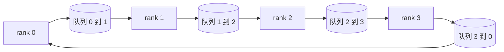

# 从零实现集合通信原语

> 支撑分布式训练的四种集合操作是 `allreduce`、`broadcast`、`allgather` 和 `reduce_scatter`。训练框架提供的其他原语都只是它们的封装。在 `multiprocessing.Queue` 网格上把它们实现一次，再用参考实现验证；完成后，后续课程剩下的就只是把这些组件接起来。

**类型：** 构建
**语言：** Python
**前置知识：** Phase 19 Track C 第 42–49 课
**用时：** 约 90 分钟

## 学习目标

- 用两遍算法实现环形 `allreduce`（先 `reduce_scatter`，再 `allgather`），并证明每个 rank 的通信量是每个元素 2(N-1)/N 字节。
- 基于 `multiprocessing.Queue` 上的点对点发送，实现 `broadcast`、`allgather` 和 `reduce_scatter`。
- 对相同输入，将每个原语的输出与使用 gloo 的 `torch.distributed` 参考实现进行验证。
- 根据集群形状、延迟下限和带宽上限，论证选择 ring 还是 tree。

## 问题

朴素地在 N 个 rank 上执行 `allreduce`，会把张量发送给根节点 N 次，再广播返回 N 次。每个 rank 的带宽开销按 O(N) 增长，根节点会成为瓶颈，而耗时下限是最慢链路延迟的 N 倍。环形 `allreduce` 把通信摊平成 2(N-1) 个、每个大小为 T/N 的分块，因此每个 rank 的字节数降为 2T(N-1)/N，且与集群规模无关。对于较小的 N 和高延迟链路，树形 `allreduce` 更有优势，因为它的深度是 log2(N) 跳，而不是 2(N-1) 跳。拓扑选错后，最慢的 GPU 就会决定 step 时间。

你将在本课程线中学习的每个分布式训练框架，都依赖这四种原语。PyTorch DDP 为每个参数桶执行一次 `allreduce` 来同步梯度。ZeRO 用 `reduce_scatter` 分片优化器状态，再用 `allgather` 广播更新后的参数。FSDP 把完整前向改造成 `allgather` 加 `reduce_scatter`。流水线并行需要在各阶段组之间用 `broadcast` 传递激活值。如果你无法实现这四种集合操作，就无法解释训练为什么停滞、梯度不匹配为什么出现在 rank 3，或者为什么切换拓扑后流水线气泡会翻倍。

## 概念



### 两遍环形 `allreduce`

将张量切分成 N 个等大的分块，索引为 0..N-1。每个 rank 持有与自身 rank 相同索引的分块。第 1 遍 `reduce_scatter` 执行 N-1 步。在第 s 步，rank r 将分块 (r - s) mod N 发送给 rank (r + 1) mod N，并从 rank (r - 1) mod N 接收分块 (r - s - 1) mod N，再把收到的分块累加到本地副本中。N-1 步之后，rank r 持有分块 r 的完整求和结果。第 2 遍 `allgather` 再执行 N-1 步，沿环旋转已经完成的分块，直到每个 rank 都持有每个分块的完整求和结果。

| 原语 | 每个 rank 的字节数 | 步数 | 使用场景 |
|-----------|---------------|-------|-------------|
| Ring allreduce | 2T(N-1)/N | 2(N-1) | 大 T、带宽充足的同构集群 |
| Tree allreduce | T log2(N) | 2 log2(N) | 小 T 或高延迟链路 |
| Broadcast | T | log2(N) tree | 参数初始化、标量配置 |
| Allgather | T(N-1)/N | N-1 | 分片前向、ZeRO 取消分片 |
| Reduce_scatter | T(N-1)/N | N-1 | ZeRO 梯度分片 |

### 用队列网格替代 NCCL

NCCL 运行在 PCIe 和 NVLink 上，并由硬件卸载归约操作；CPU 上没有这种能力。每条环边配置一个 `multiprocessing.Queue`，就能以单生产者、单消费者的方式提供有序点对点传递。归约发生在用户空间，因此要承担 Python 开销，但线上的通信模式与 NCCL 环形 `allreduce` 完全相同。先在队列版本上推理正确性，集群上的行为也就随之清晰。

### 对照 gloo 验证

每个原语都配有单元测试：在相同 world size 下，使用同一个张量，将其输出与采用 gloo 后端初始化的 `torch.distributed` 进行比较。如果你的环形 `allreduce` 与 gloo 的结果偏差超过 float32 的 epsilon，测试就会失败。用参考实现进行验证是不可妥协的要求；没有这一步，原语可能看起来正确，直到真实训练运行到 step 10000 才暴露问题。

```figure
ci-ring-allreduce
```

## 构建

`code/main.py` 实现了：

- `Mesh` 类：将 N 个 `multiprocessing.Queue` 实例连接成一个环，并为每个 rank 暴露 `send(dst, tensor)` 和 `recv(src)`。
- `ring_allreduce(mesh, rank, world_size, tensor)`：运行两遍算法。
- `broadcast(mesh, rank, world_size, tensor, src)`：通过对数深度的树执行广播。
- `allgather(mesh, rank, world_size, tensor)`：使用 N-1 次旋转。
- `reduce_scatter(mesh, rank, world_size, tensor)`：作为 `allreduce` 的第一遍。
- `_gloo_reference(op, world_size, tensor)`：将同一输入交给使用 gloo 的 `torch.distributed`，用于字节级相等比较。

运行：

```bash
python3 code/main.py
```

输出：一张逐原语的验证表，比较队列网格与 gloo 的输出；随后输出逐 rank 的字节计数器，证明通信量按 2T(N-1)/N 缩放。

## 生产环境中的模式

三种模式可以把这些原语加固到足以投入生产。

**在 allreduce 前先对梯度分桶。** 一个 10 亿参数的模型有数万个梯度张量。每个张量执行一次 allreduce，就要重复支付 N 次延迟下限。DDP 将梯度分成约 25 MB 的分桶，并为每个桶执行一次 allreduce；小张量可以搭大张量的顺风车。如果不分桶，延迟开销就会主导整个 step。

**让通信与计算重叠。** 反向传播按层倒序计算梯度。最后一层的梯度一准备好，就立即启动它的 allreduce，同时让下一层继续计算。PyTorch DDP 通过 bucket-ready hook 把这套机制接起来。当网络存在空闲带宽时，这种重叠可以把可见的通信时间减半。

**按消息大小选择 ring 或 tree，不要固守一种拓扑。** NCCL 自带拓扑检测器：消息大于约 1 MB 时选择 ring，小于该大小时选择 tree。临界点取决于带宽与延迟的对比：超过 1 MB 时，带宽项 2T(N-1)/N 占主导，ring 胜出；低于 1 MB 时，log2(N) 的跳数更关键。把一种拓扑硬编码下来，在消息大小不合适时会损失吞吐量。

## 使用

生产模式：

- **PyTorch DDP。** 在反向传播后对分桶梯度调用 `dist.all_reduce`。分桶大小可以调节；对于 100Gbit 以太网，默认的 25 MB 是合理的选择。
- **DeepSpeed ZeRO。** 用 `reduce_scatter` 分片梯度，并在前向前用 `allgather` 重建完整参数。本课实现的原语正是 ZeRO 发起的这些调用。
- **FSDP。** 前向先用 `allgather` 取消该层的分片，完成计算后再用 `reduce_scatter` 做归约并丢弃未分片副本。原语相同，调度方式不同。

## 交付

在第 77–81 课中使用这些队列网格原语。第 77 课把 `allreduce` 接入 DDP；第 78 课把 `reduce_scatter` 接入 ZeRO；第 79 课把 `broadcast` 接入流水线激活值传递；第 81 课将四种原语组合进端到端演示。

## 练习

1. 增加树形 `allreduce` 变体，并按消息大小在 ring 与 tree 之间切换。测量两者的临界点。
2. 增加 `recv_timeout_ms`，使停滞的 rank 抛出截止时间错误，而不是永远挂起。
3. 用 TCP 套接字替换四种原语中的 `multiprocessing.Queue`。测试保持不变，但改为使用真实线路。
4. 增加带宽埋点钩子，让逐 rank 的字节计数器记录到 JSONL。
5. 在 4 个 rank 上，针对大小为 1KB、1MB、16MB 的张量比较 ring 与 tree 的 wall-clock 时间，并用实测结果论证临界点。

## 关键术语

| 术语 | 常见说法 | 实际含义 |
|------|----------------|------------------------|
| Allreduce | “跨 rank 求和” | 调用完成后每个 rank 都持有相同的归约张量 |
| Ring | “快速拓扑” | N-1 个大小为 T/N 的分块沿环流动两遍 |
| Tree | “对数拓扑” | 归约沿二叉树进行；深度为 log2(N) 跳 |
| Allgather | “拼接分片” | 每个 rank 最终都拥有其他 rank 的分片 |
| Reduce_scatter | “拆分求和结果” | 每个 rank 最终只拥有一个分块的求和结果 |
| Bucket | “合并小张量” | 把 N 次小型 allreduce 合并成一次大型 allreduce |

## 延伸阅读

- [PyTorch Distributed：NCCL 集合操作](https://pytorch.org/docs/stable/distributed.html#collective-functions)
- [Horovod 环形 allreduce 论文](https://arxiv.org/abs/1802.05799)
- [NCCL 拓扑与算法选择](https://docs.nvidia.com/deeplearning/nccl/user-guide/docs/index.html)
- [Patarasuk 和 Yuan：带宽最优的 allreduce 算法](https://www.cs.fsu.edu/~xyuan/paper/09jpdc.pdf)
- Phase 10 第 05 课——分布式训练概览
- Phase 19 第 77 课——在这些原语之上接入 DDP
