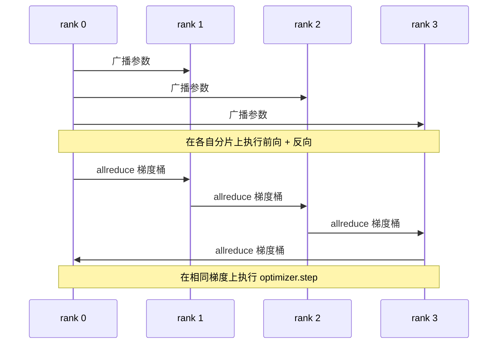

# 从零实现数据并行 DDP

> `DistributedDataParallel` 是构建在 `allreduce` 之上的一组钩子。先包装模型，从 rank 0 广播初始参数，让每个 rank 以完全相同的状态启动；再为每个参数安装一个反向传播钩子，对梯度发起 `allreduce`，剩下的就是梯度下降。完整模式只需约 200 行代码。

**类型：** 构建
**语言：** Python
**前置知识：** Phase 19 Track C 第 42–49 课
**用时：** 约 90 分钟

## 学习目标

- 构建一个形似 `DistributedDataParallel` 的包装器，在初始化时广播参数，并在反向传播后对梯度执行 `allreduce`。
- 使用 `torch.multiprocessing.spawn`，通过带文件 rendezvous 的 gloo 后端启动 N 个 CPU rank。
- 在相同数据上依次训练相同模型，比较每一步的参数是否等价，以证明梯度同步的正确性。
- 论证分桶（梯度融合）与重叠（反向传播期间进行通信）是把能工作的 DDP 变成生产级 DDP 的两个关键改动。

## 问题

一个拥有 10 亿参数、激活值占 12 GB 的模型，无法装进一张消费级 GPU。即使勉强装得下，训练也要持续数周。数据并行把一个 batch 切分到 N 个 rank 上；每个 rank 在自己的分片上执行前向和反向传播，并在每一步对所有 rank 的梯度求和，从而让 N 份副本始终保持一致。优化器实际更新的，就是这个求和后的梯度。

没有梯度同步，N 个副本到第 2 步就会发生分歧。此时它不再是“用更多数据训练一个模型”，而是 N 个碰巧共享初始权重的独立模型。若梯度同步做得很差（每个参数执行一次 allreduce、不做重叠、也不分桶），网络就会成为瓶颈，GPU 只能空等数据在线路上传输。DDP 的关键就在于让梯度同步相对于计算几乎不产生可见开销。PyTorch 的标准 DDP 通过对梯度分桶、让 allreduce 与下一层反向传播重叠，并在 NVLink 上使用 NCCL 来做到这一点。我们可以在 CPU 上用 gloo 实现这三点，学到同样的规律。

## 概念



### DDP 所需的三种操作

| 阶段 | 集合操作 | 原因 |
|-------|-----------|-----|
| 初始化 | 从 rank 0 执行 broadcast | 每个 rank 都以相同参数启动 |
| 反向传播后 | 对每个梯度执行 allreduce | 优化器更新使用的是平均梯度 |
| 有时 | broadcast 缓冲区 | 保持 BatchNorm 运行统计量同步 |

### 为什么取均值而不是求和

`Allreduce-SUM` 除以 `world_size` 就得到平均梯度。平均值与 `world_size` 无关：在单个 rank 上调好的学习率，扩展到 4 个 rank 后仍然适用，因为每一步的梯度幅度没有改变。如果不对 `Allreduce-SUM` 做除法，每次改变集群规模都必须重新调整学习率。DDP 会封装 SUM 并完成除法；本课也要这样实现。

### 为什么要对梯度分桶

一个 Transformer 有数千个参数张量。每个张量执行一次 allreduce，就要数千次支付 gloo 的延迟下限。DDP 将梯度分组成约 25 MB 的桶，每个桶只执行一次 allreduce。在线路上传输的总字节数不变，但延迟被分摊到整个桶上。对于本课使用的小模型，我们把所有内容分到一个桶中；真正需要迁移到生产环境的是这种结构。

### 为什么固定随机种子

每个 rank 都必须使用 `torch.manual_seed(seed + rank)` 进行打乱，但要使用 `torch.manual_seed(seed)` 初始化参数。所有 rank 共用一个种子，会让它们看到相同的 batch 顺序（从而失去数据并行的意义）；用 rank 专属种子初始化参数，则会让初始参数产生一个浮点精度范围内的差异，梯度同步也就无法再使副本保持一致。种子模式一旦写错，参数等价性测试在第 1 步就会失败。

```figure
ci-ddp-grad-sync
```

## 构建

`code/main.py` 实现了：

- `MiniMLP`：一个 3 层 MLP，规模足够小，可以在几秒内收敛；又足够大，能够暴露连接逻辑中的问题。
- `DistributedDataParallel(model, world_size)`：在构造时广播参数，并返回一个包装器；其 `sync_grads` 会将累积的、经过 allreduce 求和的梯度除以 `world_size`。
- `worker(rank, world_size, ...)`：完整训练循环，包括通过 gloo 初始化 `torch.distributed`、前向、反向、同步和更新。
- `_reference_single_process_loop(...)`：在单个 rank 上依次使用相同数据训练相同模型，测试用它在每一步之后与 DDP 比较参数是否字节级等价。

运行：

```bash
python3 code/main.py
```

输出：一张逐步训练表，将单进程运行的损失和参数校验和与 4 个 rank 上的 DDP 运行进行比较。两条路径的损失曲线在浮点精度范围内完全一致，证明梯度同步是正确的。

## 生产环境中的模式

三种模式可以把 DDP 加固到足以投入生产。

**找出未使用的参数。** 某些前向路径会按条件跳过参数（例如提前退出或混合专家路由器）。被跳过的参数没有梯度，但 DDP 的 bucket-ready hook 仍会等待它们，最终导致 allreduce 死锁。`find_unused_parameters=True` 会让 DDP 在归约前检查哪些参数收到了梯度。代价是每一步都要遍历一次计算图，因此除非前向路径确实存在分支，否则应保持关闭。

**静态图优化。** 当不同 step 的前向图保持稳定时，`static_graph=True` 可以让 DDP 预先计算分桶调度。在大规模训练中，这项优化很有价值：每一步节省几毫秒，累计 10000 步后就会形成明显收益。

**梯度累积需要谨慎处理。** 在 K 个微批次上累积梯度、而不在每个微批次后同步，吞吐量可以提升 10 倍。DDP 提供 `no_sync()` 上下文管理器，用来暂停反向传播后的 allreduce。如果忘记使用这个管理器，就会白白执行 K 次 allreduce，吞吐量会跌到最低。

## 使用

生产模式：

- **PyTorch DDP。** 标准实现。`torch.nn.parallel.DistributedDataParallel(model)` 接入了分桶、重叠和 `no_sync` 上下文。
- **HuggingFace Accelerate。** 增加了一个启动器，负责处理 `torchrun` 环境变量和模型包装；底层仍然是同一个 DDP。
- **Megatron-LM 数据并行。** 将 DDP 与张量并行结合起来处理大模型；其中的数据并行部分仍是反向传播后执行 allreduce 的同一模式。

## 交付

第 78 课（ZeRO 分片）用 `reduce_scatter` 替换每个参数一次的 allreduce，使每个 rank 只保存自己的优化器状态分片。第 81 课把 DDP 与 ZeRO 组合到端到端演示中。

## 练习

1. 增加可配置大小的梯度桶，在更深的模型上测量它相对于“每个参数一次 allreduce”的加速效果。
2. 将 `no_sync()` 实现为上下文管理器，并验证在 K 个微批次上的梯度累积结果与单进程基线一致。
3. 增加 `find_unused_parameters` 模式，让前向有时跳过一个 MLP 层；不设置该标志时，运行应当死锁。
4. 用仅调用 `torch.distributed.barrier()` 的同步方式替换 gloo，体会基于 allreduce 的同步与基于 barrier 的同步之间的差异。
5. 针对 batch size 为 1、16、256 的情况，测量梯度同步开销占 step 时间的比例，并解释其缩放规律。

## 关键术语

| 术语 | 常见说法 | 实际含义 |
|------|----------------|------------------------|
| DDP | “数据并行” | 每一步广播参数并对梯度执行 allreduce 的包装器 |
| Bucket | “融合梯度” | 将 N 次小型 allreduce 合并成一次大型 allreduce |
| Overlap | “隐藏通信” | 在后续层仍进行反向计算时发起 allreduce |
| no_sync | “累积” | 为梯度累积跳过反向传播后的 allreduce |
| find_unused | “有分支的前向” | 在归约前检测没有梯度的参数 |

## 延伸阅读

- [PyTorch DistributedDataParallel 文档](https://pytorch.org/docs/stable/generated/torch.nn.parallel.DistributedDataParallel.html)
- [PyTorch DDP 内部机制教程](https://pytorch.org/tutorials/intermediate/ddp_tutorial.html)
- [Li 等：PyTorch Distributed——加速数据并行训练的经验](https://arxiv.org/abs/2006.15704)
- Phase 19 第 76 课——DDP 所依赖的集合操作
- Phase 19 第 78 课——ZeRO 分片用 reduce_scatter 替换逐参数 allreduce
