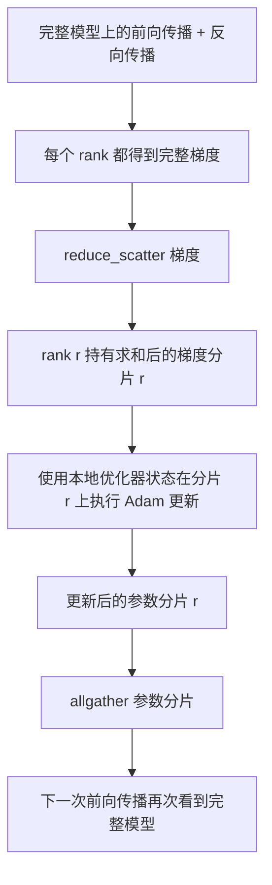

# ZeRO 优化器状态分片

> Adam 为每个参数保存两个动量估计值，而且都使用 float32。一个 7B 参数模型要携带 56 GB 的优化器状态。ZeRO stage 1 将这些状态分片到 N 个 rank 上；每个 rank 只拥有优化器状态的 1/N。本地更新后，更新过的参数分片再广播回来，每个 rank 重建出完整模型，然后开始下一步。它带来的收益，是训练栈中最大单项内存分配的线性下降。

**类型：** 构建
**语言：** Python
**前置知识：** Phase 19 Track C 第 42–49 课
**用时：** 约 90 分钟

## 学习目标

- 将优化器状态（第一动量、第二动量和 fp32 主副本）分片到 N 个 rank 上，使每个 rank 只拥有 1/N。
- 使用 `reduce_scatter` 让每个 rank 只接收自己分片对应的梯度和，再用 `allgather` 广播更新后的参数分片。
- 针对 stage 1、stage 2、stage 3，计算它们相对于原生 DDP 的内存节省表。
- 根据模型大小和带宽预算，论证应选择 stage 1、stage 2 还是 stage 3。

## 问题

原生 DDP 会复制所有内容：每个 rank 都完整保存参数、梯度和优化器状态。对于一个使用 fp16 的 7B 参数模型，这意味着每个 rank 需要 14 GB 参数、14 GB 梯度和 28 GB 优化器状态。优化器状态占用最大，也最容易分片，因为它只在更新步骤中使用，不参与前向或反向传播。

ZeRO stage 1 对优化器状态进行分片。每个 rank 只持有 Adam 动量的 1/N。反向传播后，ZeRO 不再对完整梯度执行 allreduce 再在本地更新，而是执行 `reduce_scatter`，让每个 rank 只收到自己分片对应的梯度和。随后，该 rank 在自己的主参数分片上执行优化器更新。更新后的参数分片再通过 `allgather` 汇集回来，使每个 rank 都拥有下一次前向所需的完整模型。优化器内存降为原来的 1/N。每一步在线路上传输的流量与 DDP 相同：按带宽计算，一次 `reduce_scatter` 加一次 `allgather` 等价于一次 allreduce。内存节省了，吞吐量保持不变。

## 概念



### ZeRO 的阶段

| 阶段 | 分片内容 | 每个 rank 的内存 | 每步通信 |
|-------|----------------|------------------|---------------|
| DDP | 无 | 参数 + 梯度 + 优化器 | 1x allreduce |
| ZeRO-1 | 优化器状态 | 参数 + 梯度 + 优化器/N | 1x reduce_scatter + 1x allgather |
| ZeRO-2 | 优化器 + 梯度 | 参数 + 梯度/N + 优化器/N | 1x reduce_scatter + 1x allgather |
| ZeRO-3 | 优化器 + 梯度 + 参数 | 参数/N + 梯度/N + 优化器/N | 每层 1x allgather + 每层 1x reduce_scatter |

Stage 1 是成本最低的收益点，因为优化器状态占据了主要内存预算。Stage 2 需要加入梯度分片累积逻辑，但带宽开销相同。Stage 3（FSDP）在每次前向和反向中都要按层通信，以此换取参数分片带来的内存下降。本课完整实现 stage 1。

### 内存计算：真实数字

对于一个使用 Adam 混合精度训练、拥有 P 个参数的模型：

| 项目 | 原生 DDP | ZeRO-1 | 原因 |
|------|---------|--------|-----|
| fp16 参数 | 2P bytes | 2P bytes | 前向需要 |
| fp16 梯度 | 2P bytes | 2P bytes | 反向需要 |
| fp32 主副本 | 4P bytes | 4P/N bytes | 只有优化器使用 |
| fp32 第一动量 | 4P bytes | 4P/N bytes | 只有优化器使用 |
| fp32 第二动量 | 4P bytes | 4P/N bytes | 只有优化器使用 |
| 总计 | 16P bytes | 4P + 12P/N bytes |   |

当 N=8 时：原生 DDP 为 16P，ZeRO-1 为 5.5P，下降 65%。当 N=64 时：原生 DDP 为 16P，ZeRO-1 为 4.19P，下降 74%。

### 为什么 reduce_scatter 优于先 allreduce 再分片

allreduce 会让每个 rank 都得到完整的梯度和。如果你只需要分片 r，那么已经归约出的梯度中有 (N-1)/N 会在 rank r 上被浪费。`reduce_scatter` 恰好只交付每个 rank 所拥有的那一片；每个 rank 的字节数与 allreduce 相同（因为 allreduce = `reduce_scatter` + `allgather`），但它的后半段被后续的参数分片 `allgather` 替代了。总线路流量与 DDP 相同，而内存被分摊开来。

```figure
cd-zero-shard
```

## 构建

`code/main.py` 实现了：

- `flatten_params(module)` 和 `unflatten_into(module, flat)`：将模型参数打包成一个连续张量，再从中解包回模型。正是这种扁平布局，让按 rank 分片可以简化为一次切片操作。
- `ZeroOptimizer(model, world_size, rank, lr)`：持有当前 rank 的主参数副本分片和 Adam 动量分片。
- `step()`：对扁平梯度执行 `reduce_scatter`，在当前 rank 的分片上应用 Adam，再通过 `allgather` 汇集更新后的参数。
- 一个训练 3 层 MLP 20 步的演示，同时打印每一步的内存预算和原生 DDP 基线。

运行：

```bash
python3 code/main.py
```

输出：每一步的损失和内存表，展示 ZeRO-1 在每个 rank 上只保存 1/N 的优化器状态，而 DDP 保存完整副本。

## 生产环境中的模式

三种模式可以把 ZeRO 加固到足以投入生产。

**分片检查点很重要。** ZeRO-1 的优化器状态分布在不同 rank 上；检查点必须记录每个 rank 持有哪些内容。第 80 课会构建分片检查点清单，使 ZeRO 运行能够在相同的 world size 下恢复。没有它，保存的状态在重启时就无法读取。

**混合精度才是关键。** ZeRO 是一种混合精度技术；被分片的正是 fp32 主副本。如果不使用混合精度运行 ZeRO，就要为 fp32 主副本支付内存代价，却得不到 fp16 前向带来的相应收益。生产环境总是把 ZeRO 与 autocast 或 bf16 权重搭配使用。

**Stage 1 几乎是零成本收益。** 按带宽计算，它的通信量与 DDP 相同。内存节省量随 N 线性增长，唯一成本是记录和维护优化器分片。除非参数分片的内存也成为问题，生产系统通常默认使用 stage 1；遇到这种情况，再用 stage 2 或 stage 3 以通信换内存。

## 使用

生产模式：

- **DeepSpeed ZeRO。** 参考实现。`deepspeed_config.json` 用于选择 stage 1/2/3 和分区大小。
- **PyTorch FSDP。** PyTorch 原生的等价方案。`ShardingStrategy.SHARD_GRAD_OP` 对应 ZeRO-2；`FULL_SHARD` 对应 ZeRO-3。
- **HuggingFace Accelerate。** 用统一配置包装 DeepSpeed 和 FSDP。

## 交付

第 79 课（流水线并行）提供了正交的分片轴：它不是在同一个模型内跨 rank 分片优化器状态，而是把不同层分片到不同 rank 上。第 81 课在端到端演示中组合 DDP + ZeRO。

## 练习

1. 扩展到 ZeRO-2，分片保存梯度：每个 rank 只保存自己分片对应的梯度，做法是在反向传播后将非本分片部分清零。
2. 增加内存分析器，在 rank 0 上打印实际的 fp32 字节用量，并与公式预测进行比较。
3. 测量原生 DDP 与 ZeRO-1 每一步的 wall-clock 时间，并将其拆分为前向、反向和通信部分。
4. 在 ZeRO-1 下实现梯度裁剪：必须通过对各 rank 的局部平方范数执行 allreduce，计算跨所有分片的 L2 范数。
5. 实现一个使用 allreduce 而不是 `reduce_scatter` 的“朴素 ZeRO”，测量线路耗时差异，并用数据论证选择 `reduce_scatter` 的理由。

## 关键术语

| 术语 | 常见说法 | 实际含义 |
|------|----------------|------------------------|
| ZeRO-1 | “分片保存优化器” | 每个 rank 持有 1/N 的 fp32 主副本和 Adam 动量 |
| ZeRO-2 | “梯度也分片” | 每个 rank 在 `reduce_scatter` 后进一步丢弃非本分片梯度 |
| ZeRO-3 | “分片保存参数” | 每个 rank 持有 1/N 的 fp16 参数；前向时按层 allgather |
| Master copy | “fp32 权重” | 优化器实际更新的高精度参数副本 |
| Reduce_scatter | “拆分求和结果” | 只向每个 rank 交付其分片对应的梯度和 |

## 延伸阅读

- [Rajbhandari 等：ZeRO——面向万亿参数模型训练的内存优化](https://arxiv.org/abs/1910.02054)
- [DeepSpeed ZeRO 文档](https://www.deepspeed.ai/tutorials/zero/)
- [PyTorch FSDP 文档](https://pytorch.org/docs/stable/fsdp.html)
- Phase 19 第 76 课——本课所依赖的 reduce_scatter 和 allgather
- Phase 19 第 80 课——ZeRO 状态必须使用的分片检查点
