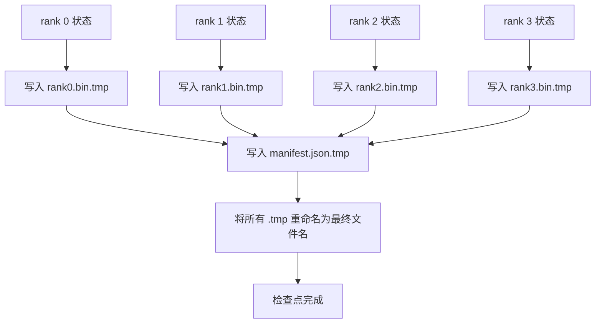

# 分片检查点与原子恢复

> 一个 700 亿参数的训练任务每隔几小时就因节点故障暂停。检查点格式决定你损失的是 30 分钟还是 30 小时。分片检查点并行写入每个 rank 的分片，并在清单中记录所有权。恢复时，每个 rank 从自己的文件加载分片，在相同 world size 下重建状态，优化器仿佛从未中断一样继续更新。原子写入则避免未完成的检查点污染下一次恢复。

**类型：** 构建
**语言：** Python
**前置课程：** Phase 19 Track C 课程 42–49
**用时：** 约 90 分钟

## 学习目标

- 将多 rank 检查点保存为每个 rank 一个分片文件，并配套记录归属关系的清单。
- 使用原子写入模式（先写临时路径再重命名），确保写入中途崩溃不会产生半成品检查点。
- 从清单恢复，并验证每个 rank 上 fp16 参数与 ZeRO 优化器状态均逐字节相等。
- 让清单结构防御三种故障：world size 变化、分片数量不匹配和部分写入。

## 问题

普通检查点会把全部参数和优化器状态读入 rank 0，完成聚合后写入单个文件。对于 700 亿参数模型，这意味着 1.1 TB 状态要经过一个 rank 的网络端口。写入会阻塞其他 rank，因为它们只能等待聚合完成。IO 带宽取决于最慢的单块 GPU 网络链路，而不是集群总带宽。在真实集群中，先聚合再写入可能比前一个训练小时还久，因此任务一天甚至写不出一个检查点。

分片检查点反转了这一模式：每个 rank 并行把自己的分片写入自己的文件。清单记录哪个 rank 拥有哪些分片，恢复时即可把每个分片放回原处。总写入带宽随集群规模扩展。一个由单 rank 写入需要 4 小时的 1 TB 检查点，分给 64 个 rank 后只需 4 分钟。此外，清单为不兼容的恢复提供了契约：world size 变化和部分写入都能被检测到，加载路径可以明确失败，而不是悄悄使用过期数据。

## 概念



### 清单结构

```json
{
  "world_size": 4,
  "step": 1234,
  "wall_clock_seconds": 4521,
  "shards": [
    {"rank": 0, "path": "rank0.bin", "sha256": "...", "param_shard_offset": 0, "param_shard_numel": 65536},
    {"rank": 1, "path": "rank1.bin", "sha256": "...", "param_shard_offset": 65536, "param_shard_numel": 65536}
  ],
  "schema_version": 1
}
```

有三个字段承担关键作用。`world_size` 让不同规模下的恢复明确失败，而不是静默损坏。每个分片的 `sha256` 可以捕获部分写入或损坏的写入。每个分片的 `param_shard_offset` 与 `param_shard_numel` 让加载器能够在正确位置重建扁平参数张量。

### 原子写入

标准模式是：把每个分片写入 `<name>.tmp`，把清单写入 `manifest.json.tmp`，分别执行 fsync，然后重命名。在同一文件系统内，POSIX rename 是原子的；新文件要么完整存在，要么旧文件仍然存在。最终重命名前发生崩溃时，上一份检查点仍是生效版本。没有原子写入时，崩溃可能留下一个已经存在清单但内容不完整的分片，加载时会损坏恢复中的优化器状态。

### 结构必须防御的三种故障

| 故障 | 症状 | 防御 |
|---------|---------|---------|
| World size 变化 | 使用 N=4 的清单在 N=8 下恢复 | 检查清单中的 world_size，不匹配就明确失败 |
| 分片数量不匹配 | 恢复时发现的 rank*.bin 少于清单中的分片数 | 枚举分片并验证每个分片都存在 |
| 部分写入 | 分片文件在刷新过程中被截断 | 加载时验证 sha256 |

每项防御都会尽早拒绝错误加载；另一种结果是静默损坏，直到 100 步后 loss 变成 NaN 才暴露。

### 为什么使用每个 rank 一个文件，而不是一个大文件

在 POSIX 中，通过 `O_APPEND` 并发写入一个文件对按字节对齐的写入有效，但实践中一个分片内部的偏移覆盖 MB 级区域，锁开销会占主导。每 rank 一个文件没有竞争，并且底层文件系统支持并行时还能利用条带化（Lustre、GPFS）。生产栈（DeepSpeed、FSDP、NeMo）都因此采用每 rank 一个文件。

```figure
ci-sharded-checkpoint
```

## 动手构建

`code/main.py` 实现：

- `ShardManifest` 数据类，包含上述结构以及 `to_json`/`from_json`。
- `save_sharded(state_dict_per_rank, dir, step)`：使用先写临时文件再重命名的原子模式，把每个 rank 的二进制状态写入自己的文件，然后写入清单。
- `load_sharded(dir, expected_world_size)`：读取清单，验证每个分片的 sha256，并返回每个 rank 的状态字典。
- 往返测试：构建每 rank 状态，保存、加载并断言逐字节相等。

运行：

```bash
python3 code/main.py
```

输出：写入 4 个分片文件和清单，然后重新加载并完成逐字节验证。

## 生产中的实践模式

三种模式可以把检查点强化到可上线程度。

**异步写入。** 生产栈会在独立线程或进程中发起检查点写入，让训练继续进行。同步点设在下一个检查点：前一次保存完成前，不要开始下一次保存。DeepSpeed 的 `async_io` 标志正是如此。为让步骤清晰可见，本课保持同步写入。

**先写本地高速磁盘，再异步上传。** 先写本地 NVMe（速度快），再异步上传至 S3 或 GCS。两级模式让集群内恢复使用的检查点保持快速，同时把持久副本发送到集群外归档。清单携带本地路径，上传清单携带远端路径。

**轮换很重要。** 生产运行会保留最近 K 个检查点（通常为 3–5 个），并轮换删除最旧的一个。没有轮换，磁盘会在运行中途写满，下一次检查点就会失败。有了轮换，下一次保存前先删除最旧版本，释放空间预算。

## 使用它

生产模式：

- **DeepSpeed 检查点。** `deepspeed.save_checkpoint(tag=step)` 写入每 rank 文件和指向活动 tag 的 `latest` 文件。
- **PyTorch FSDP 检查点。** `torch.distributed.checkpoint` 使用决定每 rank 布局的 `Planner` 保存分片状态。
- **NeMo。** 用统一的 `save_to_checkpoint` API 封装 DeepSpeed 和 FSDP，并增加元数据。

## 交付

课程 81 会保存端到端 DDP+ZeRO 运行的分片检查点，并在相同 world size 下重新加载，以证明恢复契约成立。

## 练习

1. 增加异步写入：在线程中启动保存并让训练继续；下一次保存前等待前一次完成。
2. 增加 `last_5_steps` 轮换：保留最近 5 个检查点，在保存新版本前删除最旧版本。
3. 为内循环重新加载增加仅 CRC 的快速验证路径（轮换将检查点变为新的活动版本时不执行完整 sha256）。
4. 增加跨 world size 加载：读取清单，拼接后重新分片，把 N=4 的分片重平衡为 N=8。
5. 上传到一个模拟 S3（第二个目录）并写入上传清单；防御两级存储策略。

## 关键术语

| 术语 | 常见说法 | 实际含义 |
|------|----------------|--------|
| 分片检查点 | “每 rank 保存” | 每个 rank 并行写入自己的分片文件 |
| 清单 | “索引” | 记录分片路径、偏移和 sha256 的 JSON 文件 |
| 原子写入 | “临时文件再重命名” | 写入 .tmp 后执行 POSIX rename，使崩溃时旧文件仍保持生效 |
| 部分写入 | “截断的分片” | 写入过程中崩溃会产生损坏分片；sha256 可捕获它 |
| 轮换 | “保留最近 K 个” | 写入新版本前删除最旧检查点，以限制磁盘使用量 |

## 延伸阅读

- [DeepSpeed checkpointing](https://deepspeed.readthedocs.io/en/latest/model-checkpointing.html)
- [PyTorch torch.distributed.checkpoint](https://pytorch.org/docs/stable/distributed.checkpoint.html)
- [POSIX rename atomicity](https://pubs.opengroup.org/onlinepubs/9699919799/functions/rename.html)
- Phase 19 课程 78——本检查点用于保存的 ZeRO 状态
- Phase 19 课程 81——端到端演示会对保存的状态执行往返验证
