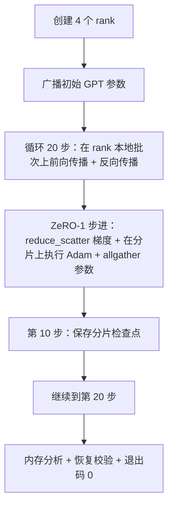

# 端到端分布式训练

> 课程 76 到 80 分别构建了一个部件。本课负责组装：一个微型 GPT 在 4 个模拟 rank 上训练，使用 DDP 做梯度同步、ZeRO-1 做优化器状态分片，并在中途保存分片检查点。演示运行 20 步，自行结束，打印 loss 曲线和内存画像，并写出可恢复的检查点。

**类型：** 构建
**语言：** Python
**前置课程：** Phase 19 Track C 课程 42–49
**用时：** 约 90 分钟

## 学习目标

- 将 DDP（课程 77）、ZeRO-1（课程 78）与分片检查点（课程 80）组合进一个训练循环。
- 在 4 个模拟 rank 上，用小型合成语料训练一个 2 层 Transformer 语言模型 20 步。
- 打印逐步 loss 表、每 rank 内存画像，以及在相同 world size 下逐字节恢复的检查点清单。
- 论证组合的正确性：每个部件都能在前置课程中独立测试，本课证明它们可以协同工作。

## 问题

Capstone 的证明在于各个部件确实能拼合。课程 76 实现了 collective；课程 77 将其封装为 DDP；课程 78 使用 reduce_scatter 分片优化器状态；课程 79 分析了流水线；课程 80 保存了分片检查点。每课都有自己的测试并能独立运行。真实训练会同时使用所有原语；如果组合错误，loss 会发散，检查点无法恢复，或者每 rank 内存本应下降却反而增长。

本课运行端到端演示并验证四个不变量：(a) 20 步内 loss 在浮点噪声范围内单调下降；(b) 每个 rank 在每一步都持有相同的参数范数；(c) 每 rank 的优化器内存等于 ZeRO-1 公式 `12P/N` 字节；(d) 第 10 步的检查点在重启时逐字节相等地重新加载。演示会自行结束：20 步、单条命令、退出码 0。

## 概念



### 微型 GPT

模型刻意做得很小：2 个 Transformer block、嵌入维度 32、4 个注意力头、词表 64、序列长度 16、批大小 4。参数只有几千个，但足以检验每个连接决策（多头注意力执行标准的掩码路径；LayerNorm 有需要同步的权重；LM head 是单独映射回词表的线性投影）。规模又足够小，使 4 个 CPU rank 上的 20 步训练能在几秒内完成。

### 组合规则

| 课程部件 | 它负责什么 | 留给循环的工作 |
|--------------|--------------|--------------|
| DDP 广播 | 初始参数同步 | 构造时调用一次 |
| ZeRO-1 步进 | 梯度同步、主副本更新、参数广播 | 每步调用一次，替代 optimiser.step |
| 分片检查点 | 持久化每 rank 状态、带 sha256 的清单 | 通过 allgather 收集状态后由 rank 0 调用 |
| 训练循环 | 前向、反向、loss 记录 | 按顺序调用上面三项 |

循环不需要知道 reduce_scatter 或 rendezvous 文件。ZeRO 和检查点模块提供窄接口，由循环负责组合。

### 为什么使用微型 GPT，而不是只用 MLP

课程 77 中的 MLP 足以验证梯度同步。微型 GPT 额外增加了三点：词表上的独立 LM head（本课为清晰起见不共享权重；完整 GPT 通常会让 head 与 token embedding 共享）、作为 loss 的 softmax+交叉熵（比 MSE 有更多数值边界情况），以及非对称前向路径（每层依次经过嵌入、注意力和 MLP）。Capstone 如果仍使用 MLP，就无法暴露组合是否正确处理 LayerNorm 或嵌入层的梯度形状。

### 自行结束意味着退出码 0

循环运行固定的 20 步后退出。没有 `while True`，不需要人工干预，也不从外部状态恢复。一个可以无人看管地运行、结束后留下完整日志的 Capstone，才能证明系统连线正确。如果任一部件死锁，演示就不会返回，测试工具会捕获这一点。

```figure
ci-distributed-assembly
```

## 动手构建

`code/main.py` 实现：

- `MiniGPT`：带掩码自注意力和独立 LM head 的 2 层 Transformer。
- `make_corpus(seed, total_tokens)`：确定性的下一 token 预测数据。
- `_train_worker`：每个 rank 启动一个 worker；广播初始化参数，运行循环，在第 10 步写入分片检查点。
- `verify_resume`：主运行结束后，在进程内重新加载第 10 步检查点，并断言保存的主分片与内存快照逐字节一致。
- `main`：编排整个演示，打印 loss 表、内存画像和验证结果。

运行：

```bash
python3 code/main.py
```

输出：20 行 loss 表、4 行每 rank 内存画像、检查点清单，以及成功时的 “RESUME VERIFIED” 行。

## 生产中的实践模式

三种模式让组合适用于真实运行。

**每 K 分钟保存一次，而不是每 K 步。** 序列长度和微批次数会改变每步耗时。每 10 分钟保存一次检查点，无论模型大小都能捕获相同的计算量。本课为简单起见按步数保存；生产系统按墙上时钟保存。

**尽早检测发散。** 生产运行会在反向传播后增加 NaN 防护和 loss 峰值检测；如果单步 loss 增长超过 2 倍，就回滚到上一检查点，而不是让优化器继续走向退化状态。本课 loss 曲线平滑，因此防护未被触发，但保留了这个钩子。

**跨 rank 聚合内存画像。** 真实运行中各 rank 内存不同（拥有最大流水线阶段的 rank 会持有更多激活）。生产日志记录各 rank 最大值和均值；本课打印每 rank 数值，以展示公式匹配情况。

## 使用它

生产模式：

- **DeepSpeed。** 在一个配置下组合 DDP、ZeRO、流水线和激活检查点。本课的组合是 DeepSpeed 形态的缩小版。
- **PyTorch FSDP。** 原生等价方案。使用 `ShardingStrategy.SHARD_GRAD_OP` 的 `FullyShardedDataParallel` 就是 ZeRO-2。
- **NeMo 与 Megatron-LM。** 为最大规模模型增加张量并行；除此之外组合形态相同。

## 交付

完整课程链在此结束。6 课合在一起，就是一个真实团队在采用 DeepSpeed 之前会构建的分布式训练子系统；该抽象已经用 gloo 验证，并覆盖了故障模式。Phase 17（基础设施与生产）负责把它带到真实集群。

## 练习

1. 增加注意力头的张量并行切分，并验证 loss 与单 rank 基线一致。使用两个 rank：每 rank 一半注意力头，对注意力输出执行 allreduce。
2. 在 4 个微批次上增加梯度累积，并证明所得梯度等于一个大批次的梯度。
3. 增加从第 10 步恢复并实际训练到第 20 步的路径，产出与原始运行相同的最终 loss。
4. 将指标（loss、grad norm、步耗时）导出为 JSONL，以便事后可视化。
5. 增加 NaN 防护，在 loss 峰值时回滚到上一检查点；用单步 LR 倍增制造峰值，练习回滚。

## 关键术语

| 术语 | 常见说法 | 实际含义 |
|------|----------------|--------|
| 端到端 | “全部接起来” | 一次运行组合所有部件，而不是每个部件各自单测 |
| 内存画像 | “每 rank 的 GB 数” | 每个 rank 为参数、梯度和优化器状态持有的字节数 |
| 恢复契约 | “保存和加载” | 检查点往返后每 rank 状态逐字节相等 |
| 自行结束 | “有界运行” | 固定步数，完成时退出码为 0，循环中不需要人工参与 |

## 延伸阅读

- [DeepSpeed end-to-end training tutorial](https://www.deepspeed.ai/getting-started/)
- [PyTorch FSDP advanced tutorial](https://pytorch.org/tutorials/intermediate/FSDP_advanced_tutorial.html)
- [Megatron-LM training script reference](https://github.com/NVIDIA/Megatron-LM)
- Phase 19 课程 76–80——本课组合的各个部件
- Phase 17——将组合带到真实集群
