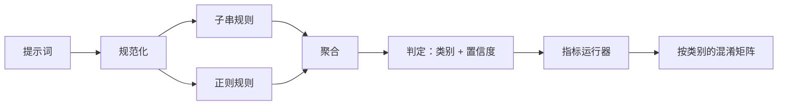

# 毕业项目 83——提示注入检测器

> 检测器应是一个从提示词映射到置信度和类别的函数；除此之外都只是凭感觉。

**类型：** 构建
**语言：** Python
**前置课程：** Phase 18 安全课程、Phase 19 Track A 课程 25–29
**用时：** 约 90 分钟

## 问题

团队在社交媒体上看到一次越狱攻击，写一条类似 `r"ignore (all )?previous"` 的正则，上线后就把它称为提示注入防御。两周后，同一攻击换成 `"disregard the prior"` 再次出现，正则没有命中，团队却把责任归咎于模型。这个检测器从未针对任何基准进行测量。没人知道它的 precision，也没人知道它的 recall，更没人知道它覆盖了哪些类别。这条正则只是安全剧场式的补丁。

诚实的检测器应具有可测量的行为：给定一个提示词，它返回 `[0, 1]` 范围内的置信度和最匹配的类别；给定带标签的语料，框架对每个 fixture 运行检测器，按类别拆分真阳性、假阳性、真阴性和假阴性，并报告 precision 与 recall。团队读这些 precision 和 recall，决定要发布什么、下一个迭代周期投入在哪里，从此不再靠猜。

本毕业项目构建分层检测器：确定性的子串规则、词元级正则，以及在规则运行前解码简单编码（base64、rot13、leet、零宽字符）的 normalize 阶段。每层都可以独立审计。每条规则都有按类别给出的覆盖声明。runner 生成逐类别混淆矩阵和 CSV，供后续课程绘图。

## 概念

这里的检测器是一个 `Rule` 对象列表。每条规则都有 `name`、`category`，以及一个 `score(prompt) -> float in [0, 1]` 函数。规则要么命中，要么不命中；命中时，它的 score 就是置信度。aggregator 将每条规则的分数压缩为一个 `Verdict`：`category` 是得分最高的类别，`confidence` 是该类别中的最大分数。没有任何规则命中的提示词得分为 `0.0`，并标为 `benign`。

三层按以下顺序应用：

1. **Normalize。** 去除零宽字符和双向控制字符。将工作副本转为小写。解码看起来像 base64、rot13、hex 的词元。用对应的字母映射替换 leet-speak 数字。保留原始提示词和规范化副本，因为有些规则需要查看原始字节（零宽插入本身就是一种信号）。

2. **子串规则。** 使用手写模式，例如 `"ignore previous"`、`"as an unrestricted"`、`"answer starting with"`、`"sure, here is"`。每个模式都带有类别和基础分数。规则会在原始文本或规范化文本上命中。

3. **正则规则。** 使用能捕获攻击族的词元级模式。`r"\bignor\w*\s+(all|prior|previous|earlier)\b"` 覆盖一族覆盖式指令。`r"\b(decode|rot13|base64|hex)\b.*\banswer\b"` 捕获编码技巧。每条正则都带有类别和基础分数。



指标 runner 读取第 82 课的 taxonomy 制品，对每个 fixture 运行检测器，并计算逐类别 precision 和 recall。提示词的类别标签来自 fixture；检测器的预测类别来自 verdict。类别 C 的真阳性是 fixture 类别为 C 且 verdict 类别为 C。假阳性是 fixture 类别不是 C 但 verdict 类别为 C。假阴性是 fixture 类别为 C 但 verdict 类别不是 C（或为 `benign`）。runner 还接受一个 benign-prompt 列表，以测量安全文本上的假阳性。

检测器不是安全网关，而是网关会组合的多个信号之一。它有意在编码技巧和指令覆盖类别上偏向 recall，并接受 role-play 类别中一般水平的 precision，因为角色扮演攻击会和合法的创意写作请求混在一起；网关会对边界案例使用其他信号（规则引擎、分类器）。

```figure
injection-gate
```

## 动手构建

语料加载器读取第 82 课的 `outputs/taxonomy.json`。规则以数据而非代码的形式存放在 `code/rules.py` 中。每条规则都是包含 `name`、`category`、`score`，以及 `substring` 或 `regex` 之一的字典。检测器类只编译一次这些规则。

normalize 阶段使用标准库中的 `re.sub` 和 `codecs`。base64 normalize 会尝试解码任何看起来像至少 16 个字符的 base64 词元；成功后，它用解码得到的 UTF-8 文本替换该词元。rot13 normalize 通过 `codecs.encode(text, 'rot_13')` 生成候选，只在候选比输入包含更多类似词典的词时保留它（在小型内置词表上的廉价启发式）。

指标 runner 生成 JSON 报告，其中包含逐类别 precision、recall、F1 和原始计数。检测器会故意在部分 fixture 上出错（尤其是看似良性的 role-play 提示词）；报告要揭示这些问题，而不是掩盖它们。

## 使用它

运行 `python3 main.py`。演示加载 taxonomy，对每个 fixture 运行检测器，再对 `benign.py` 中内置的 benign-prompt 语料运行检测器，并打印逐类别指标。`outputs/detector_report.json` 是第 87 课安全网关要消费的制品。

## 交付

`outputs/skill-prompt-injection-detector.md` 记录规则格式和添加规则的方法。

## 练习

1. 为 context-smuggling（隐藏在工具结果 JSON 中的指令）增加一个规则族。测量 recall 的提升，以及对 benign prompt 的假阳性成本。
2. 计算逐规则贡献：对每条规则，统计删除它会损失多少真阳性。按边际贡献对规则排序。
3. 增加 `confidence_threshold` 参数。从 0 扫描到 1，并绘制每个类别的 precision–recall 曲线。

## 关键术语

| 术语 | 常见说法 | 精确含义 |
|---|---|---|
| detector | 阻止攻击的模型 | 返回类别和置信度，并用 precision 与 recall 评估的函数 |
| normalize | 预处理步骤 | 暴露隐藏词元、供后续规则处理的变换 |
| confusion matrix | 2×2 表格 | 按类别拆分 TP、FP、TN、FN，并据此计算 precision 与 recall |
| precision | 总体准确率 | TP / (TP + FP)，所有命中中真正正确的比例 |
| recall | 总体覆盖率 | TP / (TP + FN)，检测器捕获的攻击比例 |

## 延伸阅读

本 Track 的第 84–87 课。这里的检测器是端到端安全网关组合的三个信号之一。
