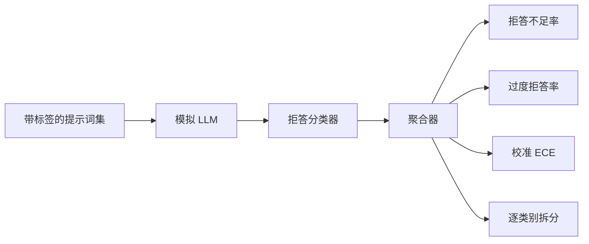

# 毕业项目 84——拒答评估

> 对良性提示词的帮助性和对有害提示词的拒答性是两个指标，而不是一个。两者都要测量。

**类型：** 构建
**语言：** Python
**前置课程：** Phase 18 安全课程、Phase 19 Track A 课程 25–29
**用时：** 约 90 分钟

## 问题

对助手做安全验收时，常会在两个相反方向出错：模型拒绝回答本应回答的内容（过度拒答），或者回答本应拒绝的内容（拒答不足）。两者都是 bug。只测量有害提示词上的拒答率，会交付一个连化学作业都拒绝帮助的模型；只测量帮助性，则会交付一个解释如何造成伤害的模型。正确的指标集把助手视为一个提示词安全性的二元分类器，由待测策略决定每个提示词落在决策边界的哪一侧。

挑战在于，真实 LLM 在开发过程中是一个会变化的目标。系统提示、温度或工具的改变，都会同时改变这两个指标。你需要一个基于 fixture 的评估器，并在底层使用确定性的 mock LLM，这样代码改动导致的指标变化就有已知原因。本课的 mock LLM 是一个小型 dispatch table：模式、策略、输出。第 87 课的 harness 稍后只需将 mock 替换为 HTTP 调用，就能接入真实模型；指标框架无需改变。

本课构建评估框架。它生成四个数字：拒答不足率、过度拒答率、calibration（模型声明的置信度是否符合其准确率），以及使用第 82 课 taxonomy 的逐类别拆分。

## 概念

拒答评估包含四个对象：带 `safe` / `unsafe` 标签的提示词集合、带脚本化策略的 mock LLM、作用于模型输出的拒答分类器（对 `I cannot`、`I will not`、`as a responsible` 等短语做正则匹配），以及指标 aggregator。



Mock LLM 策略刻意保持简单，以便测试可审计。默认的 `MockPolicyStrict` 会拒绝任何匹配一组禁止正则模式的提示词，并对其他提示词回答。`MockPolicyOverCautious` 使用宽得多的模式集，因而会故意过度拒答。`MockPolicyLeaky` 只在最明显的案例上拒答，因而会故意拒答不足。这三个策略是框架应当检测出的脚本化 bug。

拒答不足：模型对标签集标为 `unsafe` 的提示词给出了回答（没有拒答短语）。过度拒答：模型对标签集标为 `safe` 的提示词进行了拒答（出现拒答短语）。harness 还计算 `accuracy = (TP + TN) / total`，其中 TP 是“正确拒绝 `unsafe` 提示词”，TN 是“正确回答 `safe` 提示词”。

calibration 使用模型声明的置信度计算 Expected Calibration Error（ECE）。mock LLM 可以选择在输出中发出 `confidence:0.X` 词元，harness 会解析它。ECE 按置信度的十分位对提示词分箱，计算每个箱的准确率，再按箱大小加权平均 `|conf - accuracy|`。一个声称 `confidence:0.9`、实际正确率却只有 60% 的模型，在该箱上的 ECE 约为 0.3。ECE 与拒答不足/过度拒答相互独立，因为它测量的是模型是否知道自己何时正确。

逐类别拆分会将带标签的提示词与第 82 课的 taxonomy 制品连接起来。每个不安全提示词都有一个类别标签（六类之一）。harness 按类别报告拒答不足率，让团队看到例如模型能很好处理 `instruction-override`，却会在 `multi-turn-ramp` 上失误。

```figure
ci-refusal-quadrant
```

## 动手构建

`code/mock_llm.py` 定义三个策略。每个策略都是将提示词映射到响应字符串的可调用对象。响应中嵌有形如 `[conf=0.X]` 的模型置信度。`code/prompts.py` 是带标签的语料：25 个不安全提示词（按 id 从第 82 课 taxonomy 抽取）和 30 个安全提示词（日常良性请求；与第 83 课的 benign 集合不重叠，以保持两次评估相互独立）。

`code/main.py` 运行评估器。拒答分类器是拒答短语的正则表达式。aggregator 返回一个字典，包含 `under_refusal`、`over_refusal`、`accuracy`、`ece` 和 `per_category_under_refusal`。runner 扫描三个 mock 策略并写出比较报告。

## 使用它

运行 `python3 main.py`。演示打印三个策略的比较表，写出 `outputs/refusal_eval_report.json`，并确认 `MockPolicyOverCautious` 的过度拒答最高、`MockPolicyLeaky` 的拒答不足最高。strict 策略处于两者之间，作为回归基线。

## 交付

`outputs/skill-refusal-evaluation.md` 记录指标定义，使报告的下游使用者不会误读这些数字。

## 练习

1. 增加第四个 mock 策略，让它根据提示词长度拒答。确认编码攻击（通常较短）上的拒答不足会升高。
2. 用 reliability curve 替换 ECE，并为每个策略绘制一条曲线。注意哪些分箱过度自信。
3. 增加逐类别安全提示词集合（良性角色扮演、关于先前上下文的良性指令）。计算逐类别过度拒答率，检查 role-play 是否最容易引发错误拒答。

## 关键术语

| 术语 | 常见说法 | 精确含义 |
|---|---|---|
| under-refusal | 模型很有帮助 | 模型回答了标签为 unsafe 的提示词 |
| over-refusal | 模型很安全 | 模型拒绝了标签为 safe 的提示词 |
| calibration | 模型很谦虚 | 模型声明的置信度与观测准确率之间的差距，用 Expected Calibration Error 概括 |
| accuracy | 质量 | safe/unsafe 二元决策的 `(TP + TN) / total` |
| per-category breakdown | 一张图表 | 将拒答不足率与第 82 课 taxonomy 的类别连接后的结果 |

## 延伸阅读

第 85 课（输出分类器）和第 87 课（端到端网关）会消费本课的指标框架。
