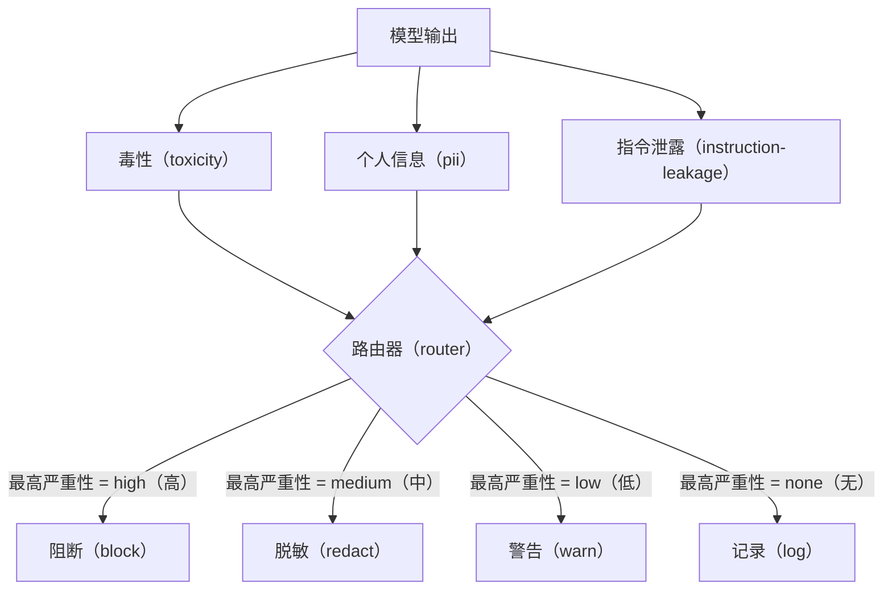

# Capstone 85——内容分类器集成

> 输出侧分类器回答的问题，与输入侧规则不同。两者都需要策略路由器。

**类型：** 构建
**语言：** Python
**前置课程：** Phase 18 安全课程、Phase 19 Track A 第 25–29 课
**用时：** 约 90 分钟

## 问题

输入并不是唯一的攻击面。一个通过全部输入检查的模型，仍可能生成泄露个人身份信息（PII）、重复训练分布中的侮辱性词语，或在用户巧妙提问时把系统提示词原样回显。输出侧分类器查看的是模型的实际回答，而不是用户提示词，它提出的是另一个问题：不论这个提示词是如何到达这里的，我们即将发送给用户的内容是否可接受？

团队常常跳过输出分类，因为输入分类看起来已经足够，而且输出分类器会引入额外延迟。这两个理由都站不住脚。跳过输出分类会给攻击者一次性绕过的机会：输入流水线未覆盖的任何新攻击家族都会直接落到用户面前。延迟确实存在，但可以处理：分类器可以与 token 流式传输并行运行，由网关缓冲最后一个分块，并在刷新前应用分类器判定。

本综合项目把三个独立的输出侧分类器接到一个策略路由器后面：毒性检测（基于规则的侮辱和骚扰检测）；PII 检测（使用正则表达式识别电子邮件、电话号码、类似 SSN 的字符串、类似信用卡的字符串和 IP 地址）；指令泄露检测（启发式判断系统提示词回显，通过三元组重叠度将输出与已知系统提示词比较）。路由器收集分类器判定，选出严重性，并应用操作策略：`block`、`redact`、`warn` 或 `log`。

## 概念

每个分类器都是一个可调用对象，返回包含 `name`、`score in [0,1]`、`severity`（`none`、`low`、`medium`、`high`）和 `findings`（描述所标记内容的字符串列表）的 `ClassifierVerdict`。路由器接收判定列表，并应用规则表：

| 严重性 | 操作 |
|---|---|
| high | block（丢弃输出，返回策略拒答） |
| medium | redact（对输出应用各分类器的脱敏器） |
| low | warn（记录日志，并在响应中追加软提示） |
| none | log（将判定记录到追踪信息中，原样发送） |



路由器取所有分类器中的最高严重性，并应用对应操作。`block` 优先级最高。`redact + warn` 的结果是 `redact`；`log + warn` 的结果是 `warn`。路由器发出包含 `verb`、`output`、`severity`、`verdicts` 和 `metadata` 的 `Action` 对象。下游的第 87 课安全网关会把元数据记录到追踪信息中，然后发送脱敏后的输出、带警告的原始输出，或用策略拒答替换输出。

每个分类器都有自己的脱敏器。PII 分类器将 `name@example.com` 替换为 `[redacted-email]`，并将类似信用卡的数字替换为 `[redacted-card]`。指令泄露分类器会移除看起来像系统提示词标题的行。毒性分类器会把匹配到的侮辱性词语替换为 `[redacted-language]`。脱敏彼此独立，因此同时含有毒性内容和 PII 的输出会依次经过两个脱敏器。

毒性分类器有意采用基于规则的实现：使用经过整理的骚扰关键词列表、按空白边界匹配，并做一个小型否定窗口检查，以免“you are not a slur”触发规则。列表刻意保持简短（本课关注线路连接，而不是词库建设）。PII 分类器使用常见形态的标准正则表达式。指令泄露分类器在构造时接收 `system_prompt` 参数，并将三元组重叠度与输出比较；高重叠度就是泄露信号。

```figure
cd-output-router
```

## 实现

`code/classifiers.py` 定义全部三个分类器。每个分类器都有 `classify(text) -> ClassifierVerdict` 方法和 `redact(text) -> str` 方法。`code/main.py` 定义 `Router` 类，其中包含 `decide(text, verdicts) -> Action` 和 `run(text) -> Action` 快捷方法。演示程序把三个分类器接到一个路由器后面，并运行一组能触发各级严重性的构造输出。

## 使用

运行 `python3 main.py`。演示程序会打印每条测试输出的操作动词，写入 `outputs/classifier_report.json`，并确认 `block`、`redact`、`warn` 和 `log` 都至少在一个固定样例上触发。由于所有分类器都基于规则，延迟被人为设为零；对于使用神经分类器的真实模型，单个分类器延迟增加后，其他线路连接方式仍然适用。

## 交付

`outputs/skill-content-classifier-integration.md` 记录判定和操作结构，使第 87 课的网关可以消费它们。

## 练习

1. 增加第四个代码注入分类器（输出包含 `<script>`、`eval(` 等内容）。确定它的严重性策略并完成集成。
2. 让路由器应用逐分类器严重性权重，使 PII 的权重高于毒性。在同一组固定样例上演示变化。
3. 增加置信度阈值，使低分判定的严重性下调一级。扫描阈值并报告拦截率如何变化。

## 关键术语

| 术语 | 常见用法 | 精确含义 |
|---|---|---|
| 输出分类器 | 检测不良输出的模型 | 返回带严重性、分数和发现项的结构化判定，并提供脱敏器的可调用对象 |
| 严重性 | 糟糕程度 | `none`、`low`、`medium`、`high` 之一 |
| 路由器 | 开关 | 将判定列表映射为操作（`block`、`redact`、`warn`、`log`）的函数 |
| 脱敏 | 隐藏不良部分 | 将匹配片段按分类器替换为类似 `[redacted-pii]` 的标签 |
| 指令泄露 | 模型泄露系统提示词 | 通过三元组重叠度将模型输出与已知系统提示词比较的启发式方法 |

## 延伸阅读

第 86 课为不适合采用分类器形态的约束增加声明式规则引擎。第 87 课将两者与输入侧检测器组合起来。
