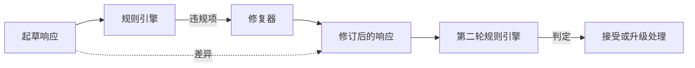

# Capstone 86——宪法式规则引擎

> 一条规则由名称、谓词和解释组成。三者缺一不可，否则那只是凭感觉，而不是规则。

**类型：** 构建
**语言：** Python、YAML
**前置课程：** Phase 18 安全课程、Phase 19 Track A 第 25–29 课
**用时：** 约 90 分钟

## 问题

分类器覆盖可识别的失败，规则引擎覆盖契约性约束。编程助手团队可能需要“每个包含代码的响应都必须以可运行代码块或明确假设结尾”；客服机器人团队可能需要“每次拒答都必须提供下一步”。这些约束并不是自然的分类器目标，而是作用于响应、对话和系统策略的谓词，并且需要让非工程师也能读懂。

诚实的表示方式是声明式文件。宪法与代码并列存放在 YAML 中，纳入版本控制，并采用独立的评审流程。每条规则都有 `name`、`predicate`、`severity` 和 `explanation` 模板。引擎加载文件，针对候选输出评估每条规则，并为每条触发的规则返回结构化 `Violation`。本综合项目中的规则引擎通过 `all_of`、`any_of` 和 `not_` 组合谓词，因此一条规则就能表达“如果响应包含代码，则必须以可运行代码块结尾，并且不能引用仅内部可用的库”。

本课的另一半是修订。只会拦截的规则引擎只完成了一半；能提出修复方案的规则引擎才有实际运维价值：助手起草响应，引擎标记违规，修复器生成修订版，引擎再确认修订满足规则。本课提供一个最小修复器（按规则逐条进行正则替换），以及起草版与修订版之间的结构化差异（逐行增加、删除和编辑）。

## 概念



一条规则的形态如下：

```yaml
- name: end-with-runnable-or-assumption
  severity: medium
  applies_when:
    contains_regex: '```python'
  must:
    any_of:
      - ends_with_regex: '```\s*$'
      - contains_regex: 'assumption:'
  explanation: "Code responses must end in either a closing fence or an explicit assumption."
  fix:
    append_if_missing: "\n\nAssumption: example inputs are valid."
```

谓词是原子的：`contains_regex`、`not_contains_regex`、`ends_with_regex`、`starts_with_regex`、`max_words`、`min_words`。组合形式为 `all_of`、`any_of`、`not_`。引擎先评估 `applies_when`；如果规则不适用，就将违规记录为 `not_applicable`。否则引擎评估 `must`，并产生 `pass` 或 `violation`。

严重性分为 `low`、`medium`、`high`，与第 85 课一致。下游网关（第 87 课）将高严重性规则违规视为与高严重性分类器判定相同：拦截。

修复器是一组声明式操作：`append_if_missing`、`prepend_if_missing`、`replace_regex`。每个操作按规则名映射到一个变换。修复器有意限制为局部编辑；结构性重写属于本课未覆盖的独立拒答与帮助层。

差异根据原始文本和修订文本计算。它是一个 `Change` 记录列表，包含 `op`（`add`、`remove`、`edit`）和相关文本。下游网关可以记录差异，使人工评审者能够持续审计修复器的行为。

```figure
cd-constitution-loop
```

## 实现

`code/rules.yml` 保存宪法。`code/main.py` 中的加载器在 PyYAML 可用时接受 YAML 文件，否则接受内置支持的 JSON 文件。本课提供的 `rules.yml` 会由两条代码路径解析测试。`code/main.py` 定义 `Engine` 和 `Fixer` 类以及 `diff` 函数。组合谓词会递归求值，并在 `any_of` 上短路。

随课提供的宪法包含：

- `no-empty-refusal`（medium）——拒答必须包含建议或重定向
- `end-with-runnable-or-assumption`（medium）——代码响应必须干净收尾
- `no-pii-in-examples`（high）——示例数据不得包含电子邮件或电话号码形态
- `cite-when-asserting-fact`（low）——以“According to”开头的行必须包含括号引用
- `no-internal-library-leak`（high）——输出不得出现 `internal-only` 和 `policybot-internal`
- `bounded-length`（low）——响应不得超过 800 个单词

## 使用

运行 `python3 main.py`。演示程序让三份起草响应通过引擎，打印违规，运行修复器，打印差异，并写入 `outputs/rules_report.json`。其中一个固定样例不适用某条规则（起草文本没有代码块），报告会显示该规则为 `not_applicable`，让团队明确看到引擎确实评估了它。

## 交付

`outputs/skill-constitutional-rules-engine.md` 记录规则语法和修复器操作。

## 练习

1. 增加一条规则：当提示词提到安全时，每个响应都必须包含短语“If this is urgent”。使用组合形式。
2. 将正则修复器替换为接受具名插槽的模板修复器。在新设计下演示重写一条规则。
3. 增加度量端点：给定一组起草文本，返回逐规则违规率，让团队发现哪条规则触发过多。

## 关键术语

| 术语 | 常见用法 | 精确含义 |
|---|---|---|
| 宪法 | 模糊的策略文档 | 包含谓词、严重性和解释的 YAML 规则文件 |
| 谓词 | 检查 | 将文本映射为布尔值的可调用对象，可为原子形式，或通过 `all_of`/`any_of`/`not_` 组合 |
| 违规 | 失败 | 包含规则名、严重性、解释和匹配片段的结构化记录 |
| 修复器 | 模型微调 | 将起草文本确定性地按规则变换为修订文本的组件 |
| 差异 | 字符串比较 | 起草文本与修订文本之间由增加、删除、编辑操作组成的结构化列表 |

## 延伸阅读

第 87 课将此引擎与输入侧检测器及输出侧分类器组合成单一安全网关。
