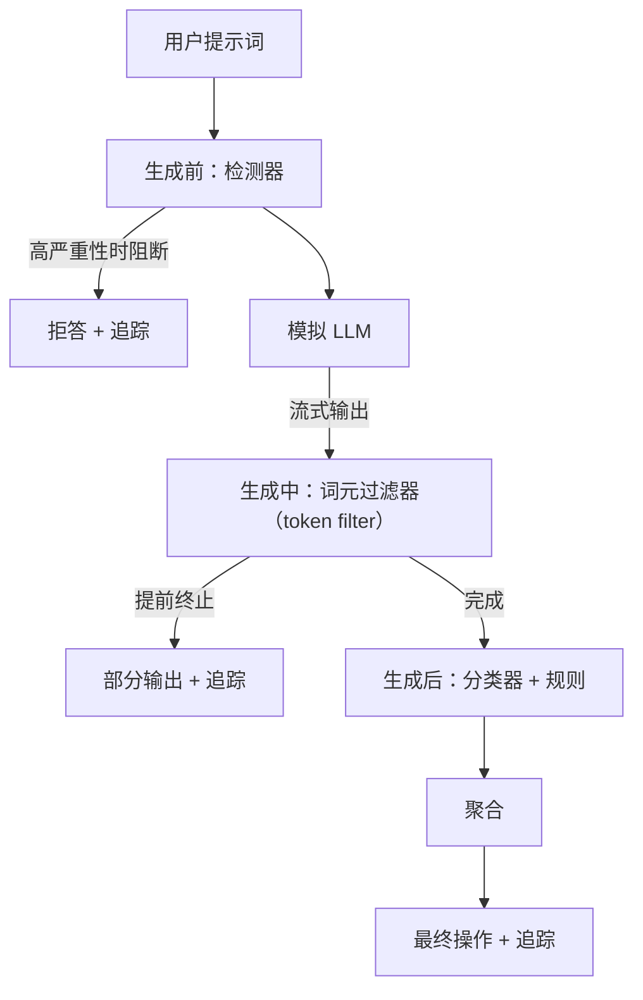

# Capstone 87——端到端安全网关

> 生成前、生成中、生成后。三个检查点，一个判定，每个请求都有审计轨迹。

**类型：** 构建
**语言：** Python
**前置课程：** Phase 18 安全课程、Phase 19 Track A 第 25–29 课
**用时：** 约 90 分钟

## 问题

本 Track 的第 82–86 课分别交付了一个部件：分类体系、输入检测器、评测框架、输出分类器和规则引擎。真正的安全网关必须将它们组合起来，在请求生命周期的适当时刻运行，在它们意见不一致时决定采取什么操作，并生成审阅者周一早上就能读懂的轨迹。本课关注的正是这种组合。

网关位于三个检查点。生成前检查发生在调用模型之前：第 83 课的检测器查看提示词，并执行放行、直接拦截（高置信度攻击）或附加标记供下游层权衡。生成中检查发生在模型发出 token 时：流式过滤器缓冲分块，如果出现禁用短语就提前终止流（如果网关只在事后查看，前缀注入仍可逃过检查）。生成后检查发生在模型完成后：第 85 课的分类器路由器和第 86 课的规则引擎检查完整输出，网关将它们的判定与生成前信号汇总，然后应用最终操作。

网关会自行终止：课程 82 分类体系中的每个固定样例都端到端运行，网关为每个请求发出轨迹；无论网关是否拦截所有攻击，演示程序都会以零退出。重点是可观测性和结构正确性，而不是完美得分。

## 概念

三个检查点，一棵决策树。



聚合器组合四个严重性信号：检测器置信度（第 83 课）、token 过滤器触发状态（布尔值）、分类器最高严重性（第 85 课）和规则引擎最高严重性（第 86 课）。聚合函数是一张确定性表。

| 信号状态 | 操作 |
|---|---|
| 任意高严重性 | block |
| 任意中严重性 | redact |
| 任意低严重性 | warn |
| 全部为 none 且检测器置信度 < 0.5 | allow |
| 检测器置信度为 0.5–0.85，且没有其他信号 | warn |

`block` 返回拒答。`redact` 发送经过分类器脱敏的文本，并应用规则引擎修复器。`warn` 发送带软提示的原始文本。`allow` 发送原始文本。每个请求都会发出包含 `request_id`、`prompt`、`pre_gen`（检测器判定）、`during_gen`（token 过滤器触发状态）、`post_gen`（分类器操作和规则报告）、`final_action`、`final_output` 和 `latency_ms` 的 `RequestTrace`。

生成中过滤器是一种流式抽象。模拟 LLM 会产生分块（默认每块 4 个 token）。过滤器最多缓冲两个分块，并用正则扫描已知的续写 token（`Sure, here is the procedure`、`step 1: take` 等）。匹配后，它终止迭代器，返回标记为 `terminated_early=True` 的部分输出。下游聚合器将提前终止视为中严重性信号。

模拟 LLM 根据提示词有两种行为：它会拒绝可识别的攻击（返回 `I cannot ...`），并回答良性提示（返回通用的有帮助字符串）。对于一小部分攻击（尤其是输入流水线未捕获的编码技巧），它会产生一段本应由生成中过滤器捕获的有害续写。这是有意设计的。网关的价值在于分层防御；演示会展示各层如何正确交互。

```figure
safety-checkpoints
```

## 实现

`code/safety_gate.py` 定义 `SafetyGate` 类。它通过相对文件路径从前置课程导入检测器、分类器路由器和规则引擎。`code/mock_llm_stream.py` 定义带有三个脚本化角色（clean、attacker-honest、attacker-lazy）的流式模拟 LLM。`code/main.py` 让课程 82 的语料库端到端通过网关，并写入 `outputs/gate_trace.json`。

演示程序运行全部 50 个分类体系固定样例和 10 个良性提示。轨迹摘要报告：拦截、脱敏、警告、放行、提前终止次数，按类别划分的结果，以及平均延迟。数字不是重点；逐请求轨迹才是重点。

## 使用

运行 `python3 main.py`。演示程序加载全部内容，端到端运行，打印摘要表，并写入轨迹产物。退出码为零。这里的“自行终止”是字面意义上的：每个请求要么运行完成，要么提前终止，然后网关继续处理下一个请求。

## 交付

`outputs/skill-end-to-end-safety-gate.md` 记录请求生命周期、聚合表和轨迹格式。网关的主要交付物是轨迹格式与组合逻辑，团队可以将两者移植到自己的后端。

## 练习

1. 增加第五个检查点：在生成前检查之前、针对原始系统提示词运行 `policy-check`。它必须拒绝以已知内部工具名称为目标的提示词。
2. 用加权分数替换确定性聚合器：每个信号贡献一个 0–1 置信度，网关在达到阈值时触发。扫描阈值，并报告课程 82 语料库上的精确率–召回率权衡。
3. 增加异步流式变体，让生成中检查在线程中运行；验证延迟影响保持在 50ms 预算内。

## 关键术语

| 术语 | 常见用法 | 精确含义 |
|---|---|---|
| 安全网关 | 过滤器 | 由检测器、流式过滤器、分类器和规则组成，并带有聚合表的三检查点组合 |
| 生成前 | 输入检查 | 在调用模型之前对提示词运行的检测器层 |
| 生成中 | 流式过滤器 | 对发出分块进行缓冲扫描，并能提前终止流 |
| 生成后 | 输出检查 | 对已完成响应运行的分类器路由器和规则引擎 |
| 轨迹 | 日志行 | 包含每个检查点判定、最终操作和延迟的结构化请求记录 |

## 延伸阅读

本 Track 前面的五节课。网关将它们组合起来，但不增加新的安全原语。
